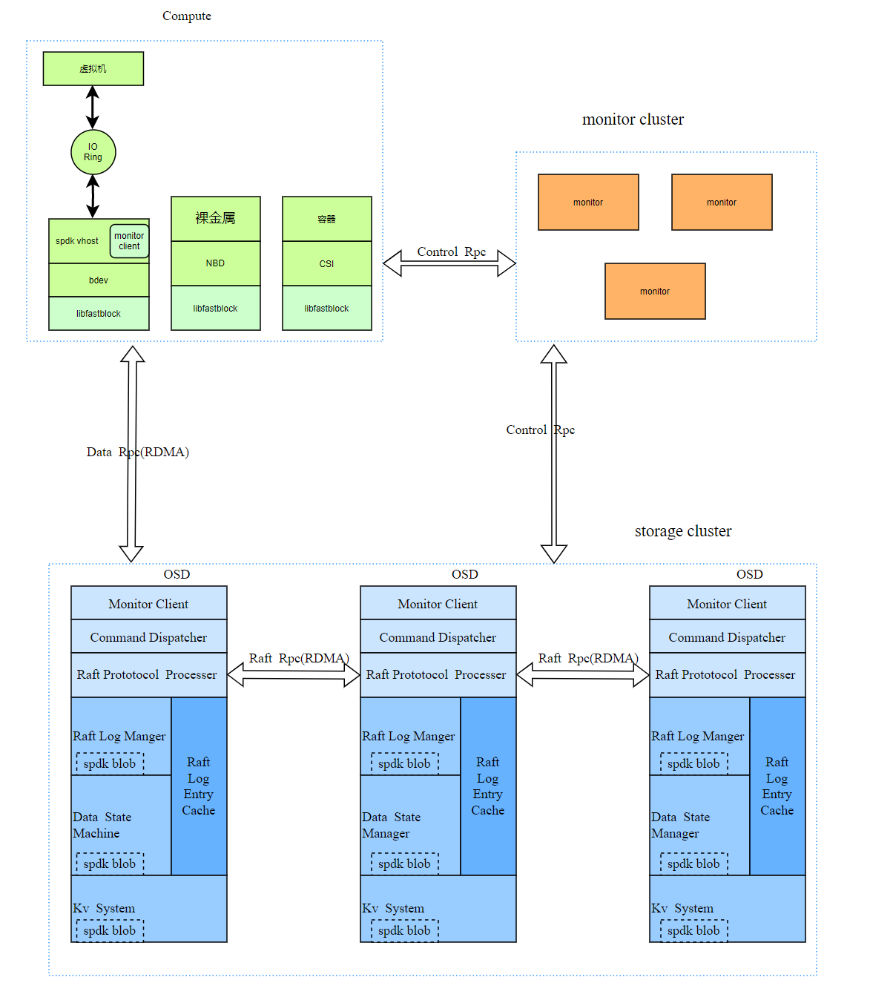
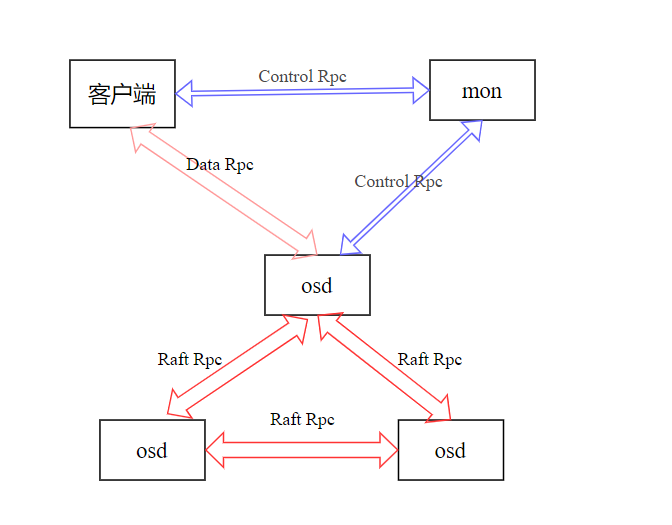
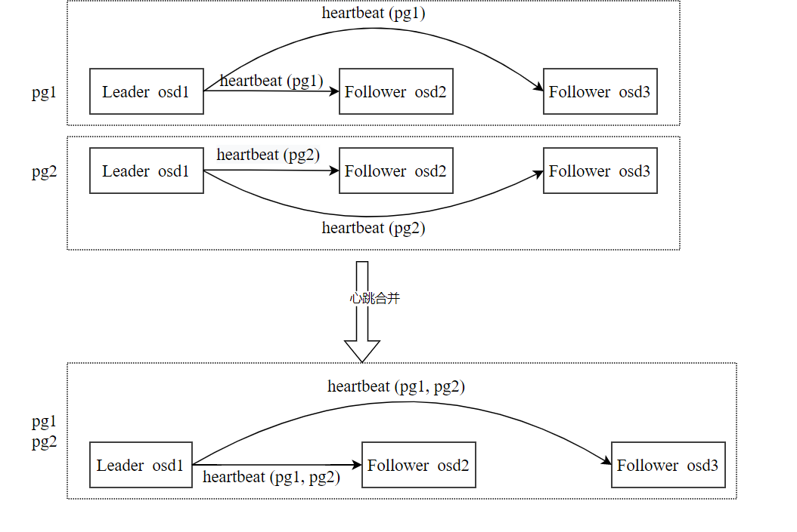
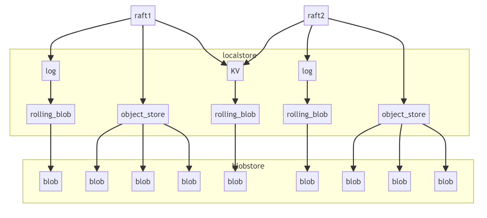

# Introduction to FastBlock

The problems of the distributed block storage system (CEPH) in use today  can no longer meet the requirements for performance, latency, cost, and  stability, which are mainly reflected in: 

- CPU economy: Currently, a large amount of CPU is consumed, and the CPU becomes a bottleneck in the NVMe SSD cluster 
- Poor availability: The master-slave strong synchronous replication strategy  is adopted, and I/O will be hung when the cluster is jitter 
- Insufficient performance of a single volume: The performance of a single volume is  even worse when interconnected to QEMU, and multiple volumes are  required to run the performance of the entire cluster during stress  testing 
- Excessive single-volume latency: Failure to take full advantage of the low  latency characteristics of NVMe devices, RBD block devices typically  have millisecond latency 
- nsufficient total concurrent performance: IOPS and throughput vary greatly from what hardware can provide 

FastBlock is designed to solve performance and latency problems, and it features: 

- It is written using the spdk programming framework and uses features such  as user-mode nvme drivers and lock-free queues to reduce I/O path  latency 
- RDMA network cards are introduced for zero-copy, kernel bypass, and network communication without CPU intervention 
- Use multi-raft for data replication to ensure data reliability 
- Simple, reliable, and easy-to-customize cluster metadata management 

# Fastblock design and architecture

The architecture of FastBlock is very similar to that of Ceph, and many  concepts such as Monitor, OSD, and PG are the same as those of Ceph for  quick understanding, as shown in the following figure:
  Thereinto:

- Compute stands for Compute Service 
- Monitor cluster is responsible for maintaining cluster metadata (including  osdMap, pgMap, pool information, and image information), as well as  managing pools and pgs. 
- Each storage cluster contains multiple storage nodes running multiple object storage dads (OSDs). 
- Control rpc is used to transfer metadata, using TCP sockets; Data RPC is used  to transfer data requests between the client and the OSD; raft rpc is  used to transfer RPC messages defined in the raft paper between OSDs.  Data rpc and raft rpc use protobuf and RDMA. 
- The monitor client is a monitor client module that communicates with the monitor. 
- The Command Dispatcher is a message processing module that receives data requests from processing clients. 
- The raft protocol Processor is used to process raft RPC messages,  elections, member changes, and other content specified in the raft  protocol. 
- The raft log manager manages and persists the raft log, and the persistent raft log uses spdk blobs. 
- The Data State Machine stores user data and uses the spdk blobstore. 
- The raft log entry cache is used to cache raft logs to improve performance. 
- The KV system provides a kv api and uses spdk blob for persistence. 

# fastblock component and interaction logic

## monitor

The Monitor service is responsible for maintaining the state of storage  nodes, deleting node additions, storing the metadata of volumes,  maintaining the topology of the cluster, responding to operations such  as creating pools by users, and evenly creating raft groups on OSDs  based on the current topology. As a cluster management tool, monitor  does not need to store data and does not need to pursue extreme  performance, so it is implemented by golang and monitor is implemented  with etcd for multi-copy storage.
The monitor cluster is an important guarantee of consistency, because  the client and OSD see the same view. For all client IO operations, only the PG layer can be seen, and both the OSD and the client will open a  timer to get OSDMAP and PGMAP information from the monitor at startup,  so all OSD and clients can see the same PG status change and make the  same response, and write operations for a specific PG will not be  written to the wrong place.
For more information, see Monitor Overview

## OSD RPC subsystem

RPC subsystem is an important system connecting each module, for the  requirements of heterogeneous network, the RPC subsystem is implemented  in two ways, namely socket-based (Control RPC) and RDMA (Data RPC and  Raft RPC), Socket-based is the classic Linux socket application  scenario, and RDMA-based RPC is implemented using asynchronous RDMA  (i.e., RDMA Write) semantics.
  
The above figure shows the connection between each module in fastblock, from which it can be seen that three types of RPCs are used, namely  Control RPC, Data RPC and Raft RPC: Control rpc: Used to pass data such  as osdmap, pgmap and image information between the client and the  monitor, and between the osd and the monitor. So a socket-based  implementation can be used; Data RPC: used to transfer object data  operations and results between the client and OSD, which is relatively  large and frequent, so RDMA-based methods are required. Raft RPC: It is  used to transfer the content of the Raft RPC protocol between OSDs,  which protects object data, which is relatively large and frequent, so  an RDMA-based method is required. Data rpc and Raft rpc use protobuf's  RPC framework, the network interaction part code uses RDMA, and the  serial number of the data transmitted by the rpc uses protobuf.

## OSD Raft subsystem

Raft achieves consistency by electing a leader and then giving him full  responsibility for managing the replication logs. The leader receives  log entries from the client, copies them to other servers, and tells  other servers when they can safely apply them to their state machine.  raft already has a lot of open source implementations, we refer to  willemt's C language raft implementation, and additionally implement  multi-raft, this module mainly includes:

- Management of raft groups, including creating, modifying, and deleting rafts; 
- raft elections and election overtime; 
- Raft log processing, including log caching, log disking, and log replication to follower nodes. 
- Data state machine processing, that is, data disking; 
- Raft snapshot management and Raft log recovery; 
- RAFT member change management (not yet implemented); 
- Raft heartbeats merge. 

The implementation of multi-group raft means that there are multiple rafts  coexisting, and the leader of each raft needs to send heartbeat packets  to its followers, so there will be multiple heartbeat packets, if there  are too many rafts, it will lead to too many heartbeat packets, which  occupies a lot of bandwidth and CPU resources. The solution is also very simple, each OSD may belong to multiple rafts, so you can merge the  rafts of the same leader and the same flower to reduce the number of  heartbeat packets. As shown in the figure below, there are two pgs  (rafts) are pg1 and pg2, pg1 and pg2 contain osd1, osd2, and osd3, osd1  is the leader, osd1 needs to send heartbeat (pg1) to osd2 and osd3, and  osd1 needs to send heartbeat (pg2) to osd2 and osd3 in pg2. After the  heartbeats are combined, only OSD1 needs to send heartbeat (PG1, PG2) to OSD2 and OSD3, respectively. 

## OSD KV subsystem

The KV subsystem is used to store the metadata of the raft and the data of  the storage system itself. Because the amount of data is not large, the  hash map in memory can store all the data, provide put, remove, and get  interfaces, and write the modified data in the hash map to the disk  every 10 ms. 

## osd localstore subsystem

Local storage is based on SPDK Blobstrore and consists of three storage modules: 

- disk_log: Stores the raft log, and one PG (corresponding to a raft group) corresponds to one spdk blob. 
- object_store: Stores object data, and each object corresponds to one spdk blob. 
- kv_store: Each CPU core has one SPDK blob. Save all KV data that needs to be  saved on the CPU core, including the metadata of the raft and the data  of the storage system itself. As shown in the figure below, suppose we  run two rafts, and the localstore provides three storage functions for  these two rafts: log, object, and kv. 

## client

The client is used to create, modify, and delete images, convert the user's data operations on the image into operations on the object (the basic  data unit for OSD processing), and then encapsulate it as a data rpc  message to the leader osd of the pg, and receive the response returned  by the leader OSD, and the result is returned to the user. There are  several modes for the client: use the spdk vhost to make it available to the virtual machine; Use NBD for bare metal use; Use CSI to make it  available to virtual machines. Eventually, all three modes will call the libfastblock library to convert images to objects and communicate with  OSD. The following describes the modes that are used by using spdk vhost to provide to virtual machines:
After the SPDK resources are initialized, you need to enable a timer to go to monitor to obtain OSDMAP, pgmap, and image information. Use the  rpc.py script of the spdk to send a request to the vhost app to create a bdev (bdev_fastblock_create), and the vhost app will create an image  after receiving the request, send the image information to the monitor,  create a bdev device, and then register the operation interface of the  device (this interface will call the libfastblock library). Use the  rpc.py script of the spdk to send a request to the vhost app to create a vhost-blk controller (vhost_create_blk_controller) for bdev, and the  vhost app will open the bdev device after receiving the request, and  register a vhost driver to process vhost messages (create a socket that  can be connected by a client (such as qemu), and follow the vhost  protocol to implement the connection service, which is a feature that  has been implemented in DPDK). libfastblock converts the user's data  operation on the image into an operation on the object (the basic data  unit for OSD processing), and then encapsulates it as a Data RPC message sent to the leader osd of the pg, and receives the response returned by the processing leader OSD.

# Code structure and compilation

The fastblock code is mainly located in the src, monitor, and msg directories: 

- The src directory mainly contains functions such as raft implementation,  rdma communication, underlying storage engine, and block-layer API  encapsulation 
- The monitor directory includes cluster metadata storage management, monitor election, PG allocation, clustermap distribution, and other functions 
- The msg directory contains all implementations of RDMA RPC, as well as a simple demo. 

```
./install-deps.sh
```

When compiling for the first time, you need to obtain dependencies such as  spdk and abseil-cpp, and run the following command to compile the  montior and osd of the Release version respectively: 

```
./build.sh -t Release -c monitor
./build.sh -t Release -c osd
```

After compilation, the and binary are in the `fastblock-mon` directory, while the and `fastblock-vhost` `fastblock-client` binary are in `mon/` the `build/src/osd/` directory `fastblock-osd` and `build/src/bdev` . If there are subsequent code changes to OSD and vhost, they can be  compiled only in the directory, and if there are changes to monitor,  they can be compiled only `build/` in `make` the `mon/` directory.

# Deployment and performance testing

Referring to the deployment and test report, in our test environment, with only  one core per OSD, we achieved a latency of less than 100 μs for a 4K  random write single thread and a concurrent performance of 410,000 IOPS.

# future works

- Implement functions such as volume snapshots and snapshot groups 
- Implement volume QoS 
- Optimized the multi-core performance of OSD and client 
- Achieve local storage engine recoverability and local storage engine optimization 
- Add a test system for unit testing, integration testing, and especially  failure testing of the raft layer and local storage engines 
- Connect to the CI system 
- PG assignment plugin for implementing customizable monitors 
- Implement the change of RAFT members and the overall joint debugging of PG allocation with Monitor 
- Optimized RDMA connection management for OSD clients 
- vhost The DPU can be unloaded from vhost 
- Export monitoring data and display data while the cluster is running 
- Deployment tool development and simplified system configuration files 
- Volume encryption and decryption are supported 
- Volume sharing is supported
