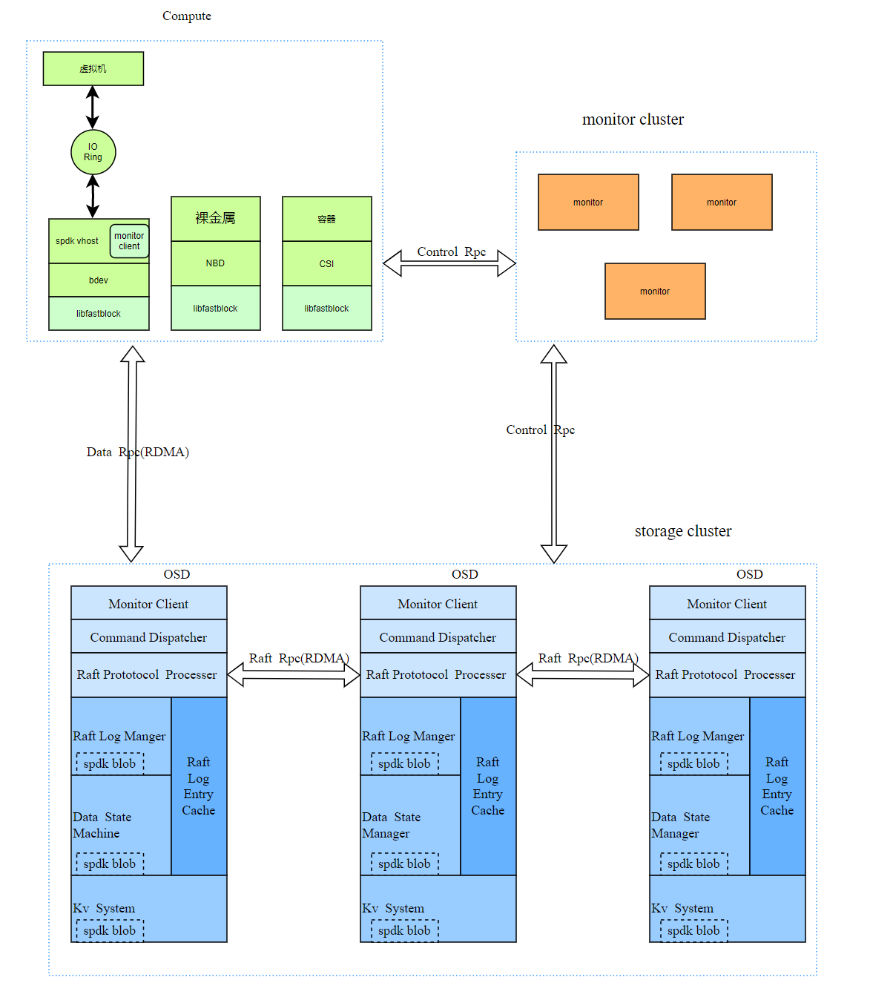
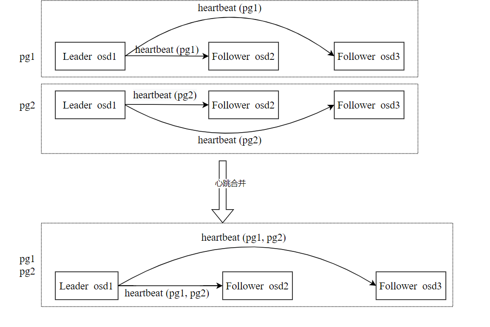

# fastblock简介
目前使用的分布式块存储系统(ceph)存在的问题已经不能适应对性能、延迟、成本和稳定性的需求，主要体现在:  
- CPU经济性: 目前需要消耗大量的CPU，CPU在nvme ssd集群中成为瓶颈
- 可用性差: 采用主从强同步复制策略, 集群抖动时有IO会被hang住
- 单卷性能不足: 对接qemu时性能更差，做压测时需要多个卷才能跑满整个集群的性能
- 单卷延迟过大: 不能充分利用nvme设备的低延迟特性，rbd块设备通常延迟都在毫秒级别
- 并发总性能不足: iops和吞吐相对硬件能够提供的水平相差较大

fastblock是为解决性能和延迟问题而生的，它的特点是:  
- 使用spdk编程框架编写，利用用户态nvme驱动、无锁队列等特性降低IO路径延迟
- 引入RDMA网卡进行零拷贝、内核旁路、无需CPU干预的网络通信
- 使用multi-raft进行数据复制，保证数据可靠性
- 简单、可靠、易定制的集群元数据管理

# fastblock设计及架构
fastblock的架构跟ceph非常类似，且monitor、osd、pg等众多概念都跟ceph一样以便于快速理解，架构如下图所示:  

其中:  
- Compute表示计算服务
- Monitor cluster负责维护集群元数据（包括osdMap、pgMap、pool信息和image信息），以及pool和pg的管理。
- storage cluster对应存储集群，每个存储集群包含多个Storage Node，每个Storage Node上运行多个osd(Object Storage Daemon)。
- Control rpc用于传输元数据，使用tcp socket；Data rpc用于在客户端和osd之间传输数据请求；raft rpc用于在osd之间传输raft论文中定义的RPC消息。其中Data rpc和raft rpc使用protobuf和RDMA。
- Monitor Client是monitor客户端模块，用于跟monitor通信。
- Command Dispatcher是消息处理模块，用于接收处理客户端的数据请求。
- raft Protocol Processer用于处理raft RPC消息、选举、成员变更等raft协议规定的内容。
- raft Log Manager负责管理和持久化raft Log，持久化raft Log使用了spdk blob。
- Data State Machine存储用户数据，使用了spdk blobstore。
- raft Log Entry Cache用于缓存raft Log，提高性能。
- KV System则提供kv api，持久化时使用了spdk blob。

# fastblock组件及交互逻辑
## monitor
monitor服务负责维护存储节点状态和节点加入删除、存储卷的元数据、维护集群的拓扑结构、响应用户创建pool等操作、根据当前的拓扑结构在osd上均匀创建raft group等。monitor作为集群管理工具，并不需要存储数据，也不需要追求极致性能，所以使用golang进行实现, monitor使用etcd进行多副本存储。  
monitor集群是一致性的重要保证，因为客户端、osd看到的都是相同的视图。对于所有客户端的io操作都只能看到pg这一层，而osd和客户端都会在启动时开启一个定时器定时去向monitor获取osdmap和pgmap信息，所以所有的osd和客户端都能够看到相同的pg状态变化并作出相同的响应，针对特定pg的写入操作也不会写到错误的地方。  
详情可参考[monitor简介](monitor/README.md "monitor简介")

## osd rpc子系统
rpc子系统是连接各模块的重要系统，出于异构网络的要求，rpc子系统的实现了两种方式，即基于socket（Control rpc）的和基于rdma（Data Rpc和Raft Rpc）的，基于socket的就是经典的linux socket应用场景，而基于rdma的rpc则是使用异步rdma(即rdma write)语义实现的。  

上图是fastblock中各个模块之间的联系，由图中可以看出使用了三种类型的rpc，分别为Control Rpc、Data Rpc和Raft Rpc:
Control rpc： 用于在客户端与monitor之间，osd与monitor之间传递osdmap、pgmap和image信息等数据，这些数据量不大，频率不高，因此可以使用基于socket的实现;
Data rpc：用于在客户端与osd之间传输对象数据操作和结果，这些数据量比较大，频率会很高，因此需要基于rdma的方法;
Raft rpc： 用于在osd之间传输raft rpc协议内容，里面会保护对象数据，这些数据量比较大，频率会很高，因此需要基于rdma的方法。 
Data rpc和Raft rpc使用protobuf的RPC框架，网络交互部分代码使用RDMA,rpc传输数据的序列号都使用protobuf。

## osd raft子系统
raft通过选举一个领导人，然后给予他全部的管理复制日志的责任来实现一致性。领导人从客户端接收日志条目（log entries），把日志条目复制到其他服务器上，并告诉其他的服务器什么时候可以安全地将日志条目应用到他们的状态机中。 raft在已经有很多开源实现，我们参考[willemt](https://github.com/willemt/raft "raft的C语言实现")的C语言raft实现，并额外实现了multi-raft，这个模块主要包括了:  
- raft groups的管理，包括raft的创建、修改和删除;
- raft选举以及选举超时处理;
- raft log处理，包括log缓存、log落盘和log复制到follower节点;
- 数据state machine处理，既数据落盘;
- raft快照管理和raft log recovery;
- raft成员变更管理(暂未实现);
- raft心跳合并。

实现multi-group raft,意味着有多个raft并存，每个raft的leader需要给它的follower发送心跳包，因此就会有多个心跳包，如果raft过多就会导致心跳包过多，占用大量的带宽和cpu资源。解决方法也很简单，每个osd可能属于多个raft，因此可以对相同leader、相同flower的raft进行心跳的合并，这样就可以减少心跳包数量。如下图所示，有两个pg（raft）分别为pg1和pg2，pg1和pg2中都包含osd1、osd2和osd3，osd1是leader，osd1需要给osd2和osd3分别发送heartbeat (pg1)，pg2中osd1需要给osd2和osd3分别发送heartbeat (pg2)。心跳合并后，只需要osd1给osd2和osd3分别发送heartbeat (pg1, pg2)。


## osd kv子系统
kv子系统用于存储raft的元数据、存储系统本身的数据，由于数据量不大，就自己设计了一套。因为数据量不大，内存中的hash map就可以存储所有数据，提供put、remove和get接口，每隔10ms把hash map中修改的数据写到磁盘中。

## osd localstore子系统
本地存储基于spdk blobstrore进行存储，包含3个存储功能模块： 
- disk_log: 存储raft log，一个pg(对应一个raft组)对应一个spdk blob。
- object_store: 存储对象数据，一个对象对应一个spdk blob。
- kv_store: 每个cpu核拥有一个spdk blob。保存当前cpu核上的需要保存的所有kv数据，包括raft的元数据、存储系统本身的数据。
如下图所示，假设我们运行了两个raft，localstore为这两个raft提供了log、object和kv这3部分存储功能。


## 客户端
客户端用于创建、修改和删除image，把用户对image的数据操作转换为对object（osd处理的基本数据单元）的操作，然后封装为Data Rpc消息发送给pg的 leader osd，并接收处理 leader osd返回的响应，结果返回给用户。 客户端有多种模式：使用spdk vhost提供给虚拟机使用；使用NBD提供给裸金属使用；使用CSI提供给虚拟机使用。这三种模式最终都会调用libfastblock库进行image到object的转换，并和osd通信。 下面主要介绍使用spdk vhost提供给虚拟机使用的模式:  
调用spdk库创建一个vhost app，spdk资源初始化后，需要开启一个定时器去向monitor获取osdmap、pgmap和image信息。
使用spdk的rpc.py脚本向vhost app发送创建bdev（bdev_fastblock_create）的请求，vhost app收到请求后创建image，把image信息发送给monitor，创建bdev设备，然后注册此设备的操作接口（此接口会调用libfastblock库）。
使用spdk的rpc.py脚本向vhost app发送创建bdev的vhost-blk controller（vhost_create_blk_controller）的请求，vhost app收到请求后打开bdev设备，注册一个vhost驱动去处理vhost消息（创建一个可供客户端(如qemu)连接的socket，并遵循vhost协议实现连接服务，这是DPDK中已实现的功能）。
libfastblock把用户对image的数据操作转换为对object（osd处理的基本数据单元）的操作，然后封装为Data Rpc消息发送给pg的 leader osd，并接收处理 leader osd返回的响应。


# 代码结构及编译、安装、运行
fastblock代码主要位于src、monitor和msg目录中:
- src目录主要包含raft实现、rdma通信、底层存储引擎、块层API封装等功能, 详情见[src目录简介](src/README.md "src代码简介")
- monitor目录则包含了集群元数据存储管理、monitor选举、pg分配、clustermap分发等功能, 详情见[monitor目录简介](monitor/README.md "monitor代码简介")
- msg目录中包含了RDMA RPC的所有实现，以及在一个简单的demo。
```
./install-deps.sh
```
首次编译时，需要获取spdk和abseil-cpp等依赖，可通过运行以下命令分别编译Release版本的montior和osd:  
```
./build.sh -t Release -c monitor
./build.sh -t Release -c osd
```
编译完成后，`fastblock-mon`和`fastblock-client`二进制位于`mon/`目录下，而`fastblock-osd`和`fastblock-vhost`二进制位于`build/src/osd/`目录和`build/src/bdev`目录下。
后续osd、vhost有代码改动，则可仅在`build/`目录下编译，而monitor有改动则可仅在`mon/`目录下`make`即可。  
可通过以下命令行将编译生成的二进制以及systemctl unit文件安装到系统目录: 
```
cd build
make install
```
最简测试开发环境搭建可参考[测试开发环境搭建](https://gitee.com/openeuler/fastblock/wikis/%E6%9C%80%E7%AE%80%E5%BC%80%E5%8F%91%E7%8E%AF%E5%A2%83%E6%90%AD%E5%BB%BA%E5%8F%8A%E4%B8%8A%E6%89%8B%E6%8C%87%E5%8D%97)   
另外，可通过vstart.sh脚本搭建一个测试开发环境，即使您没有RDMA网卡也没有NVMe磁盘，也可以很方便的搭建一个环境(以下命令行都需要make install将二进制安装到系统目录):  
```
# 搭建一个测试开发环境，有3osd, 跑三副本，使用网卡为mlx5_0, 提供三块磁盘
./vstart.sh -m dev -t aio -c 3 -r 3 -n mlx5_0 -d /dev/sda,/dev/sdb,/dev/sdc
# 搭建一个测试开发环境，有3osd, 跑三副本，使用网卡为mlx5_0, 提供三块nvme磁盘并使用nvme bdev
./vstart.sh -m dev -t nvme -c 3 -r 3 -n mlx5_0 -d 0000:b1:00.0,0000:b2:00.0,0000:b0:00.0
# 在没有RDMA网卡的虚拟机上，跑一个3osd、三副本的集群
./vstart.sh -m dev -c 3 -r 3
# 在172.31.4.144，172.31.4.145，172.31.4.146三台物理服务器上跑一个生产环境，提供三块nvme磁盘并使用nvme bdev(运行下面四个命令行):
./vstart.sh -m pro -M 172.31.4.144
./vstart.sh -m pro -n mlx5_3 -t nvme -d 0000:b0:00.0,0000:da:00.0,0000:19:00.0 -i 172.31.4.144
./vstart.sh -m pro -n mlx5_3 -t nvme -d 0000:b0:00.0,0000:da:00.0,0000:19:00.0 -i 172.31.4.145
./vstart.sh -m pro -n mlx5_3 -t nvme -d 0000:b0:00.0,0000:da:00.0,0000:19:00.0 -i 172.31.4.146
```

# 部署及性能测试
参考[部署及测试报告](docs/performance_test_1012.md "性能测试报告"), 在我们的测试环境中，在每个osd仅适用一个核的情况下，获得了4k随机写单线程100us以下的延迟以及并发41万iops的性能。

# future works
- 实现卷快照、快照组等功能
- 实现卷QoS
- osd和client多核性能优化
- 实现本地存储引擎的可恢复性，以及本地存储引擎优化
- 添加测试系统，进行单元测试、集成测试，特别是raft层和本地存储引擎的故障测试
- 接入CI系统
- 实现可定制的monitor的pg分配插件
- 实现raft成员变更及与monitor的pg分配整体联调
- 优化osd client的rdma连接管理
- 支持DPU卸载vhost
- 监控数据导出及集群运行时数据展示
- 部署工具开发及系统配置文件简化
- 支持卷加解密功能
- 支持卷共享
