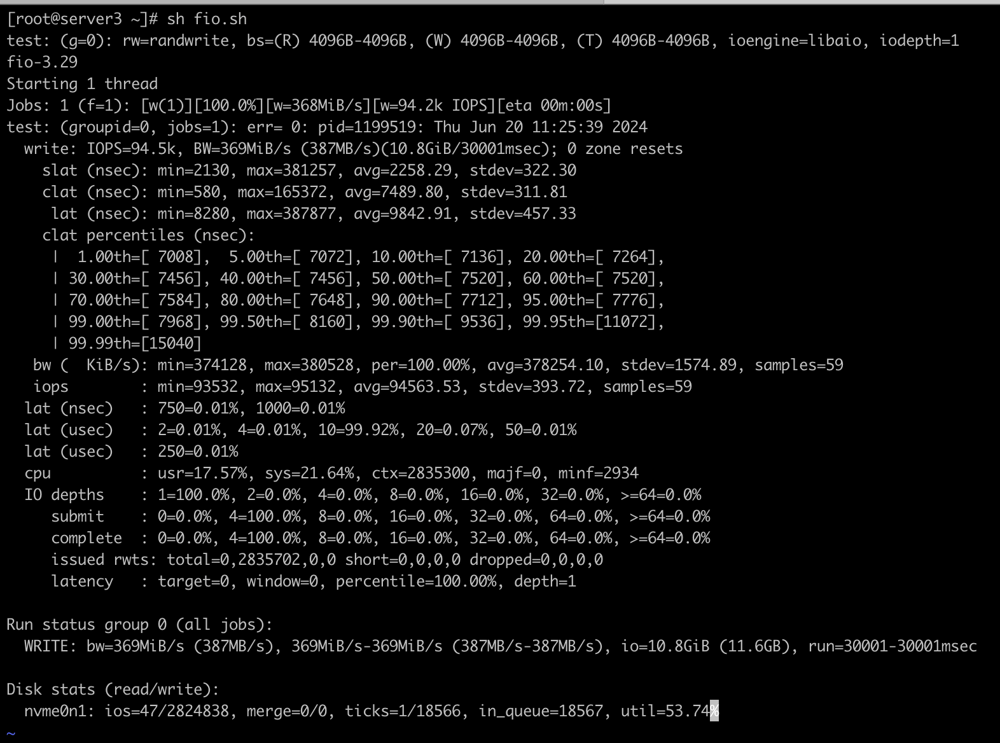
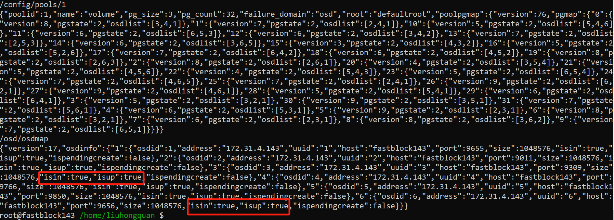

性能测试及故障恢复测试报告
# 性能测试:
## 0. 测试目标
- 测试当前版本的单副本下，多核并发IOPS看能否跑满磁盘性能
- 测试当前版本的三副本下，单线程IOPS及平均延迟和延迟分位统计
- 测试当前版本的三副本下，多核并发IOPS及平均延迟和延迟分位统计
## 1. 性能测试环境
- 服务器: 此次使用三台同配置的服务器(server2,server3,server4)进行集群模式测试，CPU为96核，4个numa节点的KunPeng 920, cpu采用性能模式，服务器拥有512G内存
- 网络：  服务器之间使用100G交换机直连,有100G RoCE网络和100G IB网络，因时间原因，主要采用RoCE网络进行测试
- 磁盘：  每台服务完全4块ES3000 V6 SSD作为后端存储, 采用spdk nvme用户态驱动进行测试

## 2. 磁盘基准性能测试
使用numjobs=1进行磁盘的单核性能测试，从结果看单核磁盘的iops为94500:  
```
fio -direct=1 -iodepth=16 -thread -rw=randwrite -bs=4096 -numjobs=1 -runti me=30 -group_reporting -name=test -filename=/dev/nvme0n1 -ioengine=libaio
```



## 3. 部署集群,并创建所需的pool和卷
挂载2M大页内存，并准备huge page:  
```
for i in `seq 0 3`
do
  echo 32768 > /sys/devices/system/node/node"$i"/hugepages/hugepages-2048kB/nr_hugepages
done
```
monitor运行在server3，使用的rdma网卡是mlx5_1,所以以下命令行部署并启动monitor进程:  
```
./vstart.sh -m pro -n mlx5_1 -M 192.168.80.83
```
在部署完monitor之后，再部署osd:  
```
for i in `seq 82 84`
do
  ./vstart.sh -m pro -n mlx5_1 -t nvme -d 0000:82:00.0,0000:83:00.0,0000:84:00.0,0000:85:00.0 -i 192.168.80."$i"  
done
```
其中0000:82:00.0,0000:83:00.0,0000:84:00.0,0000:85:00.0是服务器上4块被spdk托管的ssd。  

创建测试所需的pool和卷:
```
/usr/local/bin/fastblock-client -op=createpool -poolname=latencytest -failure_domain=host  -pgcount=1 -pgsize=3 -endpoint=192.168.80.83:3333
/usr/local/bin/fastblock-client -op=createpool -poolname=iopstest -failure_domain=host  -pgcount=4 -pgsize=3 -endpoint=192.168.80.83:3333
/usr/local/bin/fastblock-client -op=createpool -poolname=singlecopy -failure_domain=host  -pgcount=1 -pgsize=1 -endpoint=192.168.80.83:3333
/usr/local/bin/fastblock-client -op=createimage -imagesize=$((1024*1024*1024))  -imagename=latencyimage -poolname=latencytest  -endpoint=192.168.80.83:3333
/usr/local/bin/fastblock-client -op=createimage -imagesize=$((1024*1024*1024))  -imagename=iopsimage -poolname=iopstest -endpoint=192.168.80.83:3333
/usr/local/bin/fastblock-client -op=createimage -imagesize=$((1024*1024*1024))  -imagename=singlecopyimage -poolname=singlecopy -endpoint=192.168.80.83:3333
```

集群部署成功后，可以通过命令行看到集群运行状态和osdmap及pgmap:  
```
[root@server3 fastblock]# fastblock-client -op=status -endpoint=192.168.80.83:3333
  cluster:

  services:
    mon: 1 mons, 192.168.80.83
    osd: 12 osds: 12 up, 12 in

  data:
    pools  : 3 pools, 6 pgs
    objects: 0 objects
    pgs    :
      6  active
```


## 4. 单副本并发iops测试
单副本的配置文件是如下：  
```
{
  "io_type": "write",
  "io_size": 4096,
  "io_count": 100000,
  "io_depth": 1,
  "io_queue_size": 32,
  "io_queue_request": 128,
  "image_name": "singlecopyimage",
  "image_size": "134217728",
  "object_size": 4194304,
  "pool_id": 3,
  "pool_name": "singlecopy",
  "rdma_device_name": "mlx5_1",
  "mon_host": [
    "192.168.80.83"
  ],
  "msg_client_poll_cq_batch_size": 32,
  "msg_client_metadata_memory_pool_capacity": 16384,
  "msg_client_metadata_memory_pool_element_size": 1024,
  "msg_client_data_memory_pool_capacity": 16384,
  "msg_client_data_memory_pool_element_size": 8192,
  "msg_client_per_post_recv_num": 512,
  "msg_client_rpc_timeout_us": 1000000,
  "msg_client_rpc_batch_size": 1024,
  "msg_client_connect_max_retry": 30,
  "msg_client_connect_retry_interval_us": 1000000,
  "msg_rdma_resolve_timeout_us": 2000,
  "msg_rdma_poll_cm_event_timeout_us": 1000000,
  "msg_rdma_max_send_wr": 4096,
  "msg_rdma_max_send_sge": 128,
  "msg_rdma_max_recv_wr": 8192,
  "msg_rdma_max_recv_sge": 1,
  "msg_rdma_max_inline_data": 16,
  "msg_rdma_cq_num_entries": 1024,
  "msg_rdma_qp_sig_all": false
}
```
block_bench结果为:  

使用spdk的iostat.py工具观察这个osd的nvme bdev的iops，结果为:  

从中可以知道，在单副本的情况下，单核的osd能够跑满磁盘在numjobs=1时的上限，因为fastblock使用的raft协议是双写(先写raft log再写数据状态机)，而block_bench输出的iops为48000。


## 5. 三副本下4k随机写的延迟测试:  
测试配置文件如下:  
```
{
  "io_type": "write",
  "io_size": 4096,
  "io_count": 100000,
  "io_depth": 1,
  "io_queue_size": 32,
  "io_queue_request": 128,
  "image_name": "latencyimage",
  "image_size": "134217728",
  "object_size": 4194304,
  "pool_id": 1,
  "pool_name": "latencytest",
  "rdma_device_name": "mlx5_1",
  "mon_host": [
    "192.168.80.83"
  ],
  "msg_client_poll_cq_batch_size": 32,
  "msg_client_metadata_memory_pool_capacity": 16384,
  "msg_client_metadata_memory_pool_element_size": 1024,
  "msg_client_data_memory_pool_capacity": 16384,
  "msg_client_data_memory_pool_element_size": 8192,
  "msg_client_per_post_recv_num": 512,
  "msg_client_rpc_timeout_us": 1000000,
  "msg_client_rpc_batch_size": 1024,
  "msg_client_connect_max_retry": 30,
  "msg_client_connect_retry_interval_us": 1000000,
  "msg_rdma_resolve_timeout_us": 2000,
  "msg_rdma_poll_cm_event_timeout_us": 1000000,
  "msg_rdma_max_send_wr": 4096,
  "msg_rdma_max_send_sge": 128,
  "msg_rdma_max_recv_wr": 8192,
  "msg_rdma_max_recv_sge": 1,
  "msg_rdma_max_inline_data": 16,
  "msg_rdma_cq_num_entries": 1024,
  "msg_rdma_qp_sig_all": false
}
```
测试结果如下:

可⻅4k随机写的平均延迟为126.9微秒，略大于我们之前发布的100us的版本，但最大延迟有所改善，还需要进一步定位是因为测试环境不同引起，还是因为新引入代码引起了性能降低.


## 6. 多pg的iops性能测试:
测试配置文件如下:  
```
{
  "io_type": "write",
  "io_size": 4096,
  "io_count": 10000000,
  "io_depth": 64,
  "io_queue_size": 1024,
  "io_queue_request": 4096,
  "image_name": "iopsimage",
  "image_size": "1073741824",
  "object_size": 4194304,
  "pool_id": 2,
  "pool_name": "iopstest",
  "rdma_device_name": "mlx5_1",
  "mon_host": [
    "192.168.80.83"
  ],
  "msg_client_poll_cq_batch_size": 32,
  "msg_client_metadata_memory_pool_capacity": 16384,
  "msg_client_metadata_memory_pool_element_size": 1024,
  "msg_client_data_memory_pool_capacity": 16384,
  "msg_client_data_memory_pool_element_size": 8192,
  "msg_client_per_post_recv_num": 512,
  "msg_client_rpc_timeout_us": 1000000,
  "msg_client_rpc_batch_size": 1024,
  "msg_client_connect_max_retry": 30,
  "msg_client_connect_retry_interval_us": 1000000,
  "msg_rdma_resolve_timeout_us": 2000,
  "msg_rdma_poll_cm_event_timeout_us": 1000000,
  "msg_rdma_max_send_wr": 4096,
  "msg_rdma_max_send_sge": 128,
  "msg_rdma_max_recv_wr": 8192,
  "msg_rdma_max_recv_sge": 1,
  "msg_rdma_max_inline_data": 16,
  "msg_rdma_cq_num_entries": 1024,
  "msg_rdma_qp_sig_all": false
}
```
测试结果如下:  

从4k并发性能测试看，因为单个磁盘的iops上限为48000左右，测试环境有4块磁盘，理论上限为192000，fastblock测试结果为163839，基本能够跑到90%左右;

# 故障恢复测试
## 0. 测试目标
- 三副本的测试条件下, 使用block_bench对集群写数据，关闭、重启osd、outosd使pg重新分布，观察集群状态是否正常
## 1. 测试环境
- 服务器: 此次使用一台同配置的服务器(fastblock143)进行集群模式测试，CPU为40核80线程的Intel Gold 6230
- 网络：  服务器之间使用25G交换机直连，384G内存, CPU采用性能模式
- 磁盘：测试是采用12个P4510作为后端存储, 采用spdk nvme用户态驱动进行测试

## 2. 创建pool
```
fastblock-client -op=createpool -poolname=volume -pgcount=32 -pgsize=3
```

### 2.1 获取osd和pg相关信息
```
etcdctl get --prefix /
```  


### 2.2 获取pg的leader信息
```
cat /var/log/fastblock/osd*.log | grep "becoming leader"
```  


## 3. 使用block_bench写数据
block_bench配置文件：block_bench.json   
``` json
{
    "io_type": "write",
    "io_size": 4096,
    "io_count": 10000,
    "io_depth": 1,
    "io_queue_size": 128,
    "io_queue_request": 4096,
    "image_name": "test_image",
    "image_size": 107374182400,
    "object_size": 1048576,
    "pool_id": 1,
    "pool_name": "volume",
    "mon_host": ["172.31.77.143"],
    "msg_client_poll_cq_batch_size": 32,
    "msg_client_metadata_memory_pool_capacity": 16384,
    "msg_client_metadata_memory_pool_element_size": 1024,
    "msg_client_data_memory_pool_capacity": 16384,
    "msg_client_data_memory_pool_element_size": 8192,
    "msg_client_per_post_recv_num": 512,
    "msg_client_rpc_timeout_us": 1000000,
    "msg_client_rpc_batch_size": 1024,
    "msg_client_connect_max_retry": 30,
    "msg_client_connect_retry_interval_us": 1000000,
    "msg_rdma_resolve_timeout_us": 2000,
    "msg_rdma_poll_cm_event_timeout_us": 1000000,
    "msg_rdma_max_send_wr": 4096,
    "msg_rdma_max_send_sge": 128,
    "msg_rdma_max_recv_wr": 8192,
    "msg_rdma_max_recv_sge": 1,
    "msg_rdma_max_inline_data": 16,
    "msg_rdma_cq_num_entries": 1024,
    "msg_rdma_qp_sig_all": false
}
```
block_bench命令  
```
block_bench -C block_bench.json -m '[16,17]'
```  

## 4. kill掉一个osd,立即再重启
osd5是2个pg的leader，分别为1.23、1.31，kill掉osd5，立即再重启，确保osd5没有out, kill掉osd5后osd状态变为down，包含osd5的pg状态（pgstate）变为PgUndersize（4）  
查看osd和pg相关信息：
```
etcdctl get --prefix /
```  


pg 1.23、1.31选出新leader，查看osd和pg相关信息：
```
etcdctl get --prefix /
```  


重启osd5后osd状态变为up，包含osd5的pg状态（pgstate）变为PgActive（2），查看osd和pg相关信息：
```
etcdctl get --prefix /
```  


## 5. kill掉一个osd，使osd out
kill掉osd1,osd1状态变为down后，包含osd1的pg状态（pgstate）变为PgUndersize（4），查看osd和pg相关信息：
```
etcdctl get --prefix /
```  


osd1状态变为out后，查看osd和pg相关信息：
```
etcdctl get --prefix /
```  

和osd1变为out前的pg map对比可以发现原先包含osd1的pg已经重新remap，已经不包含osd1，pg状态（pgstate）变为PgActive（2）  
注意：中间还有一个remap过程，pg的osd成员列表由“osdlist”转换为“newosdlist”  

使用block_bench命令向pool写数据  

## 6. 重启已经处于out的osd，观察pg rebalance是否正常
重启osd1后，osd1状态变为up/in，查看osd和pg相关信息：
```
etcdctl get --prefix /
```  

观察此pg map可知，有些pg的状态（pgstate）变为PgRemapped (16),并且多了个newosdlist（新osd列表），说明重启osd1触发了pg rebalance.  

过段时间之后，pg map会再次更新  

和上一个pg map对比可知，处于PgRemapped (16)的pg已经变为PgActive （2），osdlist更新为对应的newosdlist，表示pg remap完成。  

## 7. pg down掉后，重启osd
杀死osd3 和 osd6，查看osd和pg相关信息：

观察pg map可知，同时包含osd3和osd6的pg状态（pgstate）变为PgDown (8),包含osd3和osd6中一个的pg的pg状态（pgstate）变为PgUndersize （4）  

重启osd3 和 osd6后，查看osd和pg相关信息：  
  
观察pg map可知，包含osd3或osd6的pg状态（pgstate）变为PgActive （2）  

down状态的pg包括1.11、1.14、1.19、1.8, pg down掉后活着的那个osd会一直选举，直到pg重新变为非down状态  
以pg 1.11为例，osd列表为6、5、3，osd3和osd6 down了，只有osd5活着  
 
osd5一直选举，直到osd3或osd6上线选出leader后，才停止选举。  

## 8. 异常测试
下面是一些异常测试，为了方便观察和出现，启动4个ods，创建的pool里只有一个pg
```
fastblock-client -op=createpool -poolname=volume -pgcount=1 -pgsize=3
```
查看osd和pg相关信息：


获取pg leader信息：


### 8.1 正在向pool里写数据时，使用outosd命令移除一个osd,观察pg remap是否正常
使用block_bench向pool写50000条数据：
```
block_bench -C block_bench.json -m '[16,17]'
```  

leader开始写数据时，使leader out  
```
fastblock-client -endpoint=172.31.77.143:3333 -op=outosd -osdid=4
```  
查看osd和pg相关信息：

pg状态变为PgRemapped (16),并且多了个newosdlist（新osd列表）

过一段时间后，pg变为PgActive （2），osdlist更新为对应的newosdlist,并且block_bench成功执行结束


### 8.2 pg在成员变更过程中，kill掉leader
查看osd和pg相关信息：


osd3是leader

使osd1 out:
```
fastblock-client -endpoint=172.31.77.143:3333 -op=outosd -osdid=1
```  
查看osd和pg相关信息：

pg状态变为PgRemapped (16),并且多了个newosdlist（新osd列表）,pg正在remap

osd成员变更开始后，kill掉leader osd3,osd3变为down后，成员变更没有被中断，选出新leader，继续成员变更，pg状态变为PgRemapped | PgUndersize (20)


osd3变为out后，成员变更还没结束，这个out动作会排队（等成员变更结束后检查是否remap）


pg成员由1、3、2变更为3、2、4，但因为osd3变为out，又触发pg remap


最后pg成员变更完成，状态变为PgActive （2），osdlist更新为2、4、5.

