# 1. 测试目标
- 在单副本和三副本下，使用虚拟机、nvmf和block_bench测试多核并发IOPS及平均延迟

# 2. 注意事项
- fastblock-vhost对接qemu的功能测试可以参考[vhost对接qemu测试](qemu_vhost_test.md)
- nvmf测试可以参考[内核initiator连接nvmf-tgt导出磁盘](nvmf_tgt.md)
- block_bench测试可以参考[性能测试](performance_test_20240731.md)
- 请注意参考[rpc系统参数配置](rpc_memory_parameter.md)进行fastblock.json、vhost.json和nvmf.json的配置，相关参数在osd侧和客户端侧必须一直，否则将无法通信  

因为受限于硬件设备不够，只有一台测试服务器，3副本需要在一台服务器上测试

# 3 环境
cpu:  Kunpeng-920   96核
系统： openEuler 22.03 (LTS-SP3)
内存： 502G
网卡： 100000Mb/s

# 4 部署集群,并创建所需的pool和image
部署fastblock集群和创建pool和image的方法参考[vhost对接qemu测试](qemu_vhost_test.md)


# 5 单个osd、单副本场景测试
启动一个osd，创建一个单副本pool，方法参考[vhost对接qemu测试](qemu_vhost_test.md)

## 5.1  block_bench测试
block_bench配置参数：
```
  "io_type": "write",
  "io_size": 4096,
  "io_count": 50000000,
  "io_depth": 32,
```
block_bench使用8个核

结果
网卡监控信息：
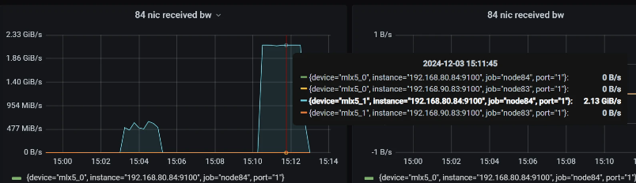
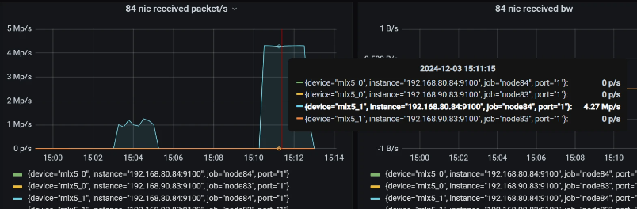

磁盘io：
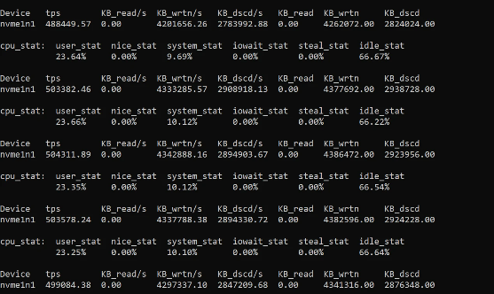

iops:
```
===============================[write latency]========================================
mean: 623.985us, p0.1: 416.19us, p0.5: 416.45us, p0.9: 417.81us, p0.95: 418.54us, p0.99: 418.57us, p0.999: 419.1us, iops: 358235, iops_dur_sec: 139.365s, total_io_count: 49925327
======================================================================================
```
iops为358235，增加block_bench绑定核数应该还可以提高

## 5.2  虚拟机测试  <a id="link1"></a>
启动fastblock-vhost:
```
fastblock-vhost  -C vhost.json  -S 8
```
或者
```
systemctl start fastblock-vhost.service
```

fastblock-vhost的配置文件vhost.json:
``` json
{
    "mon_host": ["192.168.80.84"],
    "mon_rpc_address": "192.168.80.84",
    "mon_rpc_port": 3333,
    "rdma_device_name": "mlx5_1",
    "msg_client_poll_cq_batch_size": 1024,
    "msg_client_metadata_memory_pool_capacity": 2048,
    "msg_client_metadata_memory_pool_element_size": 512,
    "msg_client_data_memory_pool_capacity": 2048,
    "msg_client_data_memory_pool_element_size": 5120,
    "msg_client_per_post_recv_num": 64,
    "msg_client_rpc_timeout_us": 300000000,
    "msg_client_rpc_batch_size": 1024,
    "msg_client_connect_max_retry": 30,
    "msg_client_connect_retry_interval_us": 1000000,
    "msg_rdma_resolve_timeout_us": 2000,
    "msg_rdma_poll_cm_event_timeout_us": 1000000,
    "msg_rdma_max_send_wr": 1024,
    "msg_rdma_max_send_sge": 128,
    "msg_rdma_max_recv_wr": 8192,
    "msg_rdma_max_recv_sge": 1,
    "msg_rdma_max_inline_data": 16,
    "msg_rdma_cq_num_entries": 1024,
    "msg_rdma_qp_sig_all": true
}
```

创建bdev设备及vhost controler,启动虚拟机的方法参考 [vhost对接qemu测试](qemu_vhost_test.md)
qemu-system-aarch64启动虚拟机时，命令行参数的num-queues是8（和fastblock-vhost的核数相同）：
```
-device vhost-user-blk-pci,chardev=spdk_vhost_blk0,num-queues=8
```

在虚拟机内部执行fio:
```
fio -direct=1 -iodepth=32 -thread -rw=randwrite -bs=4096 -numjobs=8 -runtime=120 -group_reporting -name=test -filename=/dev/vda -size=100G -ioengine=libaio -time_based
```

结果
网卡监控信息：
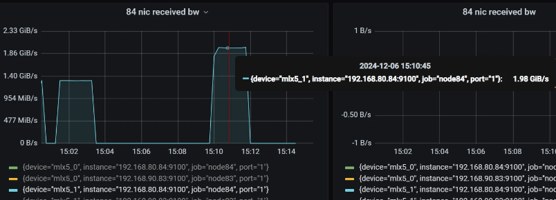
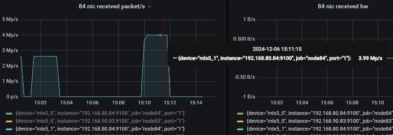

磁盘io：
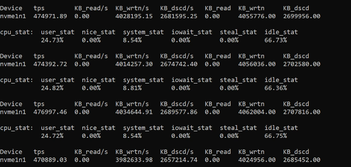

iops:
```
test: (groupid=0, jobs=8): err= 0: pid=1430: Fri Dec  6 07:13:04 2024
  write: IOPS=321k, BW=1253MiB/s (1314MB/s)(147GiB/120001msec); 0 zone resets
    slat (usec): min=3, max=5845, avg= 7.07, stdev= 3.73
    clat (usec): min=117, max=3464.8k, avg=789.96, stdev=8801.72
     lat (usec): min=124, max=3464.8k, avg=797.18, stdev=8801.71
    clat percentiles (usec):
     |  1.00th=[  429],  5.00th=[  545], 10.00th=[  594], 20.00th=[  627],
     | 30.00th=[  652], 40.00th=[  668], 50.00th=[  701], 60.00th=[  750],
     | 70.00th=[  799], 80.00th=[  873], 90.00th=[  988], 95.00th=[ 1106],
     | 99.00th=[ 1352], 99.50th=[ 1450], 99.90th=[ 2180], 99.95th=[ 3490],
     | 99.99th=[ 4178]
   bw (  MiB/s): min=    1, max= 1557, per=100.00%, avg=1295.59, stdev=18.62, samples=1854
   iops        : min=  297, max=398644, avg=331671.48, stdev=4767.07, samples=1854
  lat (usec)   : 250=0.04%, 500=2.60%, 750=58.17%, 1000=30.00%
  lat (msec)   : 2=9.08%, 4=0.10%, 10=0.01%, 20=0.01%, 1000=0.01%
  lat (msec)   : 2000=0.01%, >=2000=0.01%
  cpu          : usr=11.90%, sys=31.70%, ctx=22999361, majf=0, minf=8
  IO depths    : 1=0.1%, 2=0.1%, 4=0.1%, 8=0.1%, 16=0.1%, 32=100.0%, >=64=0.0%
     submit    : 0=0.0%, 4=100.0%, 8=0.0%, 16=0.0%, 32=0.0%, 64=0.0%, >=64=0.0%
     complete  : 0=0.0%, 4=100.0%, 8=0.0%, 16=0.0%, 32=0.1%, 64=0.0%, >=64=0.0%
     issued rwts: total=0,38486371,0,0 short=0,0,0,0 dropped=0,0,0,0
     latency   : target=0, window=0, percentile=100.00%, depth=32
```

iops为32.1万，相对于block_bench的35.8万，损耗较小，损耗在于虚拟机内部io开销和虚拟机与vhost通信开销。

## 5.3  spdk_nvmf_perf TCP测试 <a id="link2"></a>
启动fastblock-nvmf-tgt：
```
fastblock-nvmf-tgt -C nvmf-tgt.json -S 8
```

fastblock-nvmf-tgt配置文件nvmf-tgt.json：
```
{
    "mon_host": ["192.168.80.84"],
    "mon_rpc_address": "192.168.80.84",
    "mon_rpc_port": 3333,
    "rdma_device_name": "mlx5_1",
    "msg_client_poll_cq_batch_size": 1024,
    "msg_client_metadata_memory_pool_capacity": 2048,
    "msg_client_metadata_memory_pool_element_size": 512,
    "msg_client_data_memory_pool_capacity": 2048,
    "msg_client_data_memory_pool_element_size": 5120,
    "msg_client_per_post_recv_num": 64,
    "msg_client_rpc_timeout_us": 300000000,
    "msg_client_rpc_batch_size": 1024,
    "msg_client_connect_max_retry": 30,
    "msg_client_connect_retry_interval_us": 1000000,
    "msg_rdma_resolve_timeout_us": 2000,
    "msg_rdma_poll_cm_event_timeout_us": 1000000,
    "msg_rdma_max_send_wr": 1024,
    "msg_rdma_max_send_sge": 128,
    "msg_rdma_max_recv_wr": 8192,
    "msg_rdma_max_recv_sge": 1,
    "msg_rdma_max_inline_data": 16,
    "msg_rdma_cq_num_entries": 1024,
    "msg_rdma_qp_sig_all": true
}
```

创建bdev设备，创建TCP transport，创建NVMe-oF子系统，向NVMe-oF子系统添加namespace，向NVMe-oF子系统添加TCP transport类型的listener，方法参考[内核initiator连接nvmf-tgt导出磁盘](./nvmf_tgt.md)

spdk_nvmf_perf测试：
```
spdk/build/bin/spdk_nvme_perf -q 32 -s 1024 -w randwrite -t 180 -c 0xff00000000000000 -o 4096 -r 'trtype:TCP adrfam:IPv4 traddr:192.168.80.84 trsvcid:4420'
```
结果
网卡监控信息：
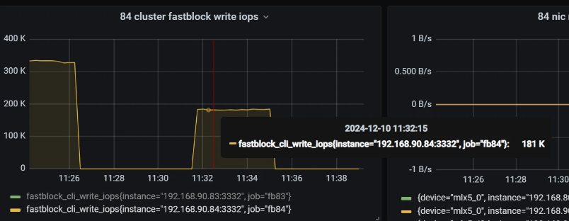
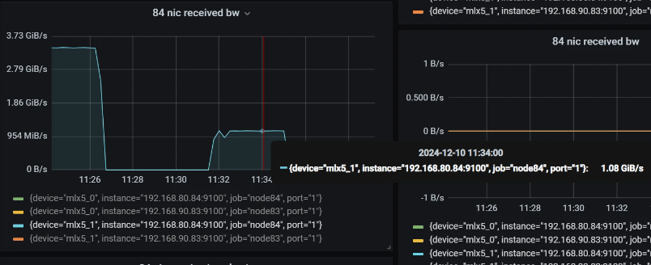
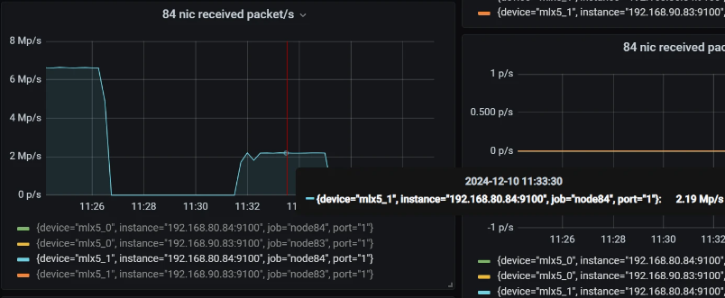

磁盘io：
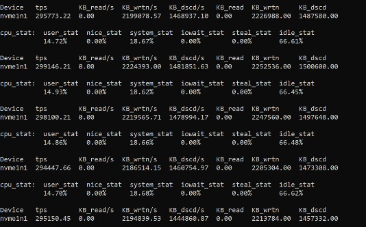

iops:
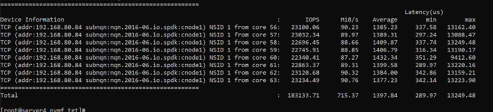

iops为18.3万，相对于block_bench的35.8万，损耗较大，损耗在于与nvmf_tgt之间的TCP通信。

## 5.4  spdk_nvmf_perf RDMA测试
启动fastblock-nvmf-tgt 参考[5.3节spdk_nvmf_perf TCP测试](#link2)
fastblock-nvmf-tgt占用8个核

创建bdev设备，创建RDMA transport，创建NVMe-oF子系统，向NVMe-oF子系统添加namespace，向NVMe-oF子系统添加RDMA transport类型的listener，方法参考[内核initiator连接nvmf-tgt导出磁盘](./nvmf_tgt.md)

spdk_nvmf_perf测试：
```
spdk/build/bin/spdk_nvme_perf -q 32 -s 1024 -w randwrite -t 180 -c 0xff00000000000000 -o 4096 -r 'trtype:RDMA adrfam:IPv4 traddr:192.168.80.84 trsvcid:4420'
```
结果
网卡监控信息：
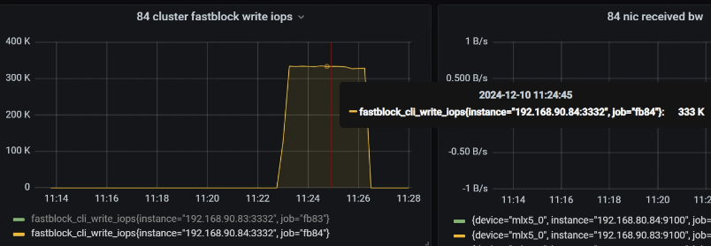
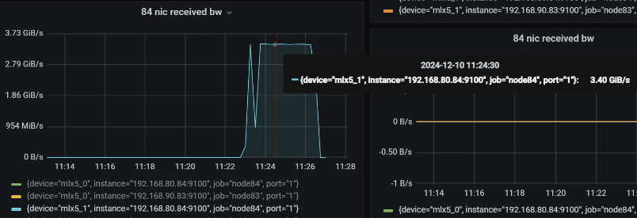
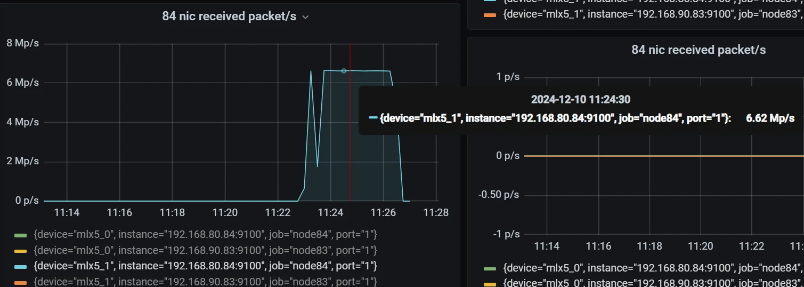

磁盘io：
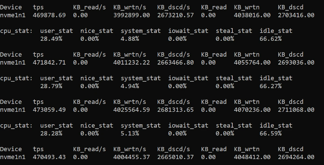

iops:
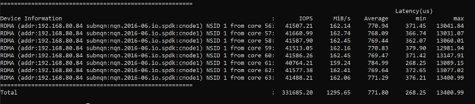

iops为33.2万，相对于block_bench的35.8万，损耗较小，损耗在于与nvmf_tgt之间的RDMA通信。

## 5.5  内核initiator连接nvmf-tgt导出磁盘测试
启动fastblock-nvmf-tgt 参考[5.3节spdk_nvmf_perf TCP测试](#link2)
fastblock-nvmf-tgt占用8个核

创建bdev设备，创建TCP transport，创建NVMe-oF子系统，向NVMe-oF子系统添加namespace，向NVMe-oF子系统添加TCP transport类
型的listener，方法参考[内核initiator连接nvmf-tgt导出磁盘](./nvmf_tgt.md)

加载nvme-tcp模块，发现nvme-of目标，连接nvme-of目标，方法参考[内核initiator连接nvmf-tgt导出磁盘](./nvmf_tgt.md)
通过nvme list可以看到多了一个磁盘

使用fio测试此磁盘：
```
fio -filename=/dev/nvme0n1 -direct=1 -iodepth=32 -thread -rw=randwrite -ioengine=libaio -bs=4096 -size=20G -numjobs=8 -runtime=120 -group_reporting -name=test
```

结果
网卡监控信息：
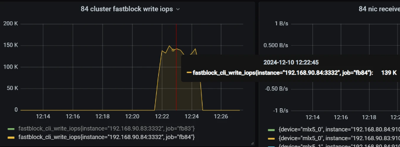
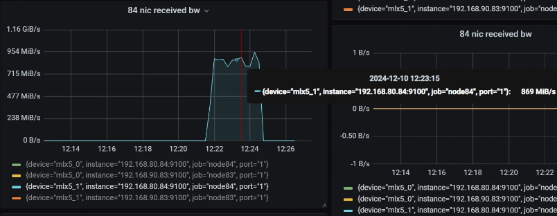
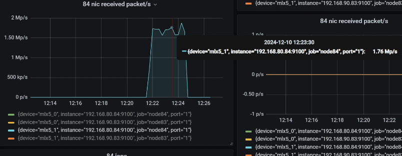

磁盘io：
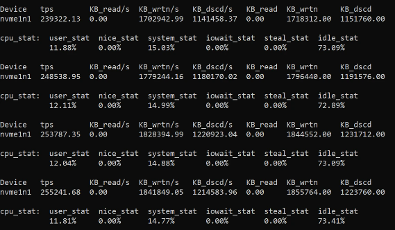

iops:
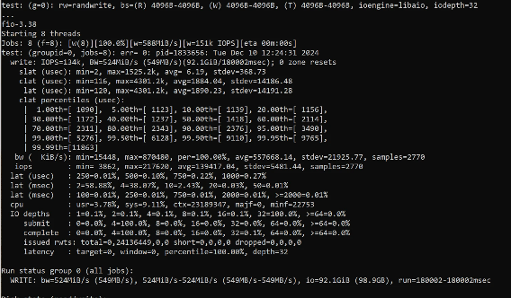

iops为13.4万，相对于block_bench的35.8万，损耗太大，损耗在于与nvmf_tgt之间的TCP通信、它经过内核、需要内核态和用户态切换。

# 6 4个osd，单副本场景测试
启动4个osd，创建一个单副本pool，方法参考[vhost对接qemu测试](qemu_vhost_test.md)

## 6.1  block_bench测试
block_bench配置参数：
```
  "io_type": "write",
  "io_size": 4096,
  "io_count": 50000000,
  "io_depth": 32,
```
block_bench使用12个核

结果 
网卡监控信息：
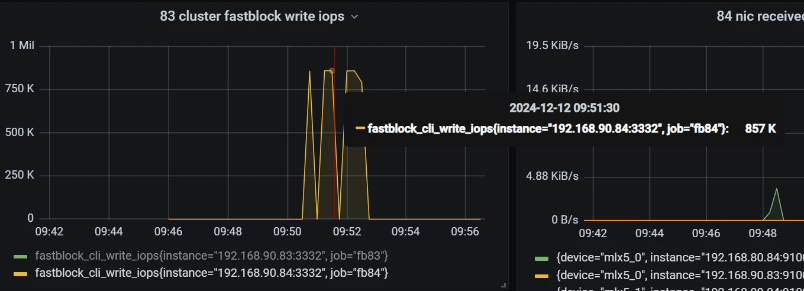
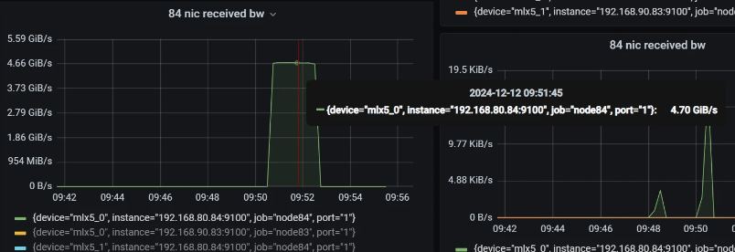
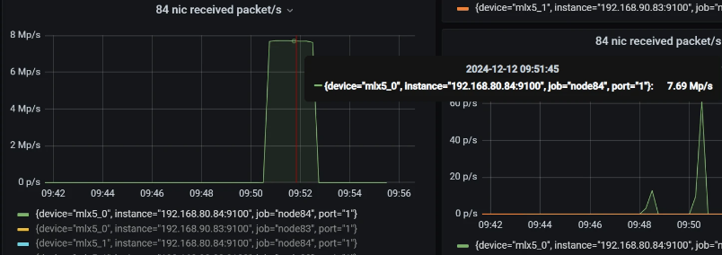 

磁盘io：  
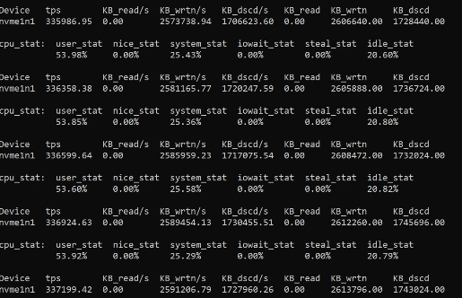
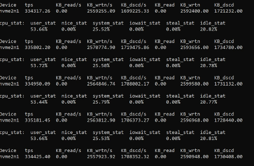
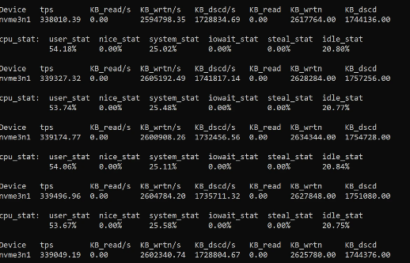
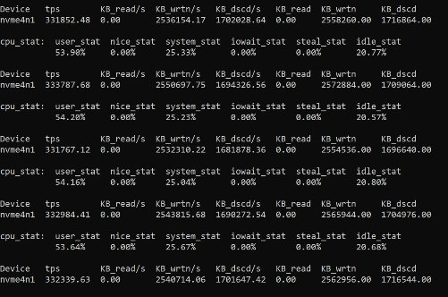

iops:
```
===============================[write latency]========================================
mean: 428.133us, p0.1: 333.36us, p0.5: 340.71us, p0.9: 341.34us, p0.95: 351.17us, p0.99: 351.79us, p0.999: 352.77us, iops: 816261, iops_dur_sec: 122.163s, total_io_count: 99716934
======================================================================================
```

iops为81.6万，网卡使用率已经很高。

## 6.2  虚拟机测试
启动fastblock-vhost，启动虚拟机的方法参考[5.2节虚拟机测试](#link1)
fastblock-vhost占用8个核

在虚拟机内部执行fio:
```
fio -direct=1 -iodepth=32 -thread -rw=randwrite -bs=4096 -numjobs=12 -runtime=120 -group_reporting -name=test -filename=/dev/vda -size=100G -ioengine=libaio -time_based
```

结果  
网卡监控信息：
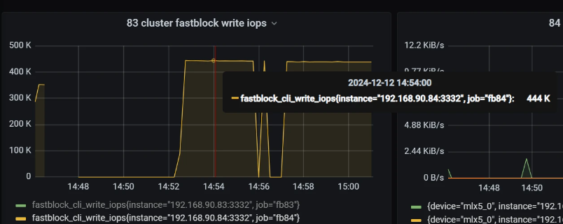
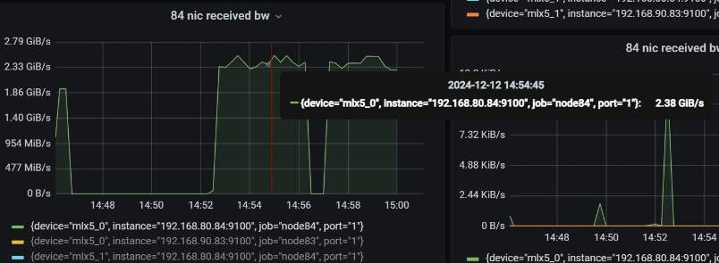
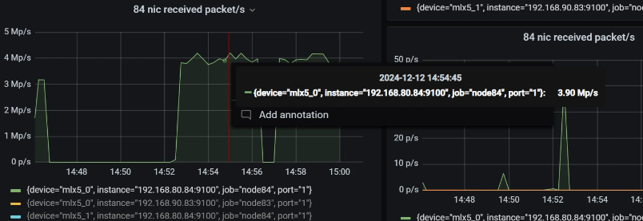

磁盘io：  
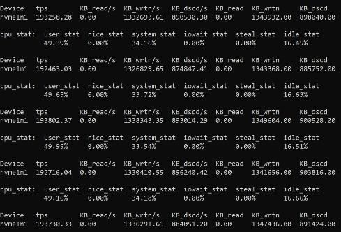 
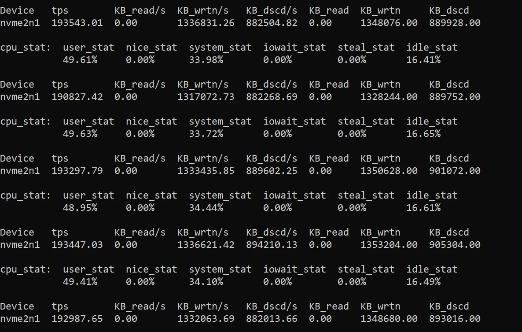
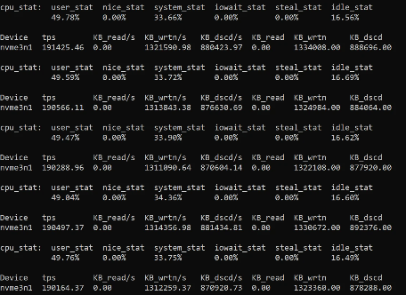
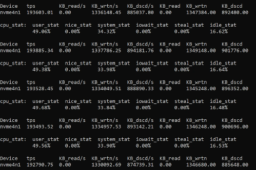

iops:
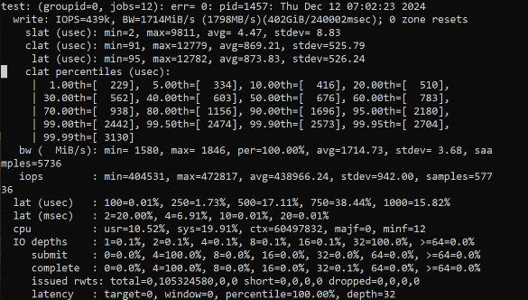

iops为42.9万，相对于block_bench的81.6万，相差较大，而另外两个场景下，只相差10%左右，需要进一步分析原因，有待优化。

## 6.3  spdk_nvmf_perf TCP测试
启动fastblock-nvmf-tgt的方法参考[5.3节spdk_nvmf_perf TCP测试](#link2)
fastblock-nvmf-tgt占用8个核

创建bdev设备，创建TCP transport，创建NVMe-oF子系统，向NVMe-oF子系统添加namespace，向NVMe-oF子系统添加TCP transport类型的listener，方法参考[内核initiator连接nvmf-tgt导出磁盘](./nvmf_tgt.md)

spdk_nvmf_perf测试：
```
spdk/build/bin/spdk_nvme_perf -q 32 -s 1024 -w randwrite -t 180 -c 0xff00000000000000 -o 4096 -r 'trtype:TCP adrfam:IPv4 traddr:192.168.80.84 trsvcid:4420'
```

结果  
网卡监控信息：
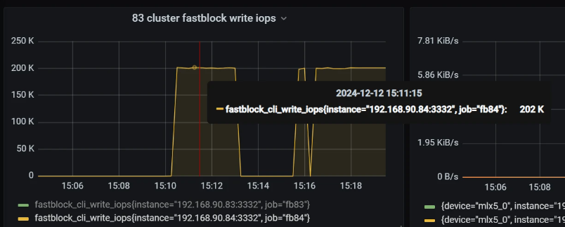
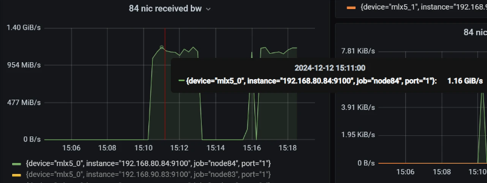
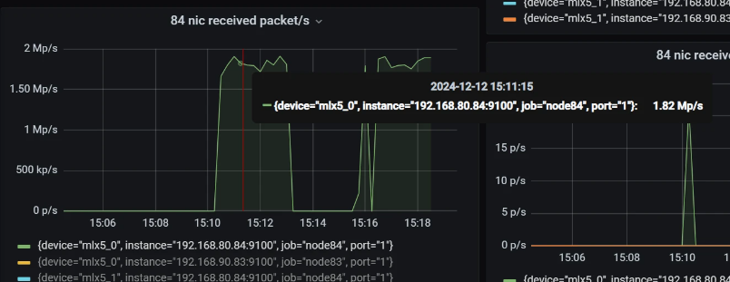

磁盘io：  
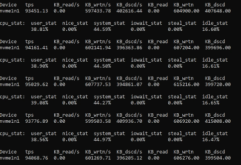  
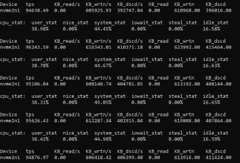   
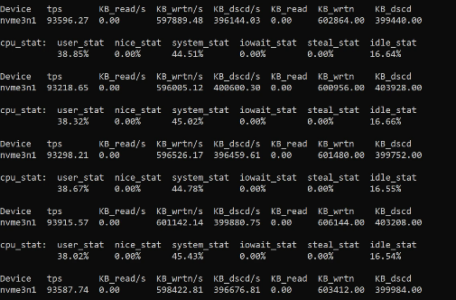   
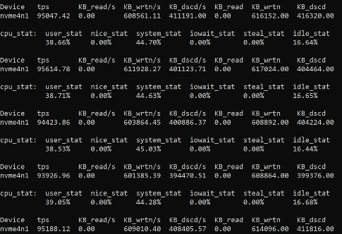  

iops:
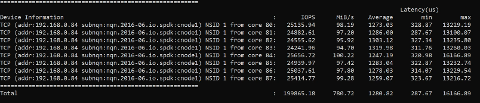

iops为20万，相对于block_bench的81.6万，相差太大，有待优化。

## 6.4  spdk_nvmf_perf RDMA测试
启动fastblock-nvmf-tgt的方法参考[5.3节spdk_nvmf_perf TCP测试](#link2)
fastblock-nvmf-tgt占用8个核

创建bdev设备，创建RDMA transport，创建NVMe-oF子系统，向NVMe-oF子系统添加namespace，向NVMe-oF子系统添加RDMA transport类型的listener，方法参考[内核initiator连接nvmf-tgt导出磁盘](./nvmf_tgt.md)

spdk_nvmf_perf测试：
```
spdk/build/bin/spdk_nvme_perf -q 32 -s 1024 -w randwrite -t 180 -c 0xfff00000000000000 -o 4096 -r 'trtype:RDMA adrfam:IPv4 traddr:192.168.80.84 trsvcid:4420'
```

结果  
网卡监控信息：
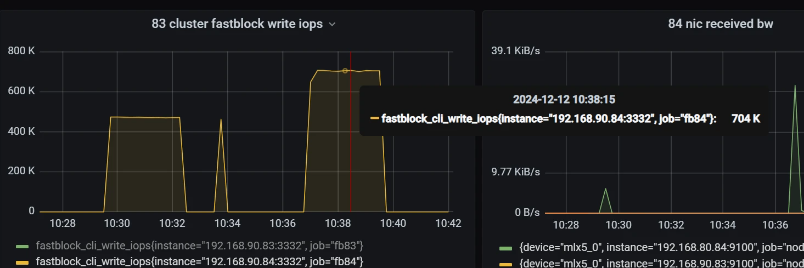 
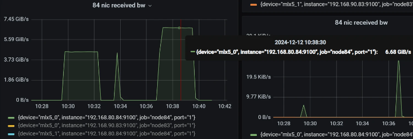 
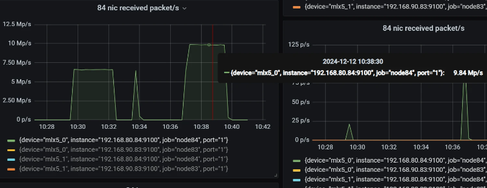 

磁盘io：  
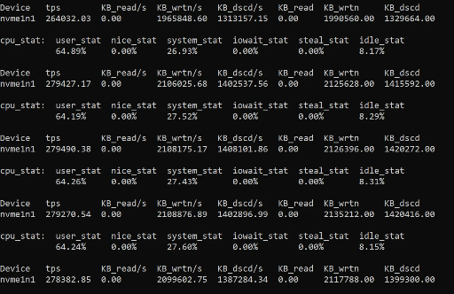  
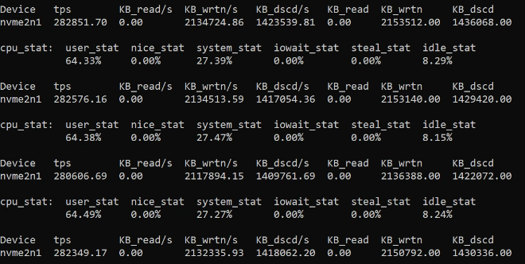  
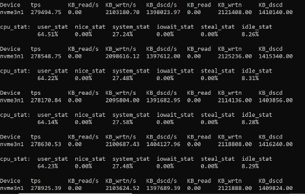  
   

iops:


iops为64万，相对于block_bench的81.6万，损耗相对较小，损耗在于与nvmf_tgt之间的RDMA通信。

## 6.5  内核initiator连接nvmf-tgt导出磁盘测试
启动fastblock-nvmf-tgt 参考[5.3节spdk_nvmf_perf TCP测试](#link2)
fastblock-nvmf-tgt占用8个核

创建bdev设备，创建TCP transport，创建NVMe-oF子系统，向NVMe-oF子系统添加namespace，向NVMe-oF子系统添加TCP transport类
型的listener，方法参考[内核initiator连接nvmf-tgt导出磁盘](./nvmf_tgt.md)

加载nvme-tcp模块，发现nvme-of目标，连接nvme-of目标，方法参考[内核initiator连接nvmf-tgt导出磁盘](./nvmf_tgt.md)
通过nvme list可以看到多了一个磁盘

使用fio测试此磁盘：
```
fio -filename=/dev/nvme0n1 -direct=1 -iodepth=32 -thread -rw=randwrite -ioengine=libaio -bs=4096 -size=20G -numjobs=12 -runtime=180 -group_reporting -name=test
```

结果  
网卡监控信息：
  
   
  

磁盘io：  
   
   
   
  

iops:


iops为13.4万，相对于block_bench的81.6万，相差太大，有待优化。

# 7 4个osd，三副本场景测试
启动4个osd，创建一个三副本pool，方法参考[vhost对接qemu测试](qemu_vhost_test.md)

## 7.1  block_bench测试
block_bench配置参数：
```
  "io_type": "write",
  "io_size": 4096,
  "io_depth": 32,
```

block_bench使用12个核
结果
网卡监控信息：


磁盘io：


iops:
```
===============================[write latency]========================================
mean: 1003.34us, p0.1: 305.54us, p0.5: 315.93us, p0.9: 340.62us, p0.95: 389.15us, p0.99: 407.48us, p0.999: 446.38us, iops: 349668, iops_dur_sec: 285.636s, total_io_count: 99877675
======================================================================================
```

iops为35万，因为只有一台物理测试服务器，三副本都在一台服务器上，如果3副本分布在三台服务器，iops会显著提高。

## 7.2  虚拟机测试
启动fastblock-vhost，启动虚拟机的方法参考[5.2节虚拟机测试](#link1)
fastblock-vhost占用8个核

在虚拟机内部执行fio:
```
fio -direct=1 -iodepth=32 -thread -rw=randwrite -bs=4096 -numjobs=12 -runtime=120 -group_reporting -name=test -filename=/dev/vda -size=100G -ioengine=libaio -time_based
```

结果  
网卡监控信息：


磁盘io：  
  
  
  
  

iops:


iops为31.2万，相对于block_bench的35万，因为虚拟机有虚拟机内部io开销和虚拟机与vhost通信开销，所以会有这10%的差距。


## 7.3  spdk_nvmf_perf TCP测试
启动fastblock-nvmf-tgt的方法参考[5.3节spdk_nvmf_perf TCP测试](#link2)
fastblock-nvmf-tgt占用8个核

创建bdev设备，创建TCP transport，创建NVMe-oF子系统，向NVMe-oF子系统添加namespace，向NVMe-oF子系统添加TCP transport类型的listener，方法参考[内核initiator连接nvmf-tgt导出磁盘](./nvmf_tgt.md)

spdk_nvmf_perf测试：
```
spdk/build/bin/spdk_nvme_perf -q 32 -s 1024 -w randwrite -t 180 -c 0xff00000000000000 -o 4096 -r 'trtype:TCP adrfam:IPv4 traddr:192.168.80.84 trsvcid:4420'
```

结果    
网卡监控信息： 


磁盘io：  
  
  
  
  

iops:


iops为20.4万，相对于block_bench的35万，差得比较多，这部分开销是它需要通过TCP网络把数据发送给nvmf_tgt。同时增加nvmf_tgt和spdk_nvme_perf使用的核数，也可以提高iops。

## 7.4  spdk_nvmf_perf RDMA测试
启动fastblock-nvmf-tgt的方法参考[5.3节spdk_nvmf_perf TCP测试](#link2)
fastblock-nvmf-tgt占用8个核

创建bdev设备，创建RDMA transport，创建NVMe-oF子系统，向NVMe-oF子系统添加namespace，向NVMe-oF子系统添加RDMA transport类型的listener，方法参考[内核initiator连接nvmf-tgt导出磁盘](./nvmf_tgt.md)

spdk_nvmf_perf测试：
```
spdk/build/bin/spdk_nvme_perf -q 32 -s 1024 -w randwrite -t 180 -c 0xfff00000000000000 -o 4096 -r 'trtype:RDMA adrfam:IPv4 traddr:192.168.80.84 trsvcid:4420'
```

结果    
网卡监控信息： 


磁盘io：  
  
  
  
  

iops:


iops为27.4万，相对于block_bench的35万，差了20%，这部分开销是它需要通过RDMA网络把数据发送给nvmf_tgt。

## 7.5  内核initiator连接nvmf-tgt导出磁盘测试
启动fastblock-nvmf-tgt 参考[5.3节spdk_nvmf_perf TCP测试](#link2)
fastblock-nvmf-tgt占用8个核

创建bdev设备，创建TCP transport，创建NVMe-oF子系统，向NVMe-oF子系统添加namespace，向NVMe-oF子系统添加TCP transport类
型的listener，方法参考[内核initiator连接nvmf-tgt导出磁盘](./nvmf_tgt.md)

加载nvme-tcp模块，发现nvme-of目标，连接nvme-of目标，方法参考[内核initiator连接nvmf-tgt导出磁盘](./nvmf_tgt.md)
通过nvme list可以看到多了一个磁盘

使用fio测试此磁盘：
```
fio -filename=/dev/nvme0n1 -direct=1 -iodepth=32 -thread -rw=randwrite -ioengine=libaio -bs=4096 -size=20G -numjobs=12 -runtime=120 -group_reporting -name=test
```

结果    
网卡监控信息：  


磁盘io：  
  
  
  
  

iops:


iops为10.6万，相对于block_bench的35万，差得更大了，这部分开销是它经过内核，需要内核态和用户态切换，同时需要通过TCP网络把数据发送给nvmf_tgt。

# 8 测试结果汇总

| 测试场景\测试方法  | block_bench |  虚拟机 fio | 内核initiator导出磁盘 fio | spdk_nvmf_perf TCP | spdk_nvmf_perf RDMA  | 
|------------------ |------------|-------------|--------------------------|--------------------|----------------------|
| 1个osd、1副本池    |  358235    |   321k      |           134K           |      183133        |      331685          |
| 4个osd、1副本池    |  816261    |   439K      |           134K           |      199865        |      641753          |
| 4个osd、3副本池    |  349668    |   312K      |           106K           |      203781        |      273759          |


从整体结果分析：
- 单副本的iops最高可达81.6万，3副本的iops最高可达35万
- 虚拟机和spdk_nvmf_perf RDMA的结果接近，损耗相对较小，但4个osd、1副本池场景下虚拟机fio结果差太多，需要进一步分析原因，有待优化
- spdk_nvmf_perf TCP和内核initiator导出磁盘 fio测试，性能太差，有待优化
- spdk_nvmf_perf RDMA结果明显优于spdk_nvmf_perf TCP，可知RDMA通信明显优于TCP通信
- 内核initiator导出磁盘 fio结果比spdk_nvmf_perf TCP差距挺大，可知io经过内核损耗挺大。
