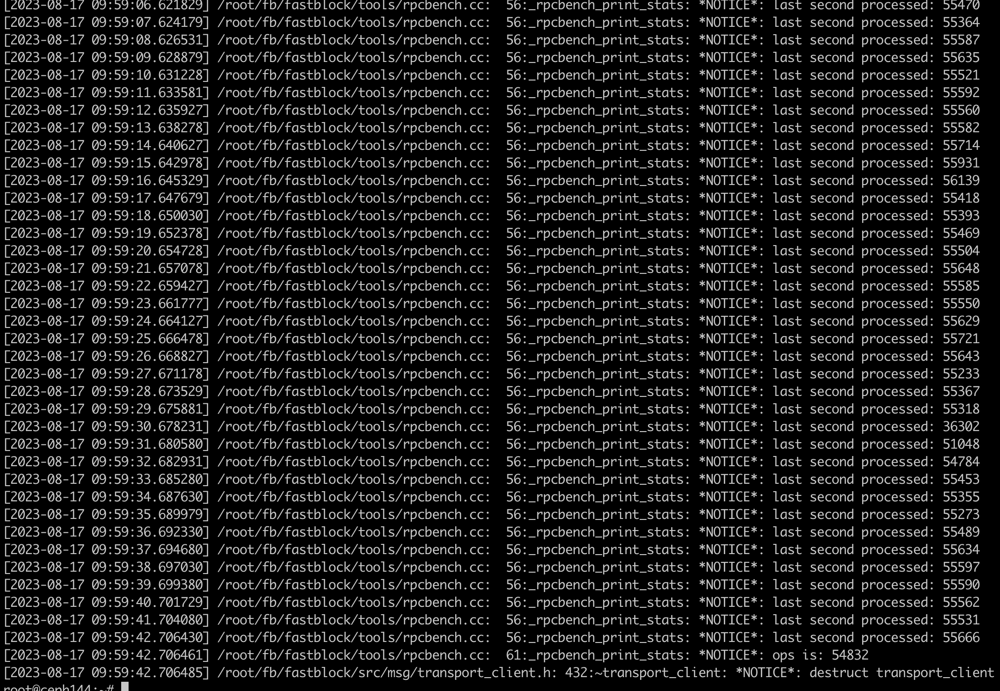

性能测试报告
# 测试环境
- commit hash: `f18a4f34e55fa67a9ecf3c04d2f1d7de31744d2c`, Release模式编译
- 服务器: 40核80线程，网卡25G支持RDMA，384G内存, CPU采用性能模式
- 磁盘：测试是采用3个P4510作为后端存储(仅启动三个osd), 采用spdk nvme用户态驱动
- 测试项: 单pg测试，分别测试了一副本、三副本下的opbench和一副本下的rpcbench, 本次重点关注ops，下一版本加入延迟分位统计
- 其它: 单pg测试时，所有进程都仅使用一个核，且是大核，避免使用同一个物理核上的两个线程。

# 测试脚本:
参考`tools/bench_singlepg.sh`进行修改，主要改动在于是使用aio bdev，而我们测试使用的是nvme bdev, 配置方式可参考src/osd/readme.md  

# 测试结果:
## 单PG的rpcbench:

结果为54832，本项测试的目标是测rpc的延迟，从而测出网络层的开销，从结果看，rpc这层开销为平均18.23微秒

## 单PG一副本的opbench:
```
root@ceph144:~/fb/fastblock/tools# opbench -o 172.31.77.144 -t 8003 -S 4096 -k 5  -m 8
[2023-08-17 11:02:13.717184] Starting SPDK v22.05.1-pre git sha1 58286b074 / DPDK 22.03.0 initialization...
[2023-08-17 11:02:13.717250] [ DPDK EAL parameters: [2023-08-17 11:02:13.717261] block [2023-08-17 11:02:13.717270] --no-shconf [2023-08-17 11:02:13.717277] -c 8 [2023-08-17 11:02:13.717285] --huge-unlink [2023-08-17 11:02:13.717292] --log-level=lib.eal:6 [2023-08-17 11:02:13.717300] --log-level=lib.cryptodev:5 [2023-08-17 11:02:13.717308] --log-level=user1:6 [2023-08-17 11:02:13.717316] --iova-mode=pa [2023-08-17 11:02:13.717324] --base-virtaddr=0x200000000000 [2023-08-17 11:02:13.717332] --match-allocations [2023-08-17 11:02:13.717339] --file-prefix=spdk_pid93060 [2023-08-17 11:02:13.717348] ]
TELEMETRY: No legacy callbacks, legacy socket not created
[2023-08-17 11:02:13.774284] app.c: 603:spdk_app_start: *NOTICE*: Total cores available: 1
[2023-08-17 11:02:13.918386] reactor.c: 947:reactor_run: *NOTICE*: Reactor started on core 3
[2023-08-17 11:02:13.918456] accel_engine.c: 969:sw_accel_engine_init: *NOTICE*: Accel framework software engine initialized.
[2023-08-17 11:02:13.964273] rpc.c: 185:spdk_rpc_listen: *ERROR*: RPC Unix domain socket path /var/tmp/spdk.sock in use. Specify another.
[2023-08-17 11:02:13.964339] rpc.c:  70:spdk_rpc_initialize: *ERROR*: Unable to start RPC service at /var/tmp/spdk.sock
[2023-08-17 11:02:13.964353] /root/fb/fastblock/tools/opbench.cc:  79:block_started: *NOTICE*: ------block start, cpu count : 1
[2023-08-17 11:02:13.964367] /root/fb/fastblock/src/msg/transport_client.h: 420:transport_client: *NOTICE*: construct transport_client, this is 0x559fe7346990
[2023-08-17 11:02:14.003535] /root/fb/fastblock/src/msg/transport_client.h: 467:start: *NOTICE*: Construct a new ctrlr = 0x559fe7346bc0, a new poll group = 0x559fe734b240
[2023-08-17 11:02:14.003588] /root/fb/fastblock/tools/opbench.h:  86:create_connect: *NOTICE*: create connect to node 0 (address 172.31.77.144, port 8003) in core 3
[2023-08-17 11:02:14.003600] /root/fb/fastblock/src/msg/transport_client.h: 171:connect: *NOTICE*: Connecting to 172.31.77.144:8003...
[2023-08-17 11:02:14.004208] client.c: 521:spdk_client_ctrlr_alloc_io_qpair_async: *NOTICE*: spdk_client_ctrlr_alloc_io_qpair : io_queue_size 128
[2023-08-17 11:02:14.004225] rdma_c.c:2385:client_rdma_ctrlr_create_io_qpair: *NOTICE*: client_rdma_ctrlr_create_io_qpair io_queue_size: 128 io_queue_requests: 4096
[2023-08-17 11:02:14.004551] rdma_c.c:2127:client_rdma_ctrlr_create_qpair: *NOTICE*: client_rdma_ctrlr_create_qpair num_entries: 128
[2023-08-17 11:02:14.006824] /root/fb/fastblock/src/msg/transport_client.h: 191:connect: *NOTICE*: Conneting to 172.31.77.144:8003 done, conn is 0x559fe734e070, ctrlr is 0x559fe7346bc0, group is 0x559fe734b240
[2023-08-17 11:02:14.006850] /root/fb/fastblock/src/msg/transport_client.h: 486:emplace_connection: *NOTICE*: Connecting to 172.31.77.144:8003
[2023-08-17 11:02:14.019165] rdma_c.c: 589:client_rdma_qpair_process_cm_event: *NOTICE*: client_rdma_qpair_process_cm_event num_entries before: 128
[2023-08-17 11:02:14.019190] rdma_c.c: 593:client_rdma_qpair_process_cm_event: *NOTICE*: client_rdma_qpair_process_cm_event num_entries: 128 128
[2023-08-17 11:02:14.019201] rdma_c.c:1271:client_rdma_register_reqs: *NOTICE*: client_rdma_register_reqs: 128
[2023-08-17 11:02:14.966721] /root/fb/fastblock/tools/opbench.cc:  61:print_stats: *NOTICE*: last second processed: 14110
[2023-08-17 11:02:15.969057] /root/fb/fastblock/tools/opbench.cc:  61:print_stats: *NOTICE*: last second processed: 15178
[2023-08-17 11:02:16.971409] /root/fb/fastblock/tools/opbench.cc:  61:print_stats: *NOTICE*: last second processed: 15024
[2023-08-17 11:02:17.973756] /root/fb/fastblock/tools/opbench.cc:  61:print_stats: *NOTICE*: last second processed: 15149
[2023-08-17 11:02:18.976106] /root/fb/fastblock/tools/opbench.cc:  61:print_stats: *NOTICE*: last second processed: 15041
[2023-08-17 11:02:18.976152] /root/fb/fastblock/tools/opbench.cc:  65:print_stats: *NOTICE*: ops is: 14900
[2023-08-17 11:02:18.976176] /root/fb/fastblock/src/msg/transport_client.h: 432:~transport_client: *NOTICE*: destruct transport_client

```
结果为14900，叠加localstore和rpc开销后，平均延迟为:67.11微秒

## 单PG三副本的opbench:
```
root@ceph144:~/fb/fastblock# opbench -o 172.31.77.144 -t 8001 -S 4096 -k 10 -m 0x8
[2023-08-17 11:22:09.485788] Starting SPDK v22.05.1-pre git sha1 58286b074 / DPDK 22.03.0 initialization...
[2023-08-17 11:22:09.485833] [ DPDK EAL parameters: [2023-08-17 11:22:09.485847] block [2023-08-17 11:22:09.485855] --no-shconf [2023-08-17 11:22:09.485862] -c 0x8 [2023-08-17 11:22:09.485868] --huge-unlink [2023-08-17 11:22:09.485875] --log-level=lib.eal:6 [2023-08-17 11:22:09.485883] --log-level=lib.cryptodev:5 [2023-08-17 11:22:09.485890] --log-level=user1:6 [2023-08-17 11:22:09.485899] --iova-mode=pa [2023-08-17 11:22:09.485906] --base-virtaddr=0x200000000000 [2023-08-17 11:22:09.485914] --match-allocations [2023-08-17 11:22:09.485921] --file-prefix=spdk_pid96427 [2023-08-17 11:22:09.485930] ]
TELEMETRY: No legacy callbacks, legacy socket not created
[2023-08-17 11:22:09.539890] app.c: 603:spdk_app_start: *NOTICE*: Total cores available: 1
[2023-08-17 11:22:09.684495] reactor.c: 947:reactor_run: *NOTICE*: Reactor started on core 3
[2023-08-17 11:22:09.684556] accel_engine.c: 969:sw_accel_engine_init: *NOTICE*: Accel framework software engine initialized.
[2023-08-17 11:22:09.729296] rpc.c: 185:spdk_rpc_listen: *ERROR*: RPC Unix domain socket path /var/tmp/spdk.sock in use. Specify another.
[2023-08-17 11:22:09.729348] rpc.c:  70:spdk_rpc_initialize: *ERROR*: Unable to start RPC service at /var/tmp/spdk.sock
[2023-08-17 11:22:09.729362] /root/fb/fastblock/tools/opbench.cc:  79:block_started: *NOTICE*: ------block start, cpu count : 1
[2023-08-17 11:22:09.729373] /root/fb/fastblock/src/msg/transport_client.h: 420:transport_client: *NOTICE*: construct transport_client, this is 0x55c9f53e5bd0
[2023-08-17 11:22:09.766977] /root/fb/fastblock/src/msg/transport_client.h: 467:start: *NOTICE*: Construct a new ctrlr = 0x55c9f53e5e00, a new poll group = 0x55c9f53ea480
[2023-08-17 11:22:09.767023] /root/fb/fastblock/tools/opbench.h:  86:create_connect: *NOTICE*: create connect to node 0 (address 172.31.77.144, port 8001) in core 3
[2023-08-17 11:22:09.767035] /root/fb/fastblock/src/msg/transport_client.h: 171:connect: *NOTICE*: Connecting to 172.31.77.144:8001...
[2023-08-17 11:22:09.767076] client.c: 521:spdk_client_ctrlr_alloc_io_qpair_async: *NOTICE*: spdk_client_ctrlr_alloc_io_qpair : io_queue_size 128
[2023-08-17 11:22:09.767089] rdma_c.c:2385:client_rdma_ctrlr_create_io_qpair: *NOTICE*: client_rdma_ctrlr_create_io_qpair io_queue_size: 128 io_queue_requests: 4096
[2023-08-17 11:22:09.767330] rdma_c.c:2127:client_rdma_ctrlr_create_qpair: *NOTICE*: client_rdma_ctrlr_create_qpair num_entries: 128
[2023-08-17 11:22:09.769474] /root/fb/fastblock/src/msg/transport_client.h: 191:connect: *NOTICE*: Conneting to 172.31.77.144:8001 done, conn is 0x55c9f53ed2b0, ctrlr is 0x55c9f53e5e00, group is 0x55c9f53ea480
[2023-08-17 11:22:09.769499] /root/fb/fastblock/src/msg/transport_client.h: 486:emplace_connection: *NOTICE*: Connecting to 172.31.77.144:8001
[2023-08-17 11:22:09.782948] rdma_c.c: 589:client_rdma_qpair_process_cm_event: *NOTICE*: client_rdma_qpair_process_cm_event num_entries before: 128
[2023-08-17 11:22:09.782974] rdma_c.c: 593:client_rdma_qpair_process_cm_event: *NOTICE*: client_rdma_qpair_process_cm_event num_entries: 128 128
[2023-08-17 11:22:09.782984] rdma_c.c:1271:client_rdma_register_reqs: *NOTICE*: client_rdma_register_reqs: 128
[2023-08-17 11:22:10.731716] /root/fb/fastblock/tools/opbench.cc:  61:print_stats: *NOTICE*: last second processed: 4940
[2023-08-17 11:22:11.734063] /root/fb/fastblock/tools/opbench.cc:  61:print_stats: *NOTICE*: last second processed: 5225
[2023-08-17 11:22:12.736416] /root/fb/fastblock/tools/opbench.cc:  61:print_stats: *NOTICE*: last second processed: 5243
[2023-08-17 11:22:13.738764] /root/fb/fastblock/tools/opbench.cc:  61:print_stats: *NOTICE*: last second processed: 5263
[2023-08-17 11:22:14.741113] /root/fb/fastblock/tools/opbench.cc:  61:print_stats: *NOTICE*: last second processed: 5245
[2023-08-17 11:22:15.743467] /root/fb/fastblock/tools/opbench.cc:  61:print_stats: *NOTICE*: last second processed: 5284
[2023-08-17 11:22:16.745813] /root/fb/fastblock/tools/opbench.cc:  61:print_stats: *NOTICE*: last second processed: 5285
[2023-08-17 11:22:17.748163] /root/fb/fastblock/tools/opbench.cc:  61:print_stats: *NOTICE*: last second processed: 5243
[2023-08-17 11:22:18.750515] /root/fb/fastblock/tools/opbench.cc:  61:print_stats: *NOTICE*: last second processed: 5261
[2023-08-17 11:22:19.752862] /root/fb/fastblock/tools/opbench.cc:  61:print_stats: *NOTICE*: last second processed: 5229
[2023-08-17 11:22:19.752897] /root/fb/fastblock/tools/opbench.cc:  65:print_stats: *NOTICE*: ops is: 5221
[2023-08-17 11:22:19.752910] /root/fb/fastblock/src/msg/transport_client.h: 432:~transport_client: *NOTICE*: destruct transport_client
```
结果为5221，平均延迟为:191.53微秒
