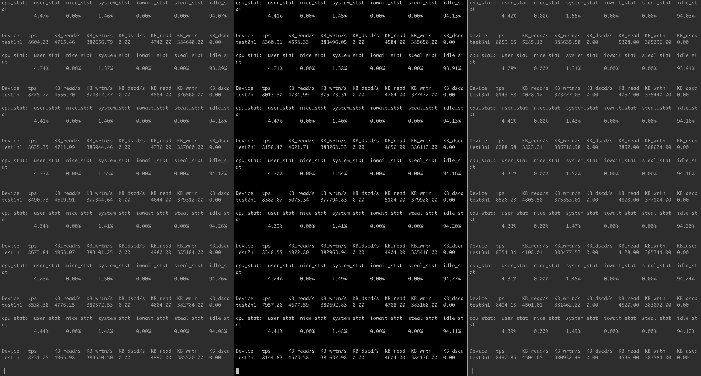
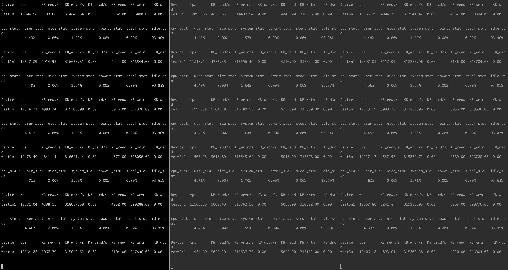
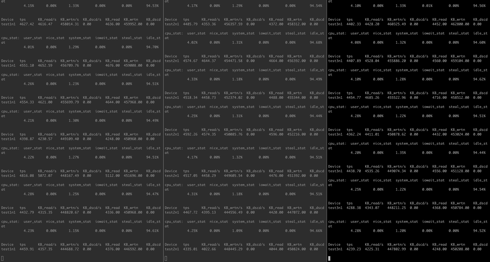

性能测试报告
# 测试环境
- commit hash: `ccc4dc89aee076aad7dc5bdfa8458ecf5e75b873`, Release模式编译
- 服务器: 40核80线程，网卡25G支持RDMA，384G内存, CPU采用性能模式
- 磁盘：测试是采用3个P4510作为后端存储(仅启动三个osd), 采用spdk nvme用户态驱动和aio bdev分别进行测试
- 测试项: 单pg测试，分别测试了一副本、二副本和三副本下的fbbench的write和rpc，以及一副本下的fbbench的rpc测试, 另外benchmark工具也能够控制写同一个对象还是不通对象，且能够展示ops、平均延迟和延迟分位统计
- 重大变更事项: 相比8.17测试报告，本次最大变更时对关键路径上的SPDK_NOTICELOG进行了注释，因为测试结果表明，这些注释对性能有超乎想象的影响, rsyslog体系会成为重大性能瓶颈
- 支持Queue Depth: 新版本fbbench支持设置QD，以便提高系统吞吐
- 其它: 测试时，所有进程都仅使用一个核，且是大核，避免使用同一个物理核上的两个线程
- 其它：因目前raft log回收存在bug，此次测试时因iops较高会导致raft log空间不够用，所以修改了raft log的size为100GB
- 其它：可使用spdk的iostat.py脚本监控被spdk接管的nvme盘

# 测试脚本:
参考`tools/bench_singlepg.sh`进行修改，适配aio bdev和nvme bdev, 并支持1、2、3副本测试, 配置方式可参考src/osd/readme.md  

# 测试结果:
## 单PG的fbbench的rpc测试, QD=1:
```
root@ceph144:~/fb/fastblock/build/tools# ./fbbench -o 172.31.77.144 -t 8001 -S 4096 -k 30 -m 0x8 -T rpc
[2023-08-29 14:57:10.851857] Starting SPDK v22.05 git sha1 395c61a42 / DPDK 21.08.0 initialization...
[2023-08-29 14:57:10.851987] [ DPDK EAL parameters: [2023-08-29 14:57:10.852017] fbbench [2023-08-29 14:57:10.852041] --no-shconf [2023-08-29 14:57:10.852061] -c 0x8 [2023-08-29 14:57:10.852082] --huge-unlink [2023-08-29 14:57:10.852104] --log-level=lib.eal:6 [2023-08-29 14:57:10.852138] --log-level=lib.cryptodev:5 [2023-08-29 14:57:10.852159] --log-level=user1:6 [2023-08-29 14:57:10.852178] --iova-mode=pa [2023-08-29 14:57:10.852201] --base-virtaddr=0x200000000000 [2023-08-29 14:57:10.852222] --match-allocations [2023-08-29 14:57:10.852243] --file-prefix=spdk_pid2750062 [2023-08-29 14:57:10.852266] ]
EAL: No free 2048 kB hugepages reported on node 1
EAL: No available 1048576 kB hugepages reported
TELEMETRY: No legacy callbacks, legacy socket not created
[2023-08-29 14:57:10.941601] app.c: 607:spdk_app_start: *NOTICE*:
[2023-08-29 14:57:10.941632] app.c: 608:spdk_app_start: *NOTICE*: Total cores available: 1
[2023-08-29 14:57:11.090814] reactor.c: 947:reactor_run: *NOTICE*: Reactor started on core 3
[2023-08-29 14:57:11.090892] accel_engine.c: 969:sw_accel_engine_init: *NOTICE*: Accel framework software engine initialized.
[2023-08-29 14:57:11.136549] /root/fb/fastblock/tools/fbbench.cc:  92:fbbench_started: *NOTICE*: ------block start, cpu count : 1
[2023-08-29 14:57:11.136605] /root/fb/fastblock/src/msg/transport_client.h: 422:transport_client: *NOTICE*: construct transport_client, this is 0x55cf27925b40
[2023-08-29 14:57:11.155680] /root/fb/fastblock/src/msg/transport_client.h: 469:start: *NOTICE*: Construct a new ctrlr = 0x55cf27ea1b20, a new poll group = 0x55cf27ea1ef0
[2023-08-29 14:57:11.155741] /root/fb/fastblock/tools/fbbench.h:  93:create_connect: *NOTICE*: create connect to node 0 (address 172.31.77.144, port 8001) in core 3
[2023-08-29 14:57:11.155756] /root/fb/fastblock/src/msg/transport_client.h: 171:connect: *NOTICE*: Connecting to 172.31.77.144:8001...
[2023-08-29 14:57:11.155797] client.c: 454:spdk_client_ctrlr_alloc_io_qpair_async: *NOTICE*: spdk_client_ctrlr_alloc_io_qpair : io_queue_size 128
[2023-08-29 14:57:11.155811] rdma_c.c:2304:client_rdma_ctrlr_create_io_qpair: *NOTICE*: client_rdma_ctrlr_create_io_qpair io_queue_size: 128 io_queue_requests: 4096
[2023-08-29 14:57:11.156137] rdma_c.c:2046:client_rdma_ctrlr_create_qpair: *NOTICE*: client_rdma_ctrlr_create_qpair num_entries: 128
[2023-08-29 14:57:11.158539] /root/fb/fastblock/src/msg/transport_client.h: 191:connect: *NOTICE*: Conneting to 172.31.77.144:8001 done, conn is 0x55cf27faf380, ctrlr is 0x55cf27ea1b20, group is 0x55cf27ea1ef0
[2023-08-29 14:57:11.158565] /root/fb/fastblock/src/msg/transport_client.h: 488:emplace_connection: *NOTICE*: Connecting to 172.31.77.144:8001
[2023-08-29 14:57:11.169899] rdma_c.c: 574:client_rdma_qpair_process_cm_event: *NOTICE*: client_rdma_qpair_process_cm_event num_entries before: 128
[2023-08-29 14:57:11.169931] rdma_c.c: 578:client_rdma_qpair_process_cm_event: *NOTICE*: client_rdma_qpair_process_cm_event num_entries: 128 128
[2023-08-29 14:57:11.169942] rdma_c.c:1226:client_rdma_register_reqs: *NOTICE*: client_rdma_register_reqs: 128
[2023-08-29 14:57:12.138883] /root/fb/fastblock/tools/fbbench.cc:  66:print_stats: *NOTICE*: last second processed: 86153
[2023-08-29 14:57:13.141239] /root/fb/fastblock/tools/fbbench.cc:  66:print_stats: *NOTICE*: last second processed: 89376
[2023-08-29 14:57:14.143583] /root/fb/fastblock/tools/fbbench.cc:  66:print_stats: *NOTICE*: last second processed: 89523
[2023-08-29 14:57:15.145935] /root/fb/fastblock/tools/fbbench.cc:  66:print_stats: *NOTICE*: last second processed: 89314
[2023-08-29 14:57:16.148283] /root/fb/fastblock/tools/fbbench.cc:  66:print_stats: *NOTICE*: last second processed: 89407
[2023-08-29 14:57:17.150633] /root/fb/fastblock/tools/fbbench.cc:  66:print_stats: *NOTICE*: last second processed: 89215
[2023-08-29 14:57:18.152988] /root/fb/fastblock/tools/fbbench.cc:  66:print_stats: *NOTICE*: last second processed: 88776
[2023-08-29 14:57:19.155337] /root/fb/fastblock/tools/fbbench.cc:  66:print_stats: *NOTICE*: last second processed: 89261
[2023-08-29 14:57:20.157687] /root/fb/fastblock/tools/fbbench.cc:  66:print_stats: *NOTICE*: last second processed: 89406
[2023-08-29 14:57:21.160038] /root/fb/fastblock/tools/fbbench.cc:  66:print_stats: *NOTICE*: last second processed: 88855
[2023-08-29 14:57:22.162387] /root/fb/fastblock/tools/fbbench.cc:  66:print_stats: *NOTICE*: last second processed: 89188
[2023-08-29 14:57:23.164738] /root/fb/fastblock/tools/fbbench.cc:  66:print_stats: *NOTICE*: last second processed: 89245
[2023-08-29 14:57:24.167087] /root/fb/fastblock/tools/fbbench.cc:  66:print_stats: *NOTICE*: last second processed: 89232
[2023-08-29 14:57:25.169437] /root/fb/fastblock/tools/fbbench.cc:  66:print_stats: *NOTICE*: last second processed: 89278
[2023-08-29 14:57:26.171790] /root/fb/fastblock/tools/fbbench.cc:  66:print_stats: *NOTICE*: last second processed: 88914
[2023-08-29 14:57:27.174137] /root/fb/fastblock/tools/fbbench.cc:  66:print_stats: *NOTICE*: last second processed: 89303
[2023-08-29 14:57:28.176488] /root/fb/fastblock/tools/fbbench.cc:  66:print_stats: *NOTICE*: last second processed: 89411
[2023-08-29 14:57:29.178837] /root/fb/fastblock/tools/fbbench.cc:  66:print_stats: *NOTICE*: last second processed: 89418
[2023-08-29 14:57:30.181188] /root/fb/fastblock/tools/fbbench.cc:  66:print_stats: *NOTICE*: last second processed: 89012
[2023-08-29 14:57:31.183539] /root/fb/fastblock/tools/fbbench.cc:  66:print_stats: *NOTICE*: last second processed: 89332
[2023-08-29 14:57:32.185888] /root/fb/fastblock/tools/fbbench.cc:  66:print_stats: *NOTICE*: last second processed: 89477
[2023-08-29 14:57:33.188239] /root/fb/fastblock/tools/fbbench.cc:  66:print_stats: *NOTICE*: last second processed: 89424
[2023-08-29 14:57:34.190589] /root/fb/fastblock/tools/fbbench.cc:  66:print_stats: *NOTICE*: last second processed: 89334
[2023-08-29 14:57:35.192940] /root/fb/fastblock/tools/fbbench.cc:  66:print_stats: *NOTICE*: last second processed: 89583
[2023-08-29 14:57:36.195290] /root/fb/fastblock/tools/fbbench.cc:  66:print_stats: *NOTICE*: last second processed: 89478
[2023-08-29 14:57:37.197641] /root/fb/fastblock/tools/fbbench.cc:  66:print_stats: *NOTICE*: last second processed: 89333
[2023-08-29 14:57:38.199991] /root/fb/fastblock/tools/fbbench.cc:  66:print_stats: *NOTICE*: last second processed: 89442
[2023-08-29 14:57:39.202344] /root/fb/fastblock/tools/fbbench.cc:  66:print_stats: *NOTICE*: last second processed: 89256
[2023-08-29 14:57:40.204692] /root/fb/fastblock/tools/fbbench.cc:  66:print_stats: *NOTICE*: last second processed: 89356
[2023-08-29 14:57:41.207042] /root/fb/fastblock/tools/fbbench.cc:  66:print_stats: *NOTICE*: last second processed: 89183
ops is: 89182, average latency is 11.213025us
latency histogram: min:10.000000us 10.000000%:10.727619us 50.000000%:11.032381us 90.000000%:11.702857us 95.000000%:12.007619us 99.000000%:13.287619us 99.900000%:16.822857us max:10163.000000us
[2023-08-29 14:57:41.207180] /root/fb/fastblock/src/msg/transport_client.h: 434:~transport_client: *NOTICE*: destruct transport_client
```
相比8.17版本，本版本的延迟从18us降低到11.2us，ops从54832提升到了89192，iops提升了62%.

## 单PG的fbbench的rpc测试, QD=8:
```
root@ceph144:~# /root/fb/fastblock/build/tools/fbbench -o 172.31.77.144 -t 8001 -S 4096 -k 10 -m 0x8 -T rpc -Q 8
[2023-08-30 18:08:59.800269] Starting SPDK v22.05.1-pre git sha1 58286b074 / DPDK 22.03.0 initialization...
[2023-08-30 18:08:59.800383] [ DPDK EAL parameters: [2023-08-30 18:08:59.800408] fbbench [2023-08-30 18:08:59.800428] --no-shconf [2023-08-30 18:08:59.800447] -c 0x8 [2023-08-30 18:08:59.800464] --huge-unlink [2023-08-30 18:08:59.800481] --log-level=lib.eal:6 [2023-08-30 18:08:59.800498] --log-level=lib.cryptodev:5 [2023-08-30 18:08:59.800515] --log-level=user1:6 [2023-08-30 18:08:59.800533] --iova-mode=pa [2023-08-30 18:08:59.800550] --base-virtaddr=0x200000000000 [2023-08-30 18:08:59.800569] --match-allocations [2023-08-30 18:08:59.800588] --file-prefix=spdk_pid2866496 [2023-08-30 18:08:59.800605] ]
EAL: No free 2048 kB hugepages reported on node 1
TELEMETRY: No legacy callbacks, legacy socket not created
[2023-08-30 18:08:59.883568] app.c: 603:spdk_app_start: *NOTICE*: Total cores available: 1
[2023-08-30 18:09:00.029867] reactor.c: 947:reactor_run: *NOTICE*: Reactor started on core 3
[2023-08-30 18:09:00.029945] accel_engine.c: 969:sw_accel_engine_init: *NOTICE*: Accel framework software engine initialized.
[2023-08-30 18:09:00.075737] /root/fb/fastblock/tools/fbbench.cc:  97:fbbench_started: *NOTICE*: ------block start, cpu count : 1
[2023-08-30 18:09:00.075787] /root/fb/fastblock/src/msg/transport_client.h: 422:transport_client: *NOTICE*: construct transport_client, this is 0x55d972a315a0
[2023-08-30 18:09:00.118810] /root/fb/fastblock/src/msg/transport_client.h: 469:start: *NOTICE*: Construct a new ctrlr = 0x55d972a317d0, a new poll group = 0x55d972a35e00
[2023-08-30 18:09:00.118880] /root/fb/fastblock/tools/fbbench.h:  94:create_connect: *NOTICE*: create connect to node 0 (address 172.31.77.144, port 8001) in core 3
[2023-08-30 18:09:00.118901] /root/fb/fastblock/src/msg/transport_client.h: 171:connect: *NOTICE*: Connecting to 172.31.77.144:8001...
[2023-08-30 18:09:00.118953] client.c: 521:spdk_client_ctrlr_alloc_io_qpair_async: *NOTICE*: spdk_client_ctrlr_alloc_io_qpair : io_queue_size 128
[2023-08-30 18:09:00.118973] rdma_c.c:2385:client_rdma_ctrlr_create_io_qpair: *NOTICE*: client_rdma_ctrlr_create_io_qpair io_queue_size: 128 io_queue_requests: 4096
[2023-08-30 18:09:00.119365] rdma_c.c:2127:client_rdma_ctrlr_create_qpair: *NOTICE*: client_rdma_ctrlr_create_qpair num_entries: 128
[2023-08-30 18:09:00.122392] /root/fb/fastblock/src/msg/transport_client.h: 191:connect: *NOTICE*: Conneting to 172.31.77.144:8001 done, conn is 0x55d972a38c30, ctrlr is 0x55d972a317d0, group is 0x55d972a35e00
[2023-08-30 18:09:00.122425] /root/fb/fastblock/src/msg/transport_client.h: 488:emplace_connection: *NOTICE*: Connecting to 172.31.77.144:8001
[2023-08-30 18:09:00.138925] rdma_c.c: 589:client_rdma_qpair_process_cm_event: *NOTICE*: client_rdma_qpair_process_cm_event num_entries before: 128
[2023-08-30 18:09:00.138966] rdma_c.c: 593:client_rdma_qpair_process_cm_event: *NOTICE*: client_rdma_qpair_process_cm_event num_entries: 128 128
[2023-08-30 18:09:00.138983] rdma_c.c:1271:client_rdma_register_reqs: *NOTICE*: client_rdma_register_reqs: 128
[2023-08-30 18:09:01.078086] /root/fb/fastblock/tools/fbbench.cc:  71:print_stats: *NOTICE*: last second processed: 284937
[2023-08-30 18:09:02.080451] /root/fb/fastblock/tools/fbbench.cc:  71:print_stats: *NOTICE*: last second processed: 305072
[2023-08-30 18:09:03.082816] /root/fb/fastblock/tools/fbbench.cc:  71:print_stats: *NOTICE*: last second processed: 301720
[2023-08-30 18:09:04.085179] /root/fb/fastblock/tools/fbbench.cc:  71:print_stats: *NOTICE*: last second processed: 305753
[2023-08-30 18:09:05.087546] /root/fb/fastblock/tools/fbbench.cc:  71:print_stats: *NOTICE*: last second processed: 304907
[2023-08-30 18:09:06.089914] /root/fb/fastblock/tools/fbbench.cc:  71:print_stats: *NOTICE*: last second processed: 302142
[2023-08-30 18:09:07.092276] /root/fb/fastblock/tools/fbbench.cc:  71:print_stats: *NOTICE*: last second processed: 302723
[2023-08-30 18:09:08.094641] /root/fb/fastblock/tools/fbbench.cc:  71:print_stats: *NOTICE*: last second processed: 302193
[2023-08-30 18:09:09.097007] /root/fb/fastblock/tools/fbbench.cc:  71:print_stats: *NOTICE*: last second processed: 300860
[2023-08-30 18:09:10.099368] /root/fb/fastblock/tools/fbbench.cc:  71:print_stats: *NOTICE*: last second processed: 302407
ops is: 301271, average latency is 3.319271us
latency histogram: min:18.000000us 10.000000%:24.624762us 50.000000%:26.087619us 90.000000%:27.428571us 95.000000%:28.038095us 99.000000%:29.744762us 99.900000%:33.401905us max:13993.000000us
[2023-08-30 18:09:10.099478] /root/fb/fastblock/src/msg/transport_client.h: 434:~transport_client: *NOTICE*: destruct transport_client
```


## 单PG一副本测试, QD=1
### 写不同对象,采用aio bdev:
```
root@ceph144:~/fb/fastblock/build/tools# ./fbbench -o 172.31.77.144 -t 8001 -S 4096 -k 20 -m 0x8 -T write
[2023-08-29 10:06:14.202481] Starting SPDK v22.05 git sha1 395c61a42 / DPDK 21.08.0 initialization...
[2023-08-29 10:06:14.202614] [ DPDK EAL parameters: [2023-08-29 10:06:14.202644] fbbench [2023-08-29 10:06:14.202669] --no-shconf [2023-08-29 10:06:14.202690] -c 0x8 [2023-08-29 10:06:14.202714] --huge-unlink [2023-08-29 10:06:14.202735] --log-level=lib.eal:6 [2023-08-29 10:06:14.202757] --log-level=lib.cryptodev:5 [2023-08-29 10:06:14.202777] --log-level=user1:6 [2023-08-29 10:06:14.202799] --iova-mode=pa [2023-08-29 10:06:14.202820] --base-virtaddr=0x200000000000 [2023-08-29 10:06:14.202842] --match-allocations [2023-08-29 10:06:14.202864] --file-prefix=spdk_pid2636291 [2023-08-29 10:06:14.202886] ]
EAL: No free 2048 kB hugepages reported on node 1
EAL: No available 1048576 kB hugepages reported
TELEMETRY: No legacy callbacks, legacy socket not created
[2023-08-29 10:06:14.288333] app.c: 607:spdk_app_start: *NOTICE*:
[2023-08-29 10:06:14.288361] app.c: 608:spdk_app_start: *NOTICE*: Total cores available: 1
[2023-08-29 10:06:14.435255] reactor.c: 947:reactor_run: *NOTICE*: Reactor started on core 3
[2023-08-29 10:06:14.435322] accel_engine.c: 969:sw_accel_engine_init: *NOTICE*: Accel framework software engine initialized.
[2023-08-29 10:06:14.481038] /root/fb/fastblock/tools/fbbench.cc:  92:fbbench_started: *NOTICE*: ------block start, cpu count : 1
[2023-08-29 10:06:14.481090] /root/fb/fastblock/src/msg/transport_client.h: 422:transport_client: *NOTICE*: construct transport_client, this is 0x55e6c51aab40
[2023-08-29 10:06:14.524727] /root/fb/fastblock/src/msg/transport_client.h: 469:start: *NOTICE*: Construct a new ctrlr = 0x55e6c5726b20, a new poll group = 0x55e6c5726ef0
[2023-08-29 10:06:14.524792] /root/fb/fastblock/tools/fbbench.h:  93:create_connect: *NOTICE*: create connect to node 0 (address 172.31.77.144, port 8001) in core 3
[2023-08-29 10:06:14.524814] /root/fb/fastblock/src/msg/transport_client.h: 171:connect: *NOTICE*: Connecting to 172.31.77.144:8001...
[2023-08-29 10:06:14.524874] client.c: 454:spdk_client_ctrlr_alloc_io_qpair_async: *NOTICE*: spdk_client_ctrlr_alloc_io_qpair : io_queue_size 128
[2023-08-29 10:06:14.524893] rdma_c.c:2304:client_rdma_ctrlr_create_io_qpair: *NOTICE*: client_rdma_ctrlr_create_io_qpair io_queue_size: 128 io_queue_requests: 4096
[2023-08-29 10:06:14.525244] rdma_c.c:2046:client_rdma_ctrlr_create_qpair: *NOTICE*: client_rdma_ctrlr_create_qpair num_entries: 128
[2023-08-29 10:06:14.528165] /root/fb/fastblock/src/msg/transport_client.h: 191:connect: *NOTICE*: Conneting to 172.31.77.144:8001 done, conn is 0x55e6c5834380, ctrlr is 0x55e6c5726b20, group is 0x55e6c5726ef0
[2023-08-29 10:06:14.528204] /root/fb/fastblock/src/msg/transport_client.h: 488:emplace_connection: *NOTICE*: Connecting to 172.31.77.144:8001
[2023-08-29 10:06:14.539140] rdma_c.c: 574:client_rdma_qpair_process_cm_event: *NOTICE*: client_rdma_qpair_process_cm_event num_entries before: 128
[2023-08-29 10:06:14.539172] rdma_c.c: 578:client_rdma_qpair_process_cm_event: *NOTICE*: client_rdma_qpair_process_cm_event num_entries: 128 128
[2023-08-29 10:06:14.539184] rdma_c.c:1226:client_rdma_register_reqs: *NOTICE*: client_rdma_register_reqs: 128
[2023-08-29 10:06:15.483387] /root/fb/fastblock/tools/fbbench.cc:  66:print_stats: *NOTICE*: last second processed: 24984
[2023-08-29 10:06:16.485753] /root/fb/fastblock/tools/fbbench.cc:  66:print_stats: *NOTICE*: last second processed: 26557
[2023-08-29 10:06:17.488118] /root/fb/fastblock/tools/fbbench.cc:  66:print_stats: *NOTICE*: last second processed: 26814
[2023-08-29 10:06:18.490485] /root/fb/fastblock/tools/fbbench.cc:  66:print_stats: *NOTICE*: last second processed: 27090
[2023-08-29 10:06:19.492851] /root/fb/fastblock/tools/fbbench.cc:  66:print_stats: *NOTICE*: last second processed: 27267
[2023-08-29 10:06:20.495217] /root/fb/fastblock/tools/fbbench.cc:  66:print_stats: *NOTICE*: last second processed: 27321
[2023-08-29 10:06:21.497582] /root/fb/fastblock/tools/fbbench.cc:  66:print_stats: *NOTICE*: last second processed: 27242
[2023-08-29 10:06:22.499948] /root/fb/fastblock/tools/fbbench.cc:  66:print_stats: *NOTICE*: last second processed: 27245
[2023-08-29 10:06:23.502314] /root/fb/fastblock/tools/fbbench.cc:  66:print_stats: *NOTICE*: last second processed: 26995
[2023-08-29 10:06:24.504680] /root/fb/fastblock/tools/fbbench.cc:  66:print_stats: *NOTICE*: last second processed: 27244
[2023-08-29 10:06:25.507045] /root/fb/fastblock/tools/fbbench.cc:  66:print_stats: *NOTICE*: last second processed: 27205
[2023-08-29 10:06:26.509411] /root/fb/fastblock/tools/fbbench.cc:  66:print_stats: *NOTICE*: last second processed: 27005
[2023-08-29 10:06:27.511776] /root/fb/fastblock/tools/fbbench.cc:  66:print_stats: *NOTICE*: last second processed: 27203
[2023-08-29 10:06:28.514147] /root/fb/fastblock/tools/fbbench.cc:  66:print_stats: *NOTICE*: last second processed: 26239
[2023-08-29 10:06:29.516516] /root/fb/fastblock/tools/fbbench.cc:  66:print_stats: *NOTICE*: last second processed: 27130
[2023-08-29 10:06:30.518881] /root/fb/fastblock/tools/fbbench.cc:  66:print_stats: *NOTICE*: last second processed: 27016
[2023-08-29 10:06:31.521247] /root/fb/fastblock/tools/fbbench.cc:  66:print_stats: *NOTICE*: last second processed: 27018
[2023-08-29 10:06:32.523613] /root/fb/fastblock/tools/fbbench.cc:  66:print_stats: *NOTICE*: last second processed: 27123
[2023-08-29 10:06:33.525978] /root/fb/fastblock/tools/fbbench.cc:  66:print_stats: *NOTICE*: last second processed: 27143
[2023-08-29 10:06:34.528344] /root/fb/fastblock/tools/fbbench.cc:  66:print_stats: *NOTICE*: last second processed: 27179
ops is: 26951, average latency is 37.104375us
latency histogram: min:29.000000us 10.000000%:33.645714us 50.000000%:34.864762us 90.000000%:37.790476us 95.000000%:40.716190us 99.000000%:78.019048us 99.900000%:144.335238us max:26514.000000us
[2023-08-29 10:06:34.528482] /root/fb/fastblock/src/msg/transport_client.h: 434:~transport_client: *NOTICE*: destruct transport_client
```
### 写不同对象,使用nvme bdev: 
```
root@ceph144:~/fb/fastblock/build/tools# ./fbbench -o 172.31.77.144 -t 8001 -S 4096 -k 20 -m 0x8 -T write
[2023-08-29 10:10:34.973843] Starting SPDK v22.05 git sha1 395c61a42 / DPDK 21.08.0 initialization...
[2023-08-29 10:10:34.973930] [ DPDK EAL parameters: [2023-08-29 10:10:34.973950] fbbench [2023-08-29 10:10:34.973966] --no-shconf [2023-08-29 10:10:34.973983] -c 0x8 [2023-08-29 10:10:34.974000] --huge-unlink [2023-08-29 10:10:34.974015] --log-level=lib.eal:6 [2023-08-29 10:10:34.974030] --log-level=lib.cryptodev:5 [2023-08-29 10:10:34.974046] --log-level=user1:6 [2023-08-29 10:10:34.974061] --iova-mode=pa [2023-08-29 10:10:34.974077] --base-virtaddr=0x200000000000 [2023-08-29 10:10:34.974092] --match-allocations [2023-08-29 10:10:34.974107] --file-prefix=spdk_pid2638050 [2023-08-29 10:10:34.974122] ]
EAL: No free 2048 kB hugepages reported on node 1
EAL: No available 1048576 kB hugepages reported
TELEMETRY: No legacy callbacks, legacy socket not created
[2023-08-29 10:10:35.059188] app.c: 607:spdk_app_start: *NOTICE*:
[2023-08-29 10:10:35.059213] app.c: 608:spdk_app_start: *NOTICE*: Total cores available: 1
[2023-08-29 10:10:35.205544] reactor.c: 947:reactor_run: *NOTICE*: Reactor started on core 3
[2023-08-29 10:10:35.205615] accel_engine.c: 969:sw_accel_engine_init: *NOTICE*: Accel framework software engine initialized.
[2023-08-29 10:10:35.251293] /root/fb/fastblock/tools/fbbench.cc:  92:fbbench_started: *NOTICE*: ------block start, cpu count : 1
[2023-08-29 10:10:35.251345] /root/fb/fastblock/src/msg/transport_client.h: 422:transport_client: *NOTICE*: construct transport_client, this is 0x55d50dcf7b40
[2023-08-29 10:10:35.299732] /root/fb/fastblock/src/msg/transport_client.h: 469:start: *NOTICE*: Construct a new ctrlr = 0x55d50e273b20, a new poll group = 0x55d50e273ef0
[2023-08-29 10:10:35.299794] /root/fb/fastblock/tools/fbbench.h:  93:create_connect: *NOTICE*: create connect to node 0 (address 172.31.77.144, port 8001) in core 3
[2023-08-29 10:10:35.299814] /root/fb/fastblock/src/msg/transport_client.h: 171:connect: *NOTICE*: Connecting to 172.31.77.144:8001...
[2023-08-29 10:10:35.299867] client.c: 454:spdk_client_ctrlr_alloc_io_qpair_async: *NOTICE*: spdk_client_ctrlr_alloc_io_qpair : io_queue_size 128
[2023-08-29 10:10:35.299885] rdma_c.c:2304:client_rdma_ctrlr_create_io_qpair: *NOTICE*: client_rdma_ctrlr_create_io_qpair io_queue_size: 128 io_queue_requests: 4096
[2023-08-29 10:10:35.300186] rdma_c.c:2046:client_rdma_ctrlr_create_qpair: *NOTICE*: client_rdma_ctrlr_create_qpair num_entries: 128
[2023-08-29 10:10:35.303099] /root/fb/fastblock/src/msg/transport_client.h: 191:connect: *NOTICE*: Conneting to 172.31.77.144:8001 done, conn is 0x55d50e381380, ctrlr is 0x55d50e273b20, group is 0x55d50e273ef0
[2023-08-29 10:10:35.303136] /root/fb/fastblock/src/msg/transport_client.h: 488:emplace_connection: *NOTICE*: Connecting to 172.31.77.144:8001
[2023-08-29 10:10:35.320642] rdma_c.c: 574:client_rdma_qpair_process_cm_event: *NOTICE*: client_rdma_qpair_process_cm_event num_entries before: 128
[2023-08-29 10:10:35.320673] rdma_c.c: 578:client_rdma_qpair_process_cm_event: *NOTICE*: client_rdma_qpair_process_cm_event num_entries: 128 128
[2023-08-29 10:10:35.320685] rdma_c.c:1226:client_rdma_register_reqs: *NOTICE*: client_rdma_register_reqs: 128
[2023-08-29 10:10:36.253640] /root/fb/fastblock/tools/fbbench.cc:  66:print_stats: *NOTICE*: last second processed: 28831
[2023-08-29 10:10:37.256004] /root/fb/fastblock/tools/fbbench.cc:  66:print_stats: *NOTICE*: last second processed: 30600
[2023-08-29 10:10:38.258373] /root/fb/fastblock/tools/fbbench.cc:  66:print_stats: *NOTICE*: last second processed: 30364
[2023-08-29 10:10:39.260737] /root/fb/fastblock/tools/fbbench.cc:  66:print_stats: *NOTICE*: last second processed: 30405
[2023-08-29 10:10:40.263102] /root/fb/fastblock/tools/fbbench.cc:  66:print_stats: *NOTICE*: last second processed: 30006
[2023-08-29 10:10:41.265467] /root/fb/fastblock/tools/fbbench.cc:  66:print_stats: *NOTICE*: last second processed: 30028
[2023-08-29 10:10:42.267831] /root/fb/fastblock/tools/fbbench.cc:  66:print_stats: *NOTICE*: last second processed: 29917
[2023-08-29 10:10:43.270195] /root/fb/fastblock/tools/fbbench.cc:  66:print_stats: *NOTICE*: last second processed: 30077
[2023-08-29 10:10:44.272559] /root/fb/fastblock/tools/fbbench.cc:  66:print_stats: *NOTICE*: last second processed: 30196
[2023-08-29 10:10:45.274925] /root/fb/fastblock/tools/fbbench.cc:  66:print_stats: *NOTICE*: last second processed: 30043
[2023-08-29 10:10:46.277269] /root/fb/fastblock/tools/fbbench.cc:  66:print_stats: *NOTICE*: last second processed: 29800
[2023-08-29 10:10:47.279576] /root/fb/fastblock/tools/fbbench.cc:  66:print_stats: *NOTICE*: last second processed: 30041
[2023-08-29 10:10:48.281882] /root/fb/fastblock/tools/fbbench.cc:  66:print_stats: *NOTICE*: last second processed: 29956
[2023-08-29 10:10:49.284189] /root/fb/fastblock/tools/fbbench.cc:  66:print_stats: *NOTICE*: last second processed: 30239
[2023-08-29 10:10:50.286496] /root/fb/fastblock/tools/fbbench.cc:  66:print_stats: *NOTICE*: last second processed: 30010
[2023-08-29 10:10:51.288803] /root/fb/fastblock/tools/fbbench.cc:  66:print_stats: *NOTICE*: last second processed: 29875
[2023-08-29 10:10:52.291109] /root/fb/fastblock/tools/fbbench.cc:  66:print_stats: *NOTICE*: last second processed: 29933
[2023-08-29 10:10:53.293417] /root/fb/fastblock/tools/fbbench.cc:  66:print_stats: *NOTICE*: last second processed: 29920
[2023-08-29 10:10:54.295724] /root/fb/fastblock/tools/fbbench.cc:  66:print_stats: *NOTICE*: last second processed: 30110
[2023-08-29 10:10:55.298031] /root/fb/fastblock/tools/fbbench.cc:  66:print_stats: *NOTICE*: last second processed: 30176
ops is: 30026, average latency is 33.304469us
latency histogram: min:27.000000us 10.000000%:29.988571us 50.000000%:31.085714us 90.000000%:33.645714us 95.000000%:35.596190us 99.000000%:77.043810us 99.900000%:136.533333us max:16457.000000us
[2023-08-29 10:10:55.298170] /root/fb/fastblock/src/msg/transport_client.h: 434:~transport_client: *NOTICE*: destruct transport_client
```

### 写相同对象，使用aio bdev:
```
root@ceph144:~/fb/fastblock/build/tools# ./fbbench -o 172.31.77.144 -t 8001 -S 4096 -k 20 -m 0x8 -T write
[2023-08-29 10:42:36.610393] Starting SPDK v22.05 git sha1 395c61a42 / DPDK 21.08.0 initialization...
[2023-08-29 10:42:36.610506] [ DPDK EAL parameters: [2023-08-29 10:42:36.610531] fbbench [2023-08-29 10:42:36.610552] --no-shconf [2023-08-29 10:42:36.610572] -c 0x8 [2023-08-29 10:42:36.610592] --huge-unlink [2023-08-29 10:42:36.610610] --log-level=lib.eal:6 [2023-08-29 10:42:36.610629] --log-level=lib.cryptodev:5 [2023-08-29 10:42:36.610648] --log-level=user1:6 [2023-08-29 10:42:36.610668] --iova-mode=pa [2023-08-29 10:42:36.610687] --base-virtaddr=0x200000000000 [2023-08-29 10:42:36.610707] --match-allocations [2023-08-29 10:42:36.610728] --file-prefix=spdk_pid2649839 [2023-08-29 10:42:36.610748] ]
EAL: No free 2048 kB hugepages reported on node 1
EAL: No available 1048576 kB hugepages reported
TELEMETRY: No legacy callbacks, legacy socket not created
[2023-08-29 10:42:36.694878] app.c: 607:spdk_app_start: *NOTICE*:
[2023-08-29 10:42:36.694904] app.c: 608:spdk_app_start: *NOTICE*: Total cores available: 1
[2023-08-29 10:42:36.840773] reactor.c: 947:reactor_run: *NOTICE*: Reactor started on core 3
[2023-08-29 10:42:36.840844] accel_engine.c: 969:sw_accel_engine_init: *NOTICE*: Accel framework software engine initialized.
[2023-08-29 10:42:36.886438] /root/fb/fastblock/tools/fbbench.cc:  92:fbbench_started: *NOTICE*: ------block start, cpu count : 1
[2023-08-29 10:42:36.886493] /root/fb/fastblock/src/msg/transport_client.h: 422:transport_client: *NOTICE*: construct transport_client, this is 0x55f099342b40
[2023-08-29 10:42:36.948286] /root/fb/fastblock/src/msg/transport_client.h: 469:start: *NOTICE*: Construct a new ctrlr = 0x55f0998beb20, a new poll group = 0x55f0998beef0
[2023-08-29 10:42:36.948377] /root/fb/fastblock/tools/fbbench.h:  93:create_connect: *NOTICE*: create connect to node 0 (address 172.31.77.144, port 8001) in core 3
[2023-08-29 10:42:36.948408] /root/fb/fastblock/src/msg/transport_client.h: 171:connect: *NOTICE*: Connecting to 172.31.77.144:8001...
[2023-08-29 10:42:36.948483] client.c: 454:spdk_client_ctrlr_alloc_io_qpair_async: *NOTICE*: spdk_client_ctrlr_alloc_io_qpair : io_queue_size 128
[2023-08-29 10:42:36.948510] rdma_c.c:2304:client_rdma_ctrlr_create_io_qpair: *NOTICE*: client_rdma_ctrlr_create_io_qpair io_queue_size: 128 io_queue_requests: 4096
[2023-08-29 10:42:36.948930] rdma_c.c:2046:client_rdma_ctrlr_create_qpair: *NOTICE*: client_rdma_ctrlr_create_qpair num_entries: 128
[2023-08-29 10:42:36.952621] /root/fb/fastblock/src/msg/transport_client.h: 191:connect: *NOTICE*: Conneting to 172.31.77.144:8001 done, conn is 0x55f0999cc380, ctrlr is 0x55f0998beb20, group is 0x55f0998beef0
[2023-08-29 10:42:36.952663] /root/fb/fastblock/src/msg/transport_client.h: 488:emplace_connection: *NOTICE*: Connecting to 172.31.77.144:8001
[2023-08-29 10:42:36.969077] rdma_c.c: 574:client_rdma_qpair_process_cm_event: *NOTICE*: client_rdma_qpair_process_cm_event num_entries before: 128
[2023-08-29 10:42:36.969122] rdma_c.c: 578:client_rdma_qpair_process_cm_event: *NOTICE*: client_rdma_qpair_process_cm_event num_entries: 128 128
[2023-08-29 10:42:36.969141] rdma_c.c:1226:client_rdma_register_reqs: *NOTICE*: client_rdma_register_reqs: 128
[2023-08-29 10:42:37.888775] /root/fb/fastblock/tools/fbbench.cc:  66:print_stats: *NOTICE*: last second processed: 28880
[2023-08-29 10:42:38.891127] /root/fb/fastblock/tools/fbbench.cc:  66:print_stats: *NOTICE*: last second processed: 31413
[2023-08-29 10:42:39.893481] /root/fb/fastblock/tools/fbbench.cc:  66:print_stats: *NOTICE*: last second processed: 31411
[2023-08-29 10:42:40.895834] /root/fb/fastblock/tools/fbbench.cc:  66:print_stats: *NOTICE*: last second processed: 31401
[2023-08-29 10:42:41.898186] /root/fb/fastblock/tools/fbbench.cc:  66:print_stats: *NOTICE*: last second processed: 31351
[2023-08-29 10:42:42.900540] /root/fb/fastblock/tools/fbbench.cc:  66:print_stats: *NOTICE*: last second processed: 31292
[2023-08-29 10:42:43.902892] /root/fb/fastblock/tools/fbbench.cc:  66:print_stats: *NOTICE*: last second processed: 31331
[2023-08-29 10:42:44.905250] /root/fb/fastblock/tools/fbbench.cc:  66:print_stats: *NOTICE*: last second processed: 31165
[2023-08-29 10:42:45.907603] /root/fb/fastblock/tools/fbbench.cc:  66:print_stats: *NOTICE*: last second processed: 31346
[2023-08-29 10:42:46.909956] /root/fb/fastblock/tools/fbbench.cc:  66:print_stats: *NOTICE*: last second processed: 31346
[2023-08-29 10:42:47.912308] /root/fb/fastblock/tools/fbbench.cc:  66:print_stats: *NOTICE*: last second processed: 31328
[2023-08-29 10:42:48.914661] /root/fb/fastblock/tools/fbbench.cc:  66:print_stats: *NOTICE*: last second processed: 31454
[2023-08-29 10:42:49.917014] /root/fb/fastblock/tools/fbbench.cc:  66:print_stats: *NOTICE*: last second processed: 31384
[2023-08-29 10:42:50.919368] /root/fb/fastblock/tools/fbbench.cc:  66:print_stats: *NOTICE*: last second processed: 31335
[2023-08-29 10:42:51.921721] /root/fb/fastblock/tools/fbbench.cc:  66:print_stats: *NOTICE*: last second processed: 30914
[2023-08-29 10:42:52.924073] /root/fb/fastblock/tools/fbbench.cc:  66:print_stats: *NOTICE*: last second processed: 31318
[2023-08-29 10:42:53.926426] /root/fb/fastblock/tools/fbbench.cc:  66:print_stats: *NOTICE*: last second processed: 31239
[2023-08-29 10:42:54.928779] /root/fb/fastblock/tools/fbbench.cc:  66:print_stats: *NOTICE*: last second processed: 31364
[2023-08-29 10:42:55.931132] /root/fb/fastblock/tools/fbbench.cc:  66:print_stats: *NOTICE*: last second processed: 31363
[2023-08-29 10:42:56.933485] /root/fb/fastblock/tools/fbbench.cc:  66:print_stats: *NOTICE*: last second processed: 31432
ops is: 31203, average latency is 32.048200us
latency histogram: min:27.000000us 10.000000%:30.841905us 50.000000%:31.695238us 90.000000%:33.158095us 95.000000%:33.889524us 99.000000%:38.278095us 99.900000%:42.422857us max:16218.000000us
[2023-08-29 10:42:56.933624] /root/fb/fastblock/src/msg/transport_client.h: 434:~transport_client: *NOTICE*: destruct transport_client
```

### 写相同对象，nvme bdev:
```
root@ceph144:~/fb/fastblock/build/tools# ./fbbench -o 172.31.77.144 -t 8001 -S 4096 -k 20 -m 0x8 -T write
[2023-08-29 10:40:21.018856] Starting SPDK v22.05 git sha1 395c61a42 / DPDK 21.08.0 initialization...
[2023-08-29 10:40:21.018955] [ DPDK EAL parameters: [2023-08-29 10:40:21.018976] fbbench [2023-08-29 10:40:21.018995] --no-shconf [2023-08-29 10:40:21.019012] -c 0x8 [2023-08-29 10:40:21.019029] --huge-unlink [2023-08-29 10:40:21.019044] --log-level=lib.eal:6 [2023-08-29 10:40:21.019060] --log-level=lib.cryptodev:5 [2023-08-29 10:40:21.019077] --log-level=user1:6 [2023-08-29 10:40:21.019093] --iova-mode=pa [2023-08-29 10:40:21.019109] --base-virtaddr=0x200000000000 [2023-08-29 10:40:21.019125] --match-allocations [2023-08-29 10:40:21.019142] --file-prefix=spdk_pid2648010 [2023-08-29 10:40:21.019159] ]
EAL: No free 2048 kB hugepages reported on node 1
EAL: No available 1048576 kB hugepages reported
TELEMETRY: No legacy callbacks, legacy socket not created
[2023-08-29 10:40:21.104472] app.c: 607:spdk_app_start: *NOTICE*:
[2023-08-29 10:40:21.104498] app.c: 608:spdk_app_start: *NOTICE*: Total cores available: 1
[2023-08-29 10:40:21.250714] reactor.c: 947:reactor_run: *NOTICE*: Reactor started on core 3
[2023-08-29 10:40:21.250786] accel_engine.c: 969:sw_accel_engine_init: *NOTICE*: Accel framework software engine initialized.
[2023-08-29 10:40:21.296450] /root/fb/fastblock/tools/fbbench.cc:  92:fbbench_started: *NOTICE*: ------block start, cpu count : 1
[2023-08-29 10:40:21.296503] /root/fb/fastblock/src/msg/transport_client.h: 422:transport_client: *NOTICE*: construct transport_client, this is 0x561cf221ab40
[2023-08-29 10:40:21.343151] /root/fb/fastblock/src/msg/transport_client.h: 469:start: *NOTICE*: Construct a new ctrlr = 0x561cf2796b20, a new poll group = 0x561cf2796ef0
[2023-08-29 10:40:21.343212] /root/fb/fastblock/tools/fbbench.h:  93:create_connect: *NOTICE*: create connect to node 0 (address 172.31.77.144, port 8001) in core 3
[2023-08-29 10:40:21.343231] /root/fb/fastblock/src/msg/transport_client.h: 171:connect: *NOTICE*: Connecting to 172.31.77.144:8001...
[2023-08-29 10:40:21.343288] client.c: 454:spdk_client_ctrlr_alloc_io_qpair_async: *NOTICE*: spdk_client_ctrlr_alloc_io_qpair : io_queue_size 128
[2023-08-29 10:40:21.343303] rdma_c.c:2304:client_rdma_ctrlr_create_io_qpair: *NOTICE*: client_rdma_ctrlr_create_io_qpair io_queue_size: 128 io_queue_requests: 4096
[2023-08-29 10:40:21.343614] rdma_c.c:2046:client_rdma_ctrlr_create_qpair: *NOTICE*: client_rdma_ctrlr_create_qpair num_entries: 128
[2023-08-29 10:40:21.346324] /root/fb/fastblock/src/msg/transport_client.h: 191:connect: *NOTICE*: Conneting to 172.31.77.144:8001 done, conn is 0x561cf28a4380, ctrlr is 0x561cf2796b20, group is 0x561cf2796ef0
[2023-08-29 10:40:21.346359] /root/fb/fastblock/src/msg/transport_client.h: 488:emplace_connection: *NOTICE*: Connecting to 172.31.77.144:8001
[2023-08-29 10:40:21.358162] rdma_c.c: 574:client_rdma_qpair_process_cm_event: *NOTICE*: client_rdma_qpair_process_cm_event num_entries before: 128
[2023-08-29 10:40:21.358196] rdma_c.c: 578:client_rdma_qpair_process_cm_event: *NOTICE*: client_rdma_qpair_process_cm_event num_entries: 128 128
[2023-08-29 10:40:21.358210] rdma_c.c:1226:client_rdma_register_reqs: *NOTICE*: client_rdma_register_reqs: 128
[2023-08-29 10:40:22.298788] /root/fb/fastblock/tools/fbbench.cc:  66:print_stats: *NOTICE*: last second processed: 33474
[2023-08-29 10:40:23.301140] /root/fb/fastblock/tools/fbbench.cc:  66:print_stats: *NOTICE*: last second processed: 35685
[2023-08-29 10:40:24.303493] /root/fb/fastblock/tools/fbbench.cc:  66:print_stats: *NOTICE*: last second processed: 35414
[2023-08-29 10:40:25.305845] /root/fb/fastblock/tools/fbbench.cc:  66:print_stats: *NOTICE*: last second processed: 35431
[2023-08-29 10:40:26.308197] /root/fb/fastblock/tools/fbbench.cc:  66:print_stats: *NOTICE*: last second processed: 35383
[2023-08-29 10:40:27.310550] /root/fb/fastblock/tools/fbbench.cc:  66:print_stats: *NOTICE*: last second processed: 35539
[2023-08-29 10:40:28.312902] /root/fb/fastblock/tools/fbbench.cc:  66:print_stats: *NOTICE*: last second processed: 35228
[2023-08-29 10:40:29.315255] /root/fb/fastblock/tools/fbbench.cc:  66:print_stats: *NOTICE*: last second processed: 35569
[2023-08-29 10:40:30.317607] /root/fb/fastblock/tools/fbbench.cc:  66:print_stats: *NOTICE*: last second processed: 35448
[2023-08-29 10:40:31.319960] /root/fb/fastblock/tools/fbbench.cc:  66:print_stats: *NOTICE*: last second processed: 35434
[2023-08-29 10:40:32.322313] /root/fb/fastblock/tools/fbbench.cc:  66:print_stats: *NOTICE*: last second processed: 35317
[2023-08-29 10:40:33.324665] /root/fb/fastblock/tools/fbbench.cc:  66:print_stats: *NOTICE*: last second processed: 35311
[2023-08-29 10:40:34.327021] /root/fb/fastblock/tools/fbbench.cc:  66:print_stats: *NOTICE*: last second processed: 35307
[2023-08-29 10:40:35.329377] /root/fb/fastblock/tools/fbbench.cc:  66:print_stats: *NOTICE*: last second processed: 35072
[2023-08-29 10:40:36.331729] /root/fb/fastblock/tools/fbbench.cc:  66:print_stats: *NOTICE*: last second processed: 35322
[2023-08-29 10:40:37.334082] /root/fb/fastblock/tools/fbbench.cc:  66:print_stats: *NOTICE*: last second processed: 35503
[2023-08-29 10:40:38.336434] /root/fb/fastblock/tools/fbbench.cc:  66:print_stats: *NOTICE*: last second processed: 35312
[2023-08-29 10:40:39.338787] /root/fb/fastblock/tools/fbbench.cc:  66:print_stats: *NOTICE*: last second processed: 35337
[2023-08-29 10:40:40.341140] /root/fb/fastblock/tools/fbbench.cc:  66:print_stats: *NOTICE*: last second processed: 35178
[2023-08-29 10:40:41.343492] /root/fb/fastblock/tools/fbbench.cc:  66:print_stats: *NOTICE*: last second processed: 34687
ops is: 35247, average latency is 28.371209us
latency histogram: min:24.000000us 10.000000%:26.697143us 50.000000%:27.550476us 90.000000%:29.013333us 95.000000%:29.866667us 99.000000%:34.377143us 99.900000%:96.548571us max:12583.000000us
[2023-08-29 10:40:41.343630] /root/fb/fastblock/src/msg/transport_client.h: 434:~transport_client: *NOTICE*: destruct transport_client
```

## 单PG二副本测试,QD=1
### 写相同对象，aio bdev:
```
root@ceph144:~/fb/fastblock/build/tools# ./fbbench -o 172.31.77.144 -t 8001 -S 4096 -k 20 -m 0x8 -T write
[2023-08-29 10:27:46.317750] Starting SPDK v22.05 git sha1 395c61a42 / DPDK 21.08.0 initialization...
[2023-08-29 10:27:46.317852] [ DPDK EAL parameters: [2023-08-29 10:27:46.317875] fbbench [2023-08-29 10:27:46.317895] --no-shconf [2023-08-29 10:27:46.317913] -c 0x8 [2023-08-29 10:27:46.317931] --huge-unlink [2023-08-29 10:27:46.317947] --log-level=lib.eal:6 [2023-08-29 10:27:46.317964] --log-level=lib.cryptodev:5 [2023-08-29 10:27:46.317982] --log-level=user1:6 [2023-08-29 10:27:46.317999] --iova-mode=pa [2023-08-29 10:27:46.318016] --base-virtaddr=0x200000000000 [2023-08-29 10:27:46.318033] --match-allocations [2023-08-29 10:27:46.318051] --file-prefix=spdk_pid2646141 [2023-08-29 10:27:46.318070] ]
EAL: No free 2048 kB hugepages reported on node 1
EAL: No available 1048576 kB hugepages reported
TELEMETRY: No legacy callbacks, legacy socket not created
[2023-08-29 10:27:46.403125] app.c: 607:spdk_app_start: *NOTICE*:
[2023-08-29 10:27:46.403151] app.c: 608:spdk_app_start: *NOTICE*: Total cores available: 1
[2023-08-29 10:27:46.549664] reactor.c: 947:reactor_run: *NOTICE*: Reactor started on core 3
[2023-08-29 10:27:46.549735] accel_engine.c: 969:sw_accel_engine_init: *NOTICE*: Accel framework software engine initialized.
[2023-08-29 10:27:46.595371] /root/fb/fastblock/tools/fbbench.cc:  92:fbbench_started: *NOTICE*: ------block start, cpu count : 1
[2023-08-29 10:27:46.595423] /root/fb/fastblock/src/msg/transport_client.h: 422:transport_client: *NOTICE*: construct transport_client, this is 0x55a52ba15b40
[2023-08-29 10:27:46.638973] /root/fb/fastblock/src/msg/transport_client.h: 469:start: *NOTICE*: Construct a new ctrlr = 0x55a52bf91b20, a new poll group = 0x55a52bf91ef0
[2023-08-29 10:27:46.639041] /root/fb/fastblock/tools/fbbench.h:  93:create_connect: *NOTICE*: create connect to node 0 (address 172.31.77.144, port 8001) in core 3
[2023-08-29 10:27:46.639063] /root/fb/fastblock/src/msg/transport_client.h: 171:connect: *NOTICE*: Connecting to 172.31.77.144:8001...
[2023-08-29 10:27:46.639117] client.c: 454:spdk_client_ctrlr_alloc_io_qpair_async: *NOTICE*: spdk_client_ctrlr_alloc_io_qpair : io_queue_size 128
[2023-08-29 10:27:46.639135] rdma_c.c:2304:client_rdma_ctrlr_create_io_qpair: *NOTICE*: client_rdma_ctrlr_create_io_qpair io_queue_size: 128 io_queue_requests: 4096
[2023-08-29 10:27:46.639478] rdma_c.c:2046:client_rdma_ctrlr_create_qpair: *NOTICE*: client_rdma_ctrlr_create_qpair num_entries: 128
[2023-08-29 10:27:46.641944] /root/fb/fastblock/src/msg/transport_client.h: 191:connect: *NOTICE*: Conneting to 172.31.77.144:8001 done, conn is 0x55a52c09f380, ctrlr is 0x55a52bf91b20, group is 0x55a52bf91ef0
[2023-08-29 10:27:46.641977] /root/fb/fastblock/src/msg/transport_client.h: 488:emplace_connection: *NOTICE*: Connecting to 172.31.77.144:8001
[2023-08-29 10:27:46.650042] rdma_c.c: 574:client_rdma_qpair_process_cm_event: *NOTICE*: client_rdma_qpair_process_cm_event num_entries before: 128
[2023-08-29 10:27:46.650071] rdma_c.c: 578:client_rdma_qpair_process_cm_event: *NOTICE*: client_rdma_qpair_process_cm_event num_entries: 128 128
[2023-08-29 10:27:46.650083] rdma_c.c:1226:client_rdma_register_reqs: *NOTICE*: client_rdma_register_reqs: 128
[2023-08-29 10:27:47.597703] /root/fb/fastblock/tools/fbbench.cc:  66:print_stats: *NOTICE*: last second processed: 15907
[2023-08-29 10:27:48.600050] /root/fb/fastblock/tools/fbbench.cc:  66:print_stats: *NOTICE*: last second processed: 16855
[2023-08-29 10:27:49.602398] /root/fb/fastblock/tools/fbbench.cc:  66:print_stats: *NOTICE*: last second processed: 16829
[2023-08-29 10:27:50.604746] /root/fb/fastblock/tools/fbbench.cc:  66:print_stats: *NOTICE*: last second processed: 16858
[2023-08-29 10:27:51.607093] /root/fb/fastblock/tools/fbbench.cc:  66:print_stats: *NOTICE*: last second processed: 16901
[2023-08-29 10:27:52.609441] /root/fb/fastblock/tools/fbbench.cc:  66:print_stats: *NOTICE*: last second processed: 16859
[2023-08-29 10:27:53.611790] /root/fb/fastblock/tools/fbbench.cc:  66:print_stats: *NOTICE*: last second processed: 16824
[2023-08-29 10:27:54.614138] /root/fb/fastblock/tools/fbbench.cc:  66:print_stats: *NOTICE*: last second processed: 16813
[2023-08-29 10:27:55.616486] /root/fb/fastblock/tools/fbbench.cc:  66:print_stats: *NOTICE*: last second processed: 16836
[2023-08-29 10:27:56.618833] /root/fb/fastblock/tools/fbbench.cc:  66:print_stats: *NOTICE*: last second processed: 16820
[2023-08-29 10:27:57.621181] /root/fb/fastblock/tools/fbbench.cc:  66:print_stats: *NOTICE*: last second processed: 16807
[2023-08-29 10:27:58.623529] /root/fb/fastblock/tools/fbbench.cc:  66:print_stats: *NOTICE*: last second processed: 16851
[2023-08-29 10:27:59.625876] /root/fb/fastblock/tools/fbbench.cc:  66:print_stats: *NOTICE*: last second processed: 16866
[2023-08-29 10:28:00.628224] /root/fb/fastblock/tools/fbbench.cc:  66:print_stats: *NOTICE*: last second processed: 16705
[2023-08-29 10:28:01.630571] /root/fb/fastblock/tools/fbbench.cc:  66:print_stats: *NOTICE*: last second processed: 16830
[2023-08-29 10:28:02.632919] /root/fb/fastblock/tools/fbbench.cc:  66:print_stats: *NOTICE*: last second processed: 16856
[2023-08-29 10:28:03.635267] /root/fb/fastblock/tools/fbbench.cc:  66:print_stats: *NOTICE*: last second processed: 16827
[2023-08-29 10:28:04.637614] /root/fb/fastblock/tools/fbbench.cc:  66:print_stats: *NOTICE*: last second processed: 16849
[2023-08-29 10:28:05.639962] /root/fb/fastblock/tools/fbbench.cc:  66:print_stats: *NOTICE*: last second processed: 16885
[2023-08-29 10:28:06.642311] /root/fb/fastblock/tools/fbbench.cc:  66:print_stats: *NOTICE*: last second processed: 16836
ops is: 16790, average latency is 59.559261us
latency histogram: min:55.000000us 10.000000%:58.026667us 50.000000%:59.001905us 90.000000%:60.708571us 95.000000%:61.683810us 99.000000%:65.828571us 99.900000%:72.167619us max:7498.000000us
```

### 写相同对象，nvme bdev:
```
root@ceph144:~/fb/fastblock/build/tools# ./fbbench -o 172.31.77.144 -t 8002 -S 4096 -k 20 -m 0x8 -T write
[2023-08-29 10:32:24.586095] Starting SPDK v22.05 git sha1 395c61a42 / DPDK 21.08.0 initialization...
[2023-08-29 10:32:24.586209] [ DPDK EAL parameters: [2023-08-29 10:32:24.586238] fbbench [2023-08-29 10:32:24.586263] --no-shconf [2023-08-29 10:32:24.586285] -c 0x8 [2023-08-29 10:32:24.586306] --huge-unlink [2023-08-29 10:32:24.586326] --log-level=lib.eal:6 [2023-08-29 10:32:24.586348] --log-level=lib.cryptodev:5 [2023-08-29 10:32:24.586370] --log-level=user1:6 [2023-08-29 10:32:24.586392] --iova-mode=pa [2023-08-29 10:32:24.586414] --base-virtaddr=0x200000000000 [2023-08-29 10:32:24.586436] --match-allocations [2023-08-29 10:32:24.586457] --file-prefix=spdk_pid2647684 [2023-08-29 10:32:24.586480] ]
EAL: No free 2048 kB hugepages reported on node 1
EAL: No available 1048576 kB hugepages reported
TELEMETRY: No legacy callbacks, legacy socket not created
[2023-08-29 10:32:24.670943] app.c: 607:spdk_app_start: *NOTICE*:
[2023-08-29 10:32:24.670967] app.c: 608:spdk_app_start: *NOTICE*: Total cores available: 1
[2023-08-29 10:32:24.816940] reactor.c: 947:reactor_run: *NOTICE*: Reactor started on core 3
[2023-08-29 10:32:24.817010] accel_engine.c: 969:sw_accel_engine_init: *NOTICE*: Accel framework software engine initialized.
[2023-08-29 10:32:24.862648] /root/fb/fastblock/tools/fbbench.cc:  92:fbbench_started: *NOTICE*: ------block start, cpu count : 1
[2023-08-29 10:32:24.862699] /root/fb/fastblock/src/msg/transport_client.h: 422:transport_client: *NOTICE*: construct transport_client, this is 0x55b719379b40
[2023-08-29 10:32:24.902666] /root/fb/fastblock/src/msg/transport_client.h: 469:start: *NOTICE*: Construct a new ctrlr = 0x55b7198f5b20, a new poll group = 0x55b7198f5ef0
[2023-08-29 10:32:24.902727] /root/fb/fastblock/tools/fbbench.h:  93:create_connect: *NOTICE*: create connect to node 0 (address 172.31.77.144, port 8002) in core 3
[2023-08-29 10:32:24.902746] /root/fb/fastblock/src/msg/transport_client.h: 171:connect: *NOTICE*: Connecting to 172.31.77.144:8002...
[2023-08-29 10:32:24.902795] client.c: 454:spdk_client_ctrlr_alloc_io_qpair_async: *NOTICE*: spdk_client_ctrlr_alloc_io_qpair : io_queue_size 128
[2023-08-29 10:32:24.902812] rdma_c.c:2304:client_rdma_ctrlr_create_io_qpair: *NOTICE*: client_rdma_ctrlr_create_io_qpair io_queue_size: 128 io_queue_requests: 4096
[2023-08-29 10:32:24.903138] rdma_c.c:2046:client_rdma_ctrlr_create_qpair: *NOTICE*: client_rdma_ctrlr_create_qpair num_entries: 128
[2023-08-29 10:32:24.905817] /root/fb/fastblock/src/msg/transport_client.h: 191:connect: *NOTICE*: Conneting to 172.31.77.144:8002 done, conn is 0x55b719a03380, ctrlr is 0x55b7198f5b20, group is 0x55b7198f5ef0
[2023-08-29 10:32:24.905854] /root/fb/fastblock/src/msg/transport_client.h: 488:emplace_connection: *NOTICE*: Connecting to 172.31.77.144:8002
[2023-08-29 10:32:24.915289] rdma_c.c: 574:client_rdma_qpair_process_cm_event: *NOTICE*: client_rdma_qpair_process_cm_event num_entries before: 128
[2023-08-29 10:32:24.915323] rdma_c.c: 578:client_rdma_qpair_process_cm_event: *NOTICE*: client_rdma_qpair_process_cm_event num_entries: 128 128
[2023-08-29 10:32:24.915337] rdma_c.c:1226:client_rdma_register_reqs: *NOTICE*: client_rdma_register_reqs: 128
[2023-08-29 10:32:25.864981] /root/fb/fastblock/tools/fbbench.cc:  66:print_stats: *NOTICE*: last second processed: 18773
[2023-08-29 10:32:26.867332] /root/fb/fastblock/tools/fbbench.cc:  66:print_stats: *NOTICE*: last second processed: 19967
[2023-08-29 10:32:27.869682] /root/fb/fastblock/tools/fbbench.cc:  66:print_stats: *NOTICE*: last second processed: 19889
[2023-08-29 10:32:28.872032] /root/fb/fastblock/tools/fbbench.cc:  66:print_stats: *NOTICE*: last second processed: 19941
[2023-08-29 10:32:29.874382] /root/fb/fastblock/tools/fbbench.cc:  66:print_stats: *NOTICE*: last second processed: 19975
[2023-08-29 10:32:30.876732] /root/fb/fastblock/tools/fbbench.cc:  66:print_stats: *NOTICE*: last second processed: 19863
[2023-08-29 10:32:31.879083] /root/fb/fastblock/tools/fbbench.cc:  66:print_stats: *NOTICE*: last second processed: 19990
[2023-08-29 10:32:32.881433] /root/fb/fastblock/tools/fbbench.cc:  66:print_stats: *NOTICE*: last second processed: 19853
[2023-08-29 10:32:33.883788] /root/fb/fastblock/tools/fbbench.cc:  66:print_stats: *NOTICE*: last second processed: 19940
[2023-08-29 10:32:34.886139] /root/fb/fastblock/tools/fbbench.cc:  66:print_stats: *NOTICE*: last second processed: 19944
[2023-08-29 10:32:35.888490] /root/fb/fastblock/tools/fbbench.cc:  66:print_stats: *NOTICE*: last second processed: 19862
[2023-08-29 10:32:36.890840] /root/fb/fastblock/tools/fbbench.cc:  66:print_stats: *NOTICE*: last second processed: 19822
[2023-08-29 10:32:37.893190] /root/fb/fastblock/tools/fbbench.cc:  66:print_stats: *NOTICE*: last second processed: 19930
[2023-08-29 10:32:38.895540] /root/fb/fastblock/tools/fbbench.cc:  66:print_stats: *NOTICE*: last second processed: 19808
[2023-08-29 10:32:39.897891] /root/fb/fastblock/tools/fbbench.cc:  66:print_stats: *NOTICE*: last second processed: 19884
[2023-08-29 10:32:40.900241] /root/fb/fastblock/tools/fbbench.cc:  66:print_stats: *NOTICE*: last second processed: 19835
[2023-08-29 10:32:41.902591] /root/fb/fastblock/tools/fbbench.cc:  66:print_stats: *NOTICE*: last second processed: 19882
[2023-08-29 10:32:42.904942] /root/fb/fastblock/tools/fbbench.cc:  66:print_stats: *NOTICE*: last second processed: 19851
[2023-08-29 10:32:43.907292] /root/fb/fastblock/tools/fbbench.cc:  66:print_stats: *NOTICE*: last second processed: 19840
[2023-08-29 10:32:44.909642] /root/fb/fastblock/tools/fbbench.cc:  66:print_stats: *NOTICE*: last second processed: 19877
ops is: 19836, average latency is 50.413390us
latency histogram: min:46.000000us 10.000000%:48.761905us 50.000000%:49.737143us 90.000000%:51.443810us 95.000000%:52.419048us 99.000000%:57.295238us 99.900000%:98.499048us max:8845.000000us
[2023-08-29 10:32:44.909782] /root/fb/fastblock/src/msg/transport_client.h: 434:~transport_client: *NOTICE*: destruct transport_client
```


### 写不同对象，nvme bdev:
```
root@ceph144:~/fb/fastblock/build/tools# ./fbbench -o 172.31.77.144 -t 8001 -S 4096 -k 20 -m 0x8 -T write
[2023-08-29 10:16:46.486257] Starting SPDK v22.05 git sha1 395c61a42 / DPDK 21.08.0 initialization...
[2023-08-29 10:16:46.486399] [ DPDK EAL parameters: [2023-08-29 10:16:46.486430] fbbench [2023-08-29 10:16:46.486455] --no-shconf [2023-08-29 10:16:46.486476] -c 0x8 [2023-08-29 10:16:46.486500] --huge-unlink [2023-08-29 10:16:46.486521] --log-level=lib.eal:6 [2023-08-29 10:16:46.486545] --log-level=lib.cryptodev:5 [2023-08-29 10:16:46.486567] --log-level=user1:6 [2023-08-29 10:16:46.486589] --iova-mode=pa [2023-08-29 10:16:46.486611] --base-virtaddr=0x200000000000 [2023-08-29 10:16:46.486633] --match-allocations [2023-08-29 10:16:46.486655] --file-prefix=spdk_pid2638321 [2023-08-29 10:16:46.486678] ]
EAL: No free 2048 kB hugepages reported on node 1
EAL: No available 1048576 kB hugepages reported
TELEMETRY: No legacy callbacks, legacy socket not created
[2023-08-29 10:16:46.573581] app.c: 607:spdk_app_start: *NOTICE*:
[2023-08-29 10:16:46.573607] app.c: 608:spdk_app_start: *NOTICE*: Total cores available: 1
[2023-08-29 10:16:46.719816] reactor.c: 947:reactor_run: *NOTICE*: Reactor started on core 3
[2023-08-29 10:16:46.719886] accel_engine.c: 969:sw_accel_engine_init: *NOTICE*: Accel framework software engine initialized.
[2023-08-29 10:16:46.765526] /root/fb/fastblock/tools/fbbench.cc:  92:fbbench_started: *NOTICE*: ------block start, cpu count : 1
[2023-08-29 10:16:46.765581] /root/fb/fastblock/src/msg/transport_client.h: 422:transport_client: *NOTICE*: construct transport_client, this is 0x55ba8c5a9b40
[2023-08-29 10:16:46.807667] /root/fb/fastblock/src/msg/transport_client.h: 469:start: *NOTICE*: Construct a new ctrlr = 0x55ba8cb25b20, a new poll group = 0x55ba8cb25ef0
[2023-08-29 10:16:46.807732] /root/fb/fastblock/tools/fbbench.h:  93:create_connect: *NOTICE*: create connect to node 0 (address 172.31.77.144, port 8001) in core 3
[2023-08-29 10:16:46.807753] /root/fb/fastblock/src/msg/transport_client.h: 171:connect: *NOTICE*: Connecting to 172.31.77.144:8001...
[2023-08-29 10:16:46.807802] client.c: 454:spdk_client_ctrlr_alloc_io_qpair_async: *NOTICE*: spdk_client_ctrlr_alloc_io_qpair : io_queue_size 128
[2023-08-29 10:16:46.807819] rdma_c.c:2304:client_rdma_ctrlr_create_io_qpair: *NOTICE*: client_rdma_ctrlr_create_io_qpair io_queue_size: 128 io_queue_requests: 4096
[2023-08-29 10:16:46.808144] rdma_c.c:2046:client_rdma_ctrlr_create_qpair: *NOTICE*: client_rdma_ctrlr_create_qpair num_entries: 128
[2023-08-29 10:16:46.810838] /root/fb/fastblock/src/msg/transport_client.h: 191:connect: *NOTICE*: Conneting to 172.31.77.144:8001 done, conn is 0x55ba8cc33380, ctrlr is 0x55ba8cb25b20, group is 0x55ba8cb25ef0
[2023-08-29 10:16:46.810876] /root/fb/fastblock/src/msg/transport_client.h: 488:emplace_connection: *NOTICE*: Connecting to 172.31.77.144:8001
[2023-08-29 10:16:46.825249] rdma_c.c: 574:client_rdma_qpair_process_cm_event: *NOTICE*: client_rdma_qpair_process_cm_event num_entries before: 128
[2023-08-29 10:16:46.825278] rdma_c.c: 578:client_rdma_qpair_process_cm_event: *NOTICE*: client_rdma_qpair_process_cm_event num_entries: 128 128
[2023-08-29 10:16:46.825288] rdma_c.c:1226:client_rdma_register_reqs: *NOTICE*: client_rdma_register_reqs: 128
[2023-08-29 10:16:47.767841] /root/fb/fastblock/tools/fbbench.cc:  66:print_stats: *NOTICE*: last second processed: 15639
[2023-08-29 10:16:48.770172] /root/fb/fastblock/tools/fbbench.cc:  66:print_stats: *NOTICE*: last second processed: 16547
[2023-08-29 10:16:49.772503] /root/fb/fastblock/tools/fbbench.cc:  66:print_stats: *NOTICE*: last second processed: 16738
[2023-08-29 10:16:50.774833] /root/fb/fastblock/tools/fbbench.cc:  66:print_stats: *NOTICE*: last second processed: 16614
[2023-08-29 10:16:51.777164] /root/fb/fastblock/tools/fbbench.cc:  66:print_stats: *NOTICE*: last second processed: 16588
[2023-08-29 10:16:52.779495] /root/fb/fastblock/tools/fbbench.cc:  66:print_stats: *NOTICE*: last second processed: 16508
[2023-08-29 10:16:53.781826] /root/fb/fastblock/tools/fbbench.cc:  66:print_stats: *NOTICE*: last second processed: 16402
[2023-08-29 10:16:54.784156] /root/fb/fastblock/tools/fbbench.cc:  66:print_stats: *NOTICE*: last second processed: 16024
[2023-08-29 10:16:55.786487] /root/fb/fastblock/tools/fbbench.cc:  66:print_stats: *NOTICE*: last second processed: 16139
[2023-08-29 10:16:56.788818] /root/fb/fastblock/tools/fbbench.cc:  66:print_stats: *NOTICE*: last second processed: 16247
[2023-08-29 10:16:57.791149] /root/fb/fastblock/tools/fbbench.cc:  66:print_stats: *NOTICE*: last second processed: 16437
[2023-08-29 10:16:58.793486] /root/fb/fastblock/tools/fbbench.cc:  66:print_stats: *NOTICE*: last second processed: 16265
[2023-08-29 10:16:59.795817] /root/fb/fastblock/tools/fbbench.cc:  66:print_stats: *NOTICE*: last second processed: 16169
[2023-08-29 10:17:00.798148] /root/fb/fastblock/tools/fbbench.cc:  66:print_stats: *NOTICE*: last second processed: 16380
[2023-08-29 10:17:01.800479] /root/fb/fastblock/tools/fbbench.cc:  66:print_stats: *NOTICE*: last second processed: 16397
[2023-08-29 10:17:02.802811] /root/fb/fastblock/tools/fbbench.cc:  66:print_stats: *NOTICE*: last second processed: 16419
[2023-08-29 10:17:03.805141] /root/fb/fastblock/tools/fbbench.cc:  66:print_stats: *NOTICE*: last second processed: 16405
[2023-08-29 10:17:04.807473] /root/fb/fastblock/tools/fbbench.cc:  66:print_stats: *NOTICE*: last second processed: 16418
[2023-08-29 10:17:05.809804] /root/fb/fastblock/tools/fbbench.cc:  66:print_stats: *NOTICE*: last second processed: 16627
[2023-08-29 10:17:06.812135] /root/fb/fastblock/tools/fbbench.cc:  66:print_stats: *NOTICE*: last second processed: 16656
ops is: 16380, average latency is 61.050061us
latency histogram: min:48.000000us 10.000000%:55.100952us 50.000000%:57.051429us 90.000000%:60.952381us 95.000000%:63.390476us 99.000000%:82.407619us 99.900000%:721.676190us max:13263.000000us
[2023-08-29 10:17:06.812283] /root/fb/fastblock/src/msg/transport_client.h: 434:~transport_client: *NOTICE*: destruct transport_client
```

### 写不同对象，aio bdev:
```
root@ceph144:~/fb/fastblock/build/tools# ./fbbench -o 172.31.77.144 -t 8001 -S 4096 -k 20 -m 0x8 -T write
[2023-08-29 10:20:41.261241] Starting SPDK v22.05 git sha1 395c61a42 / DPDK 21.08.0 initialization...
[2023-08-29 10:20:41.261348] [ DPDK EAL parameters: [2023-08-29 10:20:41.261373] fbbench [2023-08-29 10:20:41.261392] --no-shconf [2023-08-29 10:20:41.261411] -c 0x8 [2023-08-29 10:20:41.261427] --huge-unlink [2023-08-29 10:20:41.261443] --log-level=lib.eal:6 [2023-08-29 10:20:41.261460] --log-level=lib.cryptodev:5 [2023-08-29 10:20:41.261477] --log-level=user1:6 [2023-08-29 10:20:41.261494] --iova-mode=pa [2023-08-29 10:20:41.261520] --base-virtaddr=0x200000000000 [2023-08-29 10:20:41.261547] --match-allocations [2023-08-29 10:20:41.261574] --file-prefix=spdk_pid2639353 [2023-08-29 10:20:41.261596] ]
EAL: No free 2048 kB hugepages reported on node 1
EAL: No available 1048576 kB hugepages reported
TELEMETRY: No legacy callbacks, legacy socket not created
[2023-08-29 10:20:41.329727] app.c: 607:spdk_app_start: *NOTICE*:
[2023-08-29 10:20:41.329753] app.c: 608:spdk_app_start: *NOTICE*: Total cores available: 1
[2023-08-29 10:20:41.476886] reactor.c: 947:reactor_run: *NOTICE*: Reactor started on core 3
[2023-08-29 10:20:41.476958] accel_engine.c: 969:sw_accel_engine_init: *NOTICE*: Accel framework software engine initialized.
[2023-08-29 10:20:41.522550] /root/fb/fastblock/tools/fbbench.cc:  92:fbbench_started: *NOTICE*: ------block start, cpu count : 1
[2023-08-29 10:20:41.522602] /root/fb/fastblock/src/msg/transport_client.h: 422:transport_client: *NOTICE*: construct transport_client, this is 0x562583721b40
[2023-08-29 10:20:41.563563] /root/fb/fastblock/src/msg/transport_client.h: 469:start: *NOTICE*: Construct a new ctrlr = 0x562583c9db20, a new poll group = 0x562583c9def0
[2023-08-29 10:20:41.563627] /root/fb/fastblock/tools/fbbench.h:  93:create_connect: *NOTICE*: create connect to node 0 (address 172.31.77.144, port 8001) in core 3
[2023-08-29 10:20:41.563647] /root/fb/fastblock/src/msg/transport_client.h: 171:connect: *NOTICE*: Connecting to 172.31.77.144:8001...
[2023-08-29 10:20:41.563699] client.c: 454:spdk_client_ctrlr_alloc_io_qpair_async: *NOTICE*: spdk_client_ctrlr_alloc_io_qpair : io_queue_size 128
[2023-08-29 10:20:41.563716] rdma_c.c:2304:client_rdma_ctrlr_create_io_qpair: *NOTICE*: client_rdma_ctrlr_create_io_qpair io_queue_size: 128 io_queue_requests: 4096
[2023-08-29 10:20:41.564039] rdma_c.c:2046:client_rdma_ctrlr_create_qpair: *NOTICE*: client_rdma_ctrlr_create_qpair num_entries: 128
[2023-08-29 10:20:41.566709] /root/fb/fastblock/src/msg/transport_client.h: 191:connect: *NOTICE*: Conneting to 172.31.77.144:8001 done, conn is 0x562583dab380, ctrlr is 0x562583c9db20, group is 0x562583c9def0
[2023-08-29 10:20:41.566746] /root/fb/fastblock/src/msg/transport_client.h: 488:emplace_connection: *NOTICE*: Connecting to 172.31.77.144:8001
[2023-08-29 10:20:41.581437] rdma_c.c: 574:client_rdma_qpair_process_cm_event: *NOTICE*: client_rdma_qpair_process_cm_event num_entries before: 128
[2023-08-29 10:20:41.581475] rdma_c.c: 578:client_rdma_qpair_process_cm_event: *NOTICE*: client_rdma_qpair_process_cm_event num_entries: 128 128
[2023-08-29 10:20:41.581491] rdma_c.c:1226:client_rdma_register_reqs: *NOTICE*: client_rdma_register_reqs: 128
[2023-08-29 10:20:42.524873] /root/fb/fastblock/tools/fbbench.cc:  66:print_stats: *NOTICE*: last second processed: 13622
[2023-08-29 10:20:43.527213] /root/fb/fastblock/tools/fbbench.cc:  66:print_stats: *NOTICE*: last second processed: 14373
[2023-08-29 10:20:44.529551] /root/fb/fastblock/tools/fbbench.cc:  66:print_stats: *NOTICE*: last second processed: 14429
[2023-08-29 10:20:45.531890] /root/fb/fastblock/tools/fbbench.cc:  66:print_stats: *NOTICE*: last second processed: 14254
[2023-08-29 10:20:46.534229] /root/fb/fastblock/tools/fbbench.cc:  66:print_stats: *NOTICE*: last second processed: 14289
[2023-08-29 10:20:47.536569] /root/fb/fastblock/tools/fbbench.cc:  66:print_stats: *NOTICE*: last second processed: 14068
[2023-08-29 10:20:48.538908] /root/fb/fastblock/tools/fbbench.cc:  66:print_stats: *NOTICE*: last second processed: 14341
[2023-08-29 10:20:49.541248] /root/fb/fastblock/tools/fbbench.cc:  66:print_stats: *NOTICE*: last second processed: 13999
[2023-08-29 10:20:50.543588] /root/fb/fastblock/tools/fbbench.cc:  66:print_stats: *NOTICE*: last second processed: 14317
[2023-08-29 10:20:51.545927] /root/fb/fastblock/tools/fbbench.cc:  66:print_stats: *NOTICE*: last second processed: 14081
[2023-08-29 10:20:52.548266] /root/fb/fastblock/tools/fbbench.cc:  66:print_stats: *NOTICE*: last second processed: 14073
[2023-08-29 10:20:53.550607] /root/fb/fastblock/tools/fbbench.cc:  66:print_stats: *NOTICE*: last second processed: 14102
[2023-08-29 10:20:54.552946] /root/fb/fastblock/tools/fbbench.cc:  66:print_stats: *NOTICE*: last second processed: 14192
[2023-08-29 10:20:55.555285] /root/fb/fastblock/tools/fbbench.cc:  66:print_stats: *NOTICE*: last second processed: 14263
[2023-08-29 10:20:56.557624] /root/fb/fastblock/tools/fbbench.cc:  66:print_stats: *NOTICE*: last second processed: 14302
[2023-08-29 10:20:57.559964] /root/fb/fastblock/tools/fbbench.cc:  66:print_stats: *NOTICE*: last second processed: 14245
[2023-08-29 10:20:58.562303] /root/fb/fastblock/tools/fbbench.cc:  66:print_stats: *NOTICE*: last second processed: 14048
[2023-08-29 10:20:59.564643] /root/fb/fastblock/tools/fbbench.cc:  66:print_stats: *NOTICE*: last second processed: 14258
[2023-08-29 10:21:00.566984] /root/fb/fastblock/tools/fbbench.cc:  66:print_stats: *NOTICE*: last second processed: 13872
[2023-08-29 10:21:01.569323] /root/fb/fastblock/tools/fbbench.cc:  66:print_stats: *NOTICE*: last second processed: 14357
ops is: 14174, average latency is 70.551714us
latency histogram: min:57.000000us 10.000000%:63.390476us 50.000000%:65.340952us 90.000000%:70.704762us 95.000000%:74.118095us 99.000000%:89.234286us 99.900000%:2200.137143us max:13916.000000us
[2023-08-29 10:21:01.569460] /root/fb/fastblock/src/msg/transport_client.h: 434:~transport_client: *NOTICE*: destruct transport_client
```

### 一副本、二副本数据总结: 
- 在所有情况下，nvme bdev都比aio bdev快12%-15%左右，用户态驱动在测试中优于内核驱动, 但用户态驱动不利于观测磁盘IO情况，相关工具目前还较欠缺;  
- 写相同对象比写不同对象更快，猜测可能是因为免掉了状态机apply时所需的新创建blob的耗时;  
- 在一副本、写相同对象的情况下，延迟达到28us，此处基本可以看到磁盘延迟的平均延迟为28-11=17us，目前基于当前P4510单线程的fio测试，4k随机写平均延迟为11.15，似乎我们的延迟没有包含状态机apply的延迟？需要查证。
- 尾延迟情况比较严重: 基于P4510的单线程测试显示，max为2145us，而我们的单线程测试，max通常都到了10000us以上，甚至20000us，尾延迟远略于平均延迟


## 单PG三副本测试, QD=1
### 写相同对象， aio bdev:
```
root@ceph144:~/fb/fastblock/build/tools# ./fbbench -o 172.31.77.144 -t 8001 -S 4096 -k 4 -m 0x8 -T write
[2023-08-29 11:01:31.616764] Starting SPDK v22.05 git sha1 395c61a42 / DPDK 21.08.0 initialization...
[2023-08-29 11:01:31.616883] [ DPDK EAL parameters: [2023-08-29 11:01:31.616913] fbbench [2023-08-29 11:01:31.616938] --no-shconf [2023-08-29 11:01:31.616960] -c 0x8 [2023-08-29 11:01:31.616982] --huge-unlink [2023-08-29 11:01:31.617003] --log-level=lib.eal:6 [2023-08-29 11:01:31.617024] --log-level=lib.cryptodev:5 [2023-08-29 11:01:31.617045] --log-level=user1:6 [2023-08-29 11:01:31.617070] --iova-mode=pa [2023-08-29 11:01:31.617094] --base-virtaddr=0x200000000000 [2023-08-29 11:01:31.617115] --match-allocations [2023-08-29 11:01:31.617137] --file-prefix=spdk_pid2657775 [2023-08-29 11:01:31.617160] ]
EAL: No free 2048 kB hugepages reported on node 1
EAL: No available 1048576 kB hugepages reported
TELEMETRY: No legacy callbacks, legacy socket not created
[2023-08-29 11:01:31.702271] app.c: 607:spdk_app_start: *NOTICE*:
[2023-08-29 11:01:31.702297] app.c: 608:spdk_app_start: *NOTICE*: Total cores available: 1
[2023-08-29 11:01:31.848538] reactor.c: 947:reactor_run: *NOTICE*: Reactor started on core 3
[2023-08-29 11:01:31.848606] accel_engine.c: 969:sw_accel_engine_init: *NOTICE*: Accel framework software engine initialized.
[2023-08-29 11:01:31.894218] /root/fb/fastblock/tools/fbbench.cc:  92:fbbench_started: *NOTICE*: ------block start, cpu count : 1
[2023-08-29 11:01:31.894268] /root/fb/fastblock/src/msg/transport_client.h: 422:transport_client: *NOTICE*: construct transport_client, this is 0x5628fb0a0b40
[2023-08-29 11:01:31.963116] /root/fb/fastblock/src/msg/transport_client.h: 469:start: *NOTICE*: Construct a new ctrlr = 0x5628fb61cb20, a new poll group = 0x5628fb61cef0
[2023-08-29 11:01:31.963195] /root/fb/fastblock/tools/fbbench.h:  93:create_connect: *NOTICE*: create connect to node 0 (address 172.31.77.144, port 8001) in core 3
[2023-08-29 11:01:31.963225] /root/fb/fastblock/src/msg/transport_client.h: 171:connect: *NOTICE*: Connecting to 172.31.77.144:8001...
[2023-08-29 11:01:31.963296] client.c: 454:spdk_client_ctrlr_alloc_io_qpair_async: *NOTICE*: spdk_client_ctrlr_alloc_io_qpair : io_queue_size 128
[2023-08-29 11:01:31.963321] rdma_c.c:2304:client_rdma_ctrlr_create_io_qpair: *NOTICE*: client_rdma_ctrlr_create_io_qpair io_queue_size: 128 io_queue_requests: 4096
[2023-08-29 11:01:31.963730] rdma_c.c:2046:client_rdma_ctrlr_create_qpair: *NOTICE*: client_rdma_ctrlr_create_qpair num_entries: 128
[2023-08-29 11:01:31.966724] /root/fb/fastblock/src/msg/transport_client.h: 191:connect: *NOTICE*: Conneting to 172.31.77.144:8001 done, conn is 0x5628fb72a380, ctrlr is 0x5628fb61cb20, group is 0x5628fb61cef0
[2023-08-29 11:01:31.966764] /root/fb/fastblock/src/msg/transport_client.h: 488:emplace_connection: *NOTICE*: Connecting to 172.31.77.144:8001
[2023-08-29 11:01:31.982481] rdma_c.c: 574:client_rdma_qpair_process_cm_event: *NOTICE*: client_rdma_qpair_process_cm_event num_entries before: 128
[2023-08-29 11:01:31.982523] rdma_c.c: 578:client_rdma_qpair_process_cm_event: *NOTICE*: client_rdma_qpair_process_cm_event num_entries: 128 128
[2023-08-29 11:01:31.982540] rdma_c.c:1226:client_rdma_register_reqs: *NOTICE*: client_rdma_register_reqs: 128
[2023-08-29 11:01:32.896564] /root/fb/fastblock/tools/fbbench.cc:  66:print_stats: *NOTICE*: last second processed: 9982
[2023-08-29 11:01:33.898927] /root/fb/fastblock/tools/fbbench.cc:  66:print_stats: *NOTICE*: last second processed: 9911
[2023-08-29 11:01:34.901289] /root/fb/fastblock/tools/fbbench.cc:  66:print_stats: *NOTICE*: last second processed: 9907
[2023-08-29 11:01:35.903652] /root/fb/fastblock/tools/fbbench.cc:  66:print_stats: *NOTICE*: last second processed: 9931
ops is: 9932, average latency is 100.684656us
latency histogram: min:57.000000us 10.000000%:92.647619us 50.000000%:100.449524us 90.000000%:102.887619us 95.000000%:104.838095us 99.000000%:130.681905us 99.900000%:157.988571us max:15285.000000us
[2023-08-29 11:01:35.903791] /root/fb/fastblock/src/msg/transport_client.h: 434:~transport_client: *NOTICE*: destruct transport_client
```
### 写不同对象， aio bdev:
```
root@ceph144:~/fb/fastblock/build/tools# ./fbbench -o 172.31.77.144 -t 8001 -S 4096 -k 20 -m 0x8 -T write
[2023-08-29 11:11:37.992410] Starting SPDK v22.05 git sha1 395c61a42 / DPDK 21.08.0 initialization...
[2023-08-29 11:11:37.992536] [ DPDK EAL parameters: [2023-08-29 11:11:37.992562] fbbench [2023-08-29 11:11:37.992583] --no-shconf [2023-08-29 11:11:37.992602] -c 0x8 [2023-08-29 11:11:37.992621] --huge-unlink [2023-08-29 11:11:37.992640] --log-level=lib.eal:6 [2023-08-29 11:11:37.992658] --log-level=lib.cryptodev:5 [2023-08-29 11:11:37.992678] --log-level=user1:6 [2023-08-29 11:11:37.992698] --iova-mode=pa [2023-08-29 11:11:37.992717] --base-virtaddr=0x200000000000 [2023-08-29 11:11:37.992737] --match-allocations [2023-08-29 11:11:37.992755] --file-prefix=spdk_pid2664940 [2023-08-29 11:11:37.992775] ]
EAL: No free 2048 kB hugepages reported on node 1
EAL: No available 1048576 kB hugepages reported
TELEMETRY: No legacy callbacks, legacy socket not created
[2023-08-29 11:11:38.083031] app.c: 607:spdk_app_start: *NOTICE*:
[2023-08-29 11:11:38.083063] app.c: 608:spdk_app_start: *NOTICE*: Total cores available: 1
[2023-08-29 11:11:38.229339] reactor.c: 947:reactor_run: *NOTICE*: Reactor started on core 3
[2023-08-29 11:11:38.229410] accel_engine.c: 969:sw_accel_engine_init: *NOTICE*: Accel framework software engine initialized.
[2023-08-29 11:11:38.275099] /root/fb/fastblock/tools/fbbench.cc:  92:fbbench_started: *NOTICE*: ------block start, cpu count : 1
[2023-08-29 11:11:38.275153] /root/fb/fastblock/src/msg/transport_client.h: 422:transport_client: *NOTICE*: construct transport_client, this is 0x556e884cdb40
[2023-08-29 11:11:38.318533] /root/fb/fastblock/src/msg/transport_client.h: 469:start: *NOTICE*: Construct a new ctrlr = 0x556e88a49b20, a new poll group = 0x556e88a49ef0
[2023-08-29 11:11:38.318600] /root/fb/fastblock/tools/fbbench.h:  93:create_connect: *NOTICE*: create connect to node 0 (address 172.31.77.144, port 8001) in core 3
[2023-08-29 11:11:38.318621] /root/fb/fastblock/src/msg/transport_client.h: 171:connect: *NOTICE*: Connecting to 172.31.77.144:8001...
[2023-08-29 11:11:38.318674] client.c: 454:spdk_client_ctrlr_alloc_io_qpair_async: *NOTICE*: spdk_client_ctrlr_alloc_io_qpair : io_queue_size 128
[2023-08-29 11:11:38.318693] rdma_c.c:2304:client_rdma_ctrlr_create_io_qpair: *NOTICE*: client_rdma_ctrlr_create_io_qpair io_queue_size: 128 io_queue_requests: 4096
[2023-08-29 11:11:38.319047] rdma_c.c:2046:client_rdma_ctrlr_create_qpair: *NOTICE*: client_rdma_ctrlr_create_qpair num_entries: 128
[2023-08-29 11:11:38.321939] /root/fb/fastblock/src/msg/transport_client.h: 191:connect: *NOTICE*: Conneting to 172.31.77.144:8001 done, conn is 0x556e88b57380, ctrlr is 0x556e88a49b20, group is 0x556e88a49ef0
[2023-08-29 11:11:38.321972] /root/fb/fastblock/src/msg/transport_client.h: 488:emplace_connection: *NOTICE*: Connecting to 172.31.77.144:8001
[2023-08-29 11:11:38.337897] rdma_c.c: 574:client_rdma_qpair_process_cm_event: *NOTICE*: client_rdma_qpair_process_cm_event num_entries before: 128
[2023-08-29 11:11:38.337931] rdma_c.c: 578:client_rdma_qpair_process_cm_event: *NOTICE*: client_rdma_qpair_process_cm_event num_entries: 128 128
[2023-08-29 11:11:38.337943] rdma_c.c:1226:client_rdma_register_reqs: *NOTICE*: client_rdma_register_reqs: 128
[2023-08-29 11:11:39.277443] /root/fb/fastblock/tools/fbbench.cc:  66:print_stats: *NOTICE*: last second processed: 14316
[2023-08-29 11:11:40.279803] /root/fb/fastblock/tools/fbbench.cc:  66:print_stats: *NOTICE*: last second processed: 15200
[2023-08-29 11:11:41.282162] /root/fb/fastblock/tools/fbbench.cc:  66:print_stats: *NOTICE*: last second processed: 15158
[2023-08-29 11:11:42.284521] /root/fb/fastblock/tools/fbbench.cc:  66:print_stats: *NOTICE*: last second processed: 15082
[2023-08-29 11:11:43.286880] /root/fb/fastblock/tools/fbbench.cc:  66:print_stats: *NOTICE*: last second processed: 14997
[2023-08-29 11:11:44.289240] /root/fb/fastblock/tools/fbbench.cc:  66:print_stats: *NOTICE*: last second processed: 14932
[2023-08-29 11:11:45.291601] /root/fb/fastblock/tools/fbbench.cc:  66:print_stats: *NOTICE*: last second processed: 14875
[2023-08-29 11:11:46.293962] /root/fb/fastblock/tools/fbbench.cc:  66:print_stats: *NOTICE*: last second processed: 14772
[2023-08-29 11:11:47.296322] /root/fb/fastblock/tools/fbbench.cc:  66:print_stats: *NOTICE*: last second processed: 14772
[2023-08-29 11:11:48.298681] /root/fb/fastblock/tools/fbbench.cc:  66:print_stats: *NOTICE*: last second processed: 14772
[2023-08-29 11:11:49.301040] /root/fb/fastblock/tools/fbbench.cc:  66:print_stats: *NOTICE*: last second processed: 14745
[2023-08-29 11:11:50.303400] /root/fb/fastblock/tools/fbbench.cc:  66:print_stats: *NOTICE*: last second processed: 14758
[2023-08-29 11:11:51.305759] /root/fb/fastblock/tools/fbbench.cc:  66:print_stats: *NOTICE*: last second processed: 14768
[2023-08-29 11:11:52.308118] /root/fb/fastblock/tools/fbbench.cc:  66:print_stats: *NOTICE*: last second processed: 14754
[2023-08-29 11:11:53.310477] /root/fb/fastblock/tools/fbbench.cc:  66:print_stats: *NOTICE*: last second processed: 14743
[2023-08-29 11:11:54.312839] /root/fb/fastblock/tools/fbbench.cc:  66:print_stats: *NOTICE*: last second processed: 14593
[2023-08-29 11:11:55.315199] /root/fb/fastblock/tools/fbbench.cc:  66:print_stats: *NOTICE*: last second processed: 14720
[2023-08-29 11:11:56.317559] /root/fb/fastblock/tools/fbbench.cc:  66:print_stats: *NOTICE*: last second processed: 14734
[2023-08-29 11:11:57.319917] /root/fb/fastblock/tools/fbbench.cc:  66:print_stats: *NOTICE*: last second processed: 14664
[2023-08-29 11:11:58.322277] /root/fb/fastblock/tools/fbbench.cc:  66:print_stats: *NOTICE*: last second processed: 14754
ops is: 14805, average latency is 67.544748us
latency histogram: min:57.000000us 10.000000%:63.878095us 50.000000%:66.316190us 90.000000%:71.192381us 95.000000%:74.118095us 99.000000%:83.870476us 99.900000%:247.710476us max:15280.000000us
[2023-08-29 11:11:58.322433] /root/fb/fastblock/src/msg/transport_client.h: 434:~transport_client: *NOTICE*: destruct transport_client
```


### 写相同对象, nvme bdev
```
root@ceph144:~/fb/fastblock/build/tools# ./fbbench -o 172.31.77.144 -t 8001 -S 4096 -k 20 -m 0x8 -T write
[2023-08-29 11:19:57.348156] Starting SPDK v22.05 git sha1 395c61a42 / DPDK 21.08.0 initialization...
[2023-08-29 11:19:57.348294] [ DPDK EAL parameters: [2023-08-29 11:19:57.348323] fbbench [2023-08-29 11:19:57.348345] --no-shconf [2023-08-29 11:19:57.348367] -c 0x8 [2023-08-29 11:19:57.348389] --huge-unlink [2023-08-29 11:19:57.348411] --log-level=lib.eal:6 [2023-08-29 11:19:57.348432] --log-level=lib.cryptodev:5 [2023-08-29 11:19:57.348453] --log-level=user1:6 [2023-08-29 11:19:57.348475] --iova-mode=pa [2023-08-29 11:19:57.348497] --base-virtaddr=0x200000000000 [2023-08-29 11:19:57.348519] --match-allocations [2023-08-29 11:19:57.348540] --file-prefix=spdk_pid2666166 [2023-08-29 11:19:57.348562] ]
EAL: No free 2048 kB hugepages reported on node 1
EAL: No available 1048576 kB hugepages reported
TELEMETRY: No legacy callbacks, legacy socket not created
[2023-08-29 11:19:57.439058] app.c: 607:spdk_app_start: *NOTICE*:
[2023-08-29 11:19:57.439086] app.c: 608:spdk_app_start: *NOTICE*: Total cores available: 1
[2023-08-29 11:19:57.585275] reactor.c: 947:reactor_run: *NOTICE*: Reactor started on core 3
[2023-08-29 11:19:57.585349] accel_engine.c: 969:sw_accel_engine_init: *NOTICE*: Accel framework software engine initialized.
[2023-08-29 11:19:57.630925] /root/fb/fastblock/tools/fbbench.cc:  92:fbbench_started: *NOTICE*: ------block start, cpu count : 1
[2023-08-29 11:19:57.630976] /root/fb/fastblock/src/msg/transport_client.h: 422:transport_client: *NOTICE*: construct transport_client, this is 0x5612550c3b40
[2023-08-29 11:19:57.669876] /root/fb/fastblock/src/msg/transport_client.h: 469:start: *NOTICE*: Construct a new ctrlr = 0x56125563fb20, a new poll group = 0x56125563fef0
[2023-08-29 11:19:57.669941] /root/fb/fastblock/tools/fbbench.h:  93:create_connect: *NOTICE*: create connect to node 0 (address 172.31.77.144, port 8001) in core 3
[2023-08-29 11:19:57.669962] /root/fb/fastblock/src/msg/transport_client.h: 171:connect: *NOTICE*: Connecting to 172.31.77.144:8001...
[2023-08-29 11:19:57.670014] client.c: 454:spdk_client_ctrlr_alloc_io_qpair_async: *NOTICE*: spdk_client_ctrlr_alloc_io_qpair : io_queue_size 128
[2023-08-29 11:19:57.670031] rdma_c.c:2304:client_rdma_ctrlr_create_io_qpair: *NOTICE*: client_rdma_ctrlr_create_io_qpair io_queue_size: 128 io_queue_requests: 4096
[2023-08-29 11:19:57.670276] rdma_c.c:2046:client_rdma_ctrlr_create_qpair: *NOTICE*: client_rdma_ctrlr_create_qpair num_entries: 128
[2023-08-29 11:19:57.673013] /root/fb/fastblock/src/msg/transport_client.h: 191:connect: *NOTICE*: Conneting to 172.31.77.144:8001 done, conn is 0x56125574d380, ctrlr is 0x56125563fb20, group is 0x56125563fef0
[2023-08-29 11:19:57.673049] /root/fb/fastblock/src/msg/transport_client.h: 488:emplace_connection: *NOTICE*: Connecting to 172.31.77.144:8001
[2023-08-29 11:19:57.685727] rdma_c.c: 574:client_rdma_qpair_process_cm_event: *NOTICE*: client_rdma_qpair_process_cm_event num_entries before: 128
[2023-08-29 11:19:57.685761] rdma_c.c: 578:client_rdma_qpair_process_cm_event: *NOTICE*: client_rdma_qpair_process_cm_event num_entries: 128 128
[2023-08-29 11:19:57.685775] rdma_c.c:1226:client_rdma_register_reqs: *NOTICE*: client_rdma_register_reqs: 128
[2023-08-29 11:19:58.633266] /root/fb/fastblock/tools/fbbench.cc:  66:print_stats: *NOTICE*: last second processed: 10556
[2023-08-29 11:19:59.635622] /root/fb/fastblock/tools/fbbench.cc:  66:print_stats: *NOTICE*: last second processed: 9923
[2023-08-29 11:20:00.637980] /root/fb/fastblock/tools/fbbench.cc:  66:print_stats: *NOTICE*: last second processed: 9911
[2023-08-29 11:20:01.640336] /root/fb/fastblock/tools/fbbench.cc:  66:print_stats: *NOTICE*: last second processed: 9915
[2023-08-29 11:20:02.642692] /root/fb/fastblock/tools/fbbench.cc:  66:print_stats: *NOTICE*: last second processed: 9914
[2023-08-29 11:20:03.645048] /root/fb/fastblock/tools/fbbench.cc:  66:print_stats: *NOTICE*: last second processed: 9894
[2023-08-29 11:20:04.647405] /root/fb/fastblock/tools/fbbench.cc:  66:print_stats: *NOTICE*: last second processed: 9898
[2023-08-29 11:20:05.649761] /root/fb/fastblock/tools/fbbench.cc:  66:print_stats: *NOTICE*: last second processed: 9931
[2023-08-29 11:20:06.652117] /root/fb/fastblock/tools/fbbench.cc:  66:print_stats: *NOTICE*: last second processed: 9888
[2023-08-29 11:20:07.654473] /root/fb/fastblock/tools/fbbench.cc:  66:print_stats: *NOTICE*: last second processed: 9925
[2023-08-29 11:20:08.656829] /root/fb/fastblock/tools/fbbench.cc:  66:print_stats: *NOTICE*: last second processed: 9903
[2023-08-29 11:20:09.659185] /root/fb/fastblock/tools/fbbench.cc:  66:print_stats: *NOTICE*: last second processed: 9886
[2023-08-29 11:20:10.661541] /root/fb/fastblock/tools/fbbench.cc:  66:print_stats: *NOTICE*: last second processed: 9923
[2023-08-29 11:20:11.663897] /root/fb/fastblock/tools/fbbench.cc:  66:print_stats: *NOTICE*: last second processed: 9901
[2023-08-29 11:20:12.666254] /root/fb/fastblock/tools/fbbench.cc:  66:print_stats: *NOTICE*: last second processed: 9897
[2023-08-29 11:20:13.668610] /root/fb/fastblock/tools/fbbench.cc:  66:print_stats: *NOTICE*: last second processed: 9889
[2023-08-29 11:20:14.670967] /root/fb/fastblock/tools/fbbench.cc:  66:print_stats: *NOTICE*: last second processed: 9886
[2023-08-29 11:20:15.673323] /root/fb/fastblock/tools/fbbench.cc:  66:print_stats: *NOTICE*: last second processed: 9910
[2023-08-29 11:20:16.675679] /root/fb/fastblock/tools/fbbench.cc:  66:print_stats: *NOTICE*: last second processed: 9893
[2023-08-29 11:20:17.678036] /root/fb/fastblock/tools/fbbench.cc:  66:print_stats: *NOTICE*: last second processed: 9892
ops is: 9936, average latency is 100.644122us
latency histogram: min:50.000000us 10.000000%:98.499048us 50.000000%:100.449524us 90.000000%:102.400000us 95.000000%:104.838095us 99.000000%:129.706667us 99.900000%:171.641905us max:11793.000000us
[2023-08-29 11:20:17.678199] /root/fb/fastblock/src/msg/transport_client.h: 434:~transport_client: *NOTICE*: destruct transport_client
```

### 写不同对象, nvme bdev
```
root@ceph144:~/fb/fastblock/build/tools# ./fbbench -o 172.31.77.144 -t 8001 -S 4096 -k 20 -m 0x8 -T write
[2023-08-29 11:21:30.058872] Starting SPDK v22.05 git sha1 395c61a42 / DPDK 21.08.0 initialization...
[2023-08-29 11:21:30.058977] [ DPDK EAL parameters: [2023-08-29 11:21:30.058999] fbbench [2023-08-29 11:21:30.059017] --no-shconf [2023-08-29 11:21:30.059032] -c 0x8 [2023-08-29 11:21:30.059045] --huge-unlink [2023-08-29 11:21:30.059062] --log-level=lib.eal:6 [2023-08-29 11:21:30.059078] --log-level=lib.cryptodev:5 [2023-08-29 11:21:30.059095] --log-level=user1:6 [2023-08-29 11:21:30.059111] --iova-mode=pa [2023-08-29 11:21:30.059127] --base-virtaddr=0x200000000000 [2023-08-29 11:21:30.059144] --match-allocations [2023-08-29 11:21:30.059160] --file-prefix=spdk_pid2666283 [2023-08-29 11:21:30.059177] ]
EAL: No free 2048 kB hugepages reported on node 1
EAL: No available 1048576 kB hugepages reported
TELEMETRY: No legacy callbacks, legacy socket not created
[2023-08-29 11:21:30.147844] app.c: 607:spdk_app_start: *NOTICE*:
[2023-08-29 11:21:30.147875] app.c: 608:spdk_app_start: *NOTICE*: Total cores available: 1
[2023-08-29 11:21:30.293947] reactor.c: 947:reactor_run: *NOTICE*: Reactor started on core 3
[2023-08-29 11:21:30.294017] accel_engine.c: 969:sw_accel_engine_init: *NOTICE*: Accel framework software engine initialized.
[2023-08-29 11:21:30.339647] /root/fb/fastblock/tools/fbbench.cc:  92:fbbench_started: *NOTICE*: ------block start, cpu count : 1
[2023-08-29 11:21:30.339700] /root/fb/fastblock/src/msg/transport_client.h: 422:transport_client: *NOTICE*: construct transport_client, this is 0x55fda6d3eb40
[2023-08-29 11:21:30.385457] /root/fb/fastblock/src/msg/transport_client.h: 469:start: *NOTICE*: Construct a new ctrlr = 0x55fda72bab20, a new poll group = 0x55fda72baef0
[2023-08-29 11:21:30.385535] /root/fb/fastblock/tools/fbbench.h:  93:create_connect: *NOTICE*: create connect to node 0 (address 172.31.77.144, port 8001) in core 3
[2023-08-29 11:21:30.385561] /root/fb/fastblock/src/msg/transport_client.h: 171:connect: *NOTICE*: Connecting to 172.31.77.144:8001...
[2023-08-29 11:21:30.385617] client.c: 454:spdk_client_ctrlr_alloc_io_qpair_async: *NOTICE*: spdk_client_ctrlr_alloc_io_qpair : io_queue_size 128
[2023-08-29 11:21:30.385639] rdma_c.c:2304:client_rdma_ctrlr_create_io_qpair: *NOTICE*: client_rdma_ctrlr_create_io_qpair io_queue_size: 128 io_queue_requests: 4096
[2023-08-29 11:21:30.385915] rdma_c.c:2046:client_rdma_ctrlr_create_qpair: *NOTICE*: client_rdma_ctrlr_create_qpair num_entries: 128
[2023-08-29 11:21:30.388913] /root/fb/fastblock/src/msg/transport_client.h: 191:connect: *NOTICE*: Conneting to 172.31.77.144:8001 done, conn is 0x55fda73c8380, ctrlr is 0x55fda72bab20, group is 0x55fda72baef0
[2023-08-29 11:21:30.388948] /root/fb/fastblock/src/msg/transport_client.h: 488:emplace_connection: *NOTICE*: Connecting to 172.31.77.144:8001
[2023-08-29 11:21:30.401975] rdma_c.c: 574:client_rdma_qpair_process_cm_event: *NOTICE*: client_rdma_qpair_process_cm_event num_entries before: 128
[2023-08-29 11:21:30.402011] rdma_c.c: 578:client_rdma_qpair_process_cm_event: *NOTICE*: client_rdma_qpair_process_cm_event num_entries: 128 128
[2023-08-29 11:21:30.402027] rdma_c.c:1226:client_rdma_register_reqs: *NOTICE*: client_rdma_register_reqs: 128
[2023-08-29 11:21:31.341988] /root/fb/fastblock/tools/fbbench.cc:  66:print_stats: *NOTICE*: last second processed: 16217
[2023-08-29 11:21:32.344349] /root/fb/fastblock/tools/fbbench.cc:  66:print_stats: *NOTICE*: last second processed: 17115
[2023-08-29 11:21:33.346710] /root/fb/fastblock/tools/fbbench.cc:  66:print_stats: *NOTICE*: last second processed: 17165
[2023-08-29 11:21:34.349067] /root/fb/fastblock/tools/fbbench.cc:  66:print_stats: *NOTICE*: last second processed: 17123
[2023-08-29 11:21:35.351424] /root/fb/fastblock/tools/fbbench.cc:  66:print_stats: *NOTICE*: last second processed: 17081
[2023-08-29 11:21:36.353780] /root/fb/fastblock/tools/fbbench.cc:  66:print_stats: *NOTICE*: last second processed: 17026
[2023-08-29 11:21:37.356136] /root/fb/fastblock/tools/fbbench.cc:  66:print_stats: *NOTICE*: last second processed: 16867
[2023-08-29 11:21:38.358492] /root/fb/fastblock/tools/fbbench.cc:  66:print_stats: *NOTICE*: last second processed: 16832
[2023-08-29 11:21:39.360849] /root/fb/fastblock/tools/fbbench.cc:  66:print_stats: *NOTICE*: last second processed: 16843
[2023-08-29 11:21:40.363206] /root/fb/fastblock/tools/fbbench.cc:  66:print_stats: *NOTICE*: last second processed: 16824
[2023-08-29 11:21:41.365562] /root/fb/fastblock/tools/fbbench.cc:  66:print_stats: *NOTICE*: last second processed: 16798
[2023-08-29 11:21:42.367918] /root/fb/fastblock/tools/fbbench.cc:  66:print_stats: *NOTICE*: last second processed: 16847
[2023-08-29 11:21:43.370275] /root/fb/fastblock/tools/fbbench.cc:  66:print_stats: *NOTICE*: last second processed: 16853
[2023-08-29 11:21:44.372632] /root/fb/fastblock/tools/fbbench.cc:  66:print_stats: *NOTICE*: last second processed: 16756
[2023-08-29 11:21:45.374988] /root/fb/fastblock/tools/fbbench.cc:  66:print_stats: *NOTICE*: last second processed: 16723
[2023-08-29 11:21:46.377344] /root/fb/fastblock/tools/fbbench.cc:  66:print_stats: *NOTICE*: last second processed: 16510
[2023-08-29 11:21:47.379701] /root/fb/fastblock/tools/fbbench.cc:  66:print_stats: *NOTICE*: last second processed: 16755
[2023-08-29 11:21:48.382058] /root/fb/fastblock/tools/fbbench.cc:  66:print_stats: *NOTICE*: last second processed: 16817
[2023-08-29 11:21:49.384414] /root/fb/fastblock/tools/fbbench.cc:  66:print_stats: *NOTICE*: last second processed: 16785
[2023-08-29 11:21:50.386771] /root/fb/fastblock/tools/fbbench.cc:  66:print_stats: *NOTICE*: last second processed: 16759
ops is: 16834, average latency is 59.403588us
latency histogram: min:50.000000us 10.000000%:56.076190us 50.000000%:58.270476us 90.000000%:62.171429us 95.000000%:63.878095us 99.000000%:70.217143us 99.900000%:133.607619us max:13665.000000us
[2023-08-29 11:21:50.386929] /root/fb/fastblock/src/msg/transport_client.h: 434:~transport_client: *NOTICE*: destruct transport_client
```
### 监控视角的压测图表

在这一测试中，我们采用的是aio bdev，从此图中可以看出， 在一分钟(14:34开始)的压测过程中，三块磁盘的写入次数在17000左右，其中包含了恒定的1000左右的apply io，在压测结束之后，还进行了15分钟的apply操作，原因是目前版本的raft的recover存在bug，在某个raft节点的log因为写log慢了而无法完全与leader的log匹配时，raft没办法恢复，所以退化为两副本运行，所以本次测试没有开启全速的apply，导致apply index和commit index之间差了很多。  


### 三副本数据总结: 
- 在所有情况下，nvme bdev与aio bdev相比，在写相同对象时几乎没区别，但在写不同对象时有10%左右差距，暂时没有好的解释;
- 写相同对象比写不同对象更慢，这一点与一副本和二副本矛盾，这里存疑；
- 三副本相比8.17测试数据，有巨大提升，三副本在写不同对象的情况下首次跨入100us，最优情况达到了59.4us，显示出本项目有长期调优的基础.


## 单PG一副本测试, QD=8
后续测试仅测写不同对象的情况 
### aio bdev
```
root@ceph144:~# /root/fb/fastblock/build/tools/fbbench -o 172.31.77.144 -t 8001 -S 4096 -k 10 -m 0x8 -T write -Q 8
[2023-08-30 21:30:27.197831] Starting SPDK v22.05.1-pre git sha1 58286b074 / DPDK 22.03.0 initialization...
[2023-08-30 21:30:27.197944] [ DPDK EAL parameters: [2023-08-30 21:30:27.197970] fbbench [2023-08-30 21:30:27.197991] --no-shconf [2023-08-30 21:30:27.198012] -c 0x8 [2023-08-30 21:30:27.198032] --huge-unlink [2023-08-30 21:30:27.198051] --log-level=lib.eal:6 [2023-08-30 21:30:27.198069] --log-level=lib.cryptodev:5 [2023-08-30 21:30:27.198089] --log-level=user1:6 [2023-08-30 21:30:27.198108] --iova-mode=pa [2023-08-30 21:30:27.198127] --base-virtaddr=0x200000000000 [2023-08-30 21:30:27.198146] --match-allocations [2023-08-30 21:30:27.198165] --file-prefix=spdk_pid2874466 [2023-08-30 21:30:27.198185] ]
EAL: No free 2048 kB hugepages reported on node 1
TELEMETRY: No legacy callbacks, legacy socket not created
[2023-08-30 21:30:27.280832] app.c: 603:spdk_app_start: *NOTICE*: Total cores available: 1
[2023-08-30 21:30:27.428194] reactor.c: 947:reactor_run: *NOTICE*: Reactor started on core 3
[2023-08-30 21:30:27.428263] accel_engine.c: 969:sw_accel_engine_init: *NOTICE*: Accel framework software engine initialized.
[2023-08-30 21:30:27.474074] /root/fb/fastblock/tools/fbbench.cc:  97:fbbench_started: *NOTICE*: ------block start, cpu count : 1
[2023-08-30 21:30:27.474125] /root/fb/fastblock/src/msg/transport_client.h: 422:transport_client: *NOTICE*: construct transport_client, this is 0x5623502395a0
[2023-08-30 21:30:27.519594] /root/fb/fastblock/src/msg/transport_client.h: 469:start: *NOTICE*: Construct a new ctrlr = 0x5623502397d0, a new poll group = 0x56235023de00
[2023-08-30 21:30:27.519656] /root/fb/fastblock/tools/fbbench.h:  94:create_connect: *NOTICE*: create connect to node 0 (address 172.31.77.144, port 8001) in core 3
[2023-08-30 21:30:27.519673] /root/fb/fastblock/src/msg/transport_client.h: 171:connect: *NOTICE*: Connecting to 172.31.77.144:8001...
[2023-08-30 21:30:27.519721] client.c: 521:spdk_client_ctrlr_alloc_io_qpair_async: *NOTICE*: spdk_client_ctrlr_alloc_io_qpair : io_queue_size 128
[2023-08-30 21:30:27.519739] rdma_c.c:2385:client_rdma_ctrlr_create_io_qpair: *NOTICE*: client_rdma_ctrlr_create_io_qpair io_queue_size: 128 io_queue_requests: 4096
[2023-08-30 21:30:27.520093] rdma_c.c:2127:client_rdma_ctrlr_create_qpair: *NOTICE*: client_rdma_ctrlr_create_qpair num_entries: 128
[2023-08-30 21:30:27.522957] /root/fb/fastblock/src/msg/transport_client.h: 191:connect: *NOTICE*: Conneting to 172.31.77.144:8001 done, conn is 0x562350240c30, ctrlr is 0x5623502397d0, group is 0x56235023de00
[2023-08-30 21:30:27.522991] /root/fb/fastblock/src/msg/transport_client.h: 488:emplace_connection: *NOTICE*: Connecting to 172.31.77.144:8001
[2023-08-30 21:30:27.537937] rdma_c.c: 589:client_rdma_qpair_process_cm_event: *NOTICE*: client_rdma_qpair_process_cm_event num_entries before: 128
[2023-08-30 21:30:27.537980] rdma_c.c: 593:client_rdma_qpair_process_cm_event: *NOTICE*: client_rdma_qpair_process_cm_event num_entries: 128 128
[2023-08-30 21:30:27.537999] rdma_c.c:1271:client_rdma_register_reqs: *NOTICE*: client_rdma_register_reqs: 128
[2023-08-30 21:30:28.476481] /root/fb/fastblock/tools/fbbench.cc:  71:print_stats: *NOTICE*: last second processed: 50129
[2023-08-30 21:30:29.478892] /root/fb/fastblock/tools/fbbench.cc:  71:print_stats: *NOTICE*: last second processed: 57442
[2023-08-30 21:30:30.481311] /root/fb/fastblock/tools/fbbench.cc:  71:print_stats: *NOTICE*: last second processed: 57180
[2023-08-30 21:30:31.483734] /root/fb/fastblock/tools/fbbench.cc:  71:print_stats: *NOTICE*: last second processed: 57075
[2023-08-30 21:30:32.486152] /root/fb/fastblock/tools/fbbench.cc:  71:print_stats: *NOTICE*: last second processed: 57054
[2023-08-30 21:30:33.488570] /root/fb/fastblock/tools/fbbench.cc:  71:print_stats: *NOTICE*: last second processed: 57150
[2023-08-30 21:30:34.490992] /root/fb/fastblock/tools/fbbench.cc:  71:print_stats: *NOTICE*: last second processed: 55812
[2023-08-30 21:30:35.493410] /root/fb/fastblock/tools/fbbench.cc:  71:print_stats: *NOTICE*: last second processed: 57421
[2023-08-30 21:30:36.495831] /root/fb/fastblock/tools/fbbench.cc:  71:print_stats: *NOTICE*: last second processed: 56397
[2023-08-30 21:30:37.498247] /root/fb/fastblock/tools/fbbench.cc:  71:print_stats: *NOTICE*: last second processed: 57057
ops is: 56271, average latency is 17.771143us
latency histogram: min:40.000000us 10.000000%:112.152381us 50.000000%:131.657143us 90.000000%:166.765714us 95.000000%:190.171429us 99.000000%:223.329524us 99.900000%:1638.400000us max:26043.000000us
[2023-08-30 21:30:37.498386] /root/fb/fastblock/src/msg/transport_client.h: 434:~transport_client: *NOTICE*: destruct transport_client
```
可通过iostat工具查看磁盘io情况:
```
root@ceph144:~/spdk/scripts# iostat -x 1|grep nvme1n1
nvme1n1          0.07      0.28     0.00   0.00    0.72     4.03    1.81     43.64     0.00   0.00    0.06    24.07    0.00      0.00     0.00   0.00    0.00     0.00    0.00    0.00    0.00   0.01
nvme1n1       1563.00   6252.00     0.00   0.00    0.63     4.00 1042.00   4168.00     0.00   0.00    0.01     4.00    0.00      0.00     0.00   0.00    0.00     0.00    0.00    0.00    0.99 100.40
nvme1n1       1350.00   5400.00     0.00   0.00    0.71     4.00 31721.00 243656.00     0.00   0.00    0.01     7.68    0.00      0.00     0.00   0.00    0.00     0.00    0.00    0.00    1.28 100.00
nvme1n1       1146.00   4584.00     0.00   0.00    0.84     4.00 56753.00 451664.00     0.00   0.00    0.01     7.96    0.00      0.00     0.00   0.00    0.00     0.00    0.00    0.00    1.53 100.00
nvme1n1       1165.00   4660.00     0.00   0.00    0.82     4.00 57417.00 459136.00     0.00   0.00    0.01     8.00    0.00      0.00     0.00   0.00    0.00     0.00    0.00    0.00    1.54 100.00
nvme1n1       1164.00   4656.00     0.00   0.00    0.82     4.00 58617.00 459264.00     0.00   0.00    0.01     7.83    0.00      0.00     0.00   0.00    0.00     0.00    0.00    0.00    1.52 100.00
nvme1n1       1161.00   4644.00     0.00   0.00    0.82     4.00 58218.00 458528.00     0.00   0.00    0.01     7.88    0.00      0.00     0.00   0.00    0.00     0.00    0.00    0.00    1.53 100.00
nvme1n1       1161.00   4644.00     0.00   0.00    0.82     4.00 58281.00 461288.00     0.00   0.00    0.01     7.91    0.00      0.00     0.00   0.00    0.00     0.00    0.00    0.00    1.53 100.00
nvme1n1       1142.00   4568.00     0.00   0.00    0.81     4.00 56794.00 446440.00     0.00   0.00    0.01     7.86    0.00      0.00     0.00   0.00    0.00     0.00    0.00    0.00    1.49  98.00
nvme1n1       1090.00   4360.00     0.00   0.00    0.88     4.00 57947.00 458536.00     0.00   0.00    0.01     7.91    0.00      0.00     0.00   0.00    0.00     0.00    0.00    0.00    1.54 100.00
nvme1n1        983.00   3932.00     0.00   0.00    0.98     4.00 58054.00 458360.00     0.00   0.00    0.01     7.90    0.00      0.00     0.00   0.00    0.00     0.00    0.00    0.00    1.53 100.00
nvme1n1       1278.00   5112.00     0.00   0.00    0.74     4.00 58270.00 458952.00     0.00   0.00    0.01     7.88    0.00      0.00     0.00   0.00    0.00     0.00    0.00    0.00    1.52 100.00
nvme1n1       1185.00   4740.00     0.00   0.00    0.80     4.00 22987.00 180176.00     0.00   0.00    0.01     7.84    0.00      0.00     0.00   0.00    0.00     0.00    0.00    0.00    1.19  99.60
```

### nvme bdev
```
root@ceph144:~# /root/fb/fastblock/build/tools/fbbench -o 172.31.77.144 -t 8001 -S 4096 -k 10 -m 0x8 -T write -Q 8
[2023-08-30 21:26:11.619221] Starting SPDK v22.05.1-pre git sha1 58286b074 / DPDK 22.03.0 initialization...
[2023-08-30 21:26:11.619337] [ DPDK EAL parameters: [2023-08-30 21:26:11.619356] fbbench [2023-08-30 21:26:11.619371] --no-shconf [2023-08-30 21:26:11.619385] -c 0x8 [2023-08-30 21:26:11.619400] --huge-unlink [2023-08-30 21:26:11.619414] --log-level=lib.eal:6 [2023-08-30 21:26:11.619428] --log-level=lib.cryptodev:5 [2023-08-30 21:26:11.619442] --log-level=user1:6 [2023-08-30 21:26:11.619456] --iova-mode=pa [2023-08-30 21:26:11.619485] --base-virtaddr=0x200000000000 [2023-08-30 21:26:11.619500] --match-allocations [2023-08-30 21:26:11.619513] --file-prefix=spdk_pid2873457 [2023-08-30 21:26:11.619528] ]
EAL: No free 2048 kB hugepages reported on node 1
TELEMETRY: No legacy callbacks, legacy socket not created
[2023-08-30 21:26:11.701219] app.c: 603:spdk_app_start: *NOTICE*: Total cores available: 1
[2023-08-30 21:26:11.847901] reactor.c: 947:reactor_run: *NOTICE*: Reactor started on core 3
[2023-08-30 21:26:11.847976] accel_engine.c: 969:sw_accel_engine_init: *NOTICE*: Accel framework software engine initialized.
[2023-08-30 21:26:11.893832] /root/fb/fastblock/tools/fbbench.cc:  97:fbbench_started: *NOTICE*: ------block start, cpu count : 1
[2023-08-30 21:26:11.893883] /root/fb/fastblock/src/msg/transport_client.h: 422:transport_client: *NOTICE*: construct transport_client, this is 0x5619294415a0
[2023-08-30 21:26:11.934744] /root/fb/fastblock/src/msg/transport_client.h: 469:start: *NOTICE*: Construct a new ctrlr = 0x5619294417d0, a new poll group = 0x561929445e00
[2023-08-30 21:26:11.934813] /root/fb/fastblock/tools/fbbench.h:  94:create_connect: *NOTICE*: create connect to node 0 (address 172.31.77.144, port 8001) in core 3
[2023-08-30 21:26:11.934834] /root/fb/fastblock/src/msg/transport_client.h: 171:connect: *NOTICE*: Connecting to 172.31.77.144:8001...
[2023-08-30 21:26:11.934887] client.c: 521:spdk_client_ctrlr_alloc_io_qpair_async: *NOTICE*: spdk_client_ctrlr_alloc_io_qpair : io_queue_size 128
[2023-08-30 21:26:11.934906] rdma_c.c:2385:client_rdma_ctrlr_create_io_qpair: *NOTICE*: client_rdma_ctrlr_create_io_qpair io_queue_size: 128 io_queue_requests: 4096
[2023-08-30 21:26:11.935290] rdma_c.c:2127:client_rdma_ctrlr_create_qpair: *NOTICE*: client_rdma_ctrlr_create_qpair num_entries: 128
[2023-08-30 21:26:11.938214] /root/fb/fastblock/src/msg/transport_client.h: 191:connect: *NOTICE*: Conneting to 172.31.77.144:8001 done, conn is 0x561929448c30, ctrlr is 0x5619294417d0, group is 0x561929445e00
[2023-08-30 21:26:11.938245] /root/fb/fastblock/src/msg/transport_client.h: 488:emplace_connection: *NOTICE*: Connecting to 172.31.77.144:8001
[2023-08-30 21:26:11.951434] rdma_c.c: 589:client_rdma_qpair_process_cm_event: *NOTICE*: client_rdma_qpair_process_cm_event num_entries before: 128
[2023-08-30 21:26:11.951473] rdma_c.c: 593:client_rdma_qpair_process_cm_event: *NOTICE*: client_rdma_qpair_process_cm_event num_entries: 128 128
[2023-08-30 21:26:11.951489] rdma_c.c:1271:client_rdma_register_reqs: *NOTICE*: client_rdma_register_reqs: 128
[2023-08-30 21:26:12.896147] /root/fb/fastblock/tools/fbbench.cc:  71:print_stats: *NOTICE*: last second processed: 77816
[2023-08-30 21:26:13.898486] /root/fb/fastblock/tools/fbbench.cc:  71:print_stats: *NOTICE*: last second processed: 80229
[2023-08-30 21:26:14.900825] /root/fb/fastblock/tools/fbbench.cc:  71:print_stats: *NOTICE*: last second processed: 78693
[2023-08-30 21:26:15.903167] /root/fb/fastblock/tools/fbbench.cc:  71:print_stats: *NOTICE*: last second processed: 78725
[2023-08-30 21:26:16.905511] /root/fb/fastblock/tools/fbbench.cc:  71:print_stats: *NOTICE*: last second processed: 78560
[2023-08-30 21:26:17.907846] /root/fb/fastblock/tools/fbbench.cc:  71:print_stats: *NOTICE*: last second processed: 76326
[2023-08-30 21:26:18.910184] /root/fb/fastblock/tools/fbbench.cc:  71:print_stats: *NOTICE*: last second processed: 77536
[2023-08-30 21:26:19.912529] /root/fb/fastblock/tools/fbbench.cc:  71:print_stats: *NOTICE*: last second processed: 76886
[2023-08-30 21:26:20.914866] /root/fb/fastblock/tools/fbbench.cc:  71:print_stats: *NOTICE*: last second processed: 76784
[2023-08-30 21:26:21.917208] /root/fb/fastblock/tools/fbbench.cc:  71:print_stats: *NOTICE*: last second processed: 76965
ops is: 77852, average latency is 12.844885us
latency histogram: min:33.000000us 10.000000%:75.093333us 50.000000%:90.209524us 90.000000%:125.805714us 95.000000%:146.285714us 99.000000%:181.394286us 99.900000%:1685.211429us max:13366.000000us
[2023-08-30 21:26:21.917370] /root/fb/fastblock/src/msg/transport_client.h: 434:~transport_client: *NOTICE*: destruct transport_client
```
可通过spdk提供的iostat.py工具查看磁盘io情况:
```
python3 iostat.py -s /var/tmp/socket.1.sock -t 1000 -i 1 -b test1n1
Device   tps       KB_read/s  KB_wrtn/s  KB_dscd/s  KB_read  KB_wrtn    KB_dscd
test1n1  52700.10  4878.18    638182.60  0.00       4904.00  641560.00  0.00

cpu_stat:  user_stat  nice_stat  system_stat  iowait_stat  steal_stat  idle_stat
           2.20%      0.00%      0.46%        0.00%        0.00%       97.34%

Device   tps       KB_read/s  KB_wrtn/s  KB_dscd/s  KB_read  KB_wrtn    KB_dscd
test1n1  52931.64  4661.41    627998.85  0.00       4692.00  632120.00  0.00

cpu_stat:  user_stat  nice_stat  system_stat  iowait_stat  steal_stat  idle_stat
           2.16%      0.00%      0.58%        0.00%        0.00%       97.26%

Device   tps       KB_read/s  KB_wrtn/s  KB_dscd/s  KB_read  KB_wrtn    KB_dscd
test1n1  53076.63  4749.57    632790.59  0.00       4776.00  636312.00  0.00

cpu_stat:  user_stat  nice_stat  system_stat  iowait_stat  steal_stat  idle_stat
           2.17%      0.00%      0.48%        0.00%        0.00%       97.34%

Device   tps       KB_read/s  KB_wrtn/s  KB_dscd/s  KB_read  KB_wrtn    KB_dscd
test1n1  53215.46  4917.15    625520.87  0.00       4944.00  628936.00  0.00

cpu_stat:  user_stat  nice_stat  system_stat  iowait_stat  steal_stat  idle_stat
           2.20%      0.00%      0.52%        0.00%        0.00%       97.28%

Device   tps       KB_read/s  KB_wrtn/s  KB_dscd/s  KB_read  KB_wrtn    KB_dscd
test1n1  54350.79  4762.83    613404.37  0.00       4800.00  618192.00  0.00

cpu_stat:  user_stat  nice_stat  system_stat  iowait_stat  steal_stat  idle_stat
           3.60%      0.00%      0.82%        0.00%        0.00%       95.58%

Device   tps       KB_read/s  KB_wrtn/s  KB_dscd/s  KB_read  KB_wrtn    KB_dscd
test1n1  55788.91  4844.81    621249.51  0.00       4872.00  624736.00  0.00
```
两种情况下，nvme bdev会比aio bdev快38%, 优势明显。


## 单PG二副本测试, QD=8,16,64
### aio bdev QD=8
```
root@ceph144:~# /root/fb/fastblock/build/tools/fbbench -o 172.31.77.144 -t 8001 -S 4096 -k 10 -m 0x8 -T write -Q 8
[2023-08-30 21:35:47.588370] Starting SPDK v22.05.1-pre git sha1 58286b074 / DPDK 22.03.0 initialization...
[2023-08-30 21:35:47.588476] [ DPDK EAL parameters: [2023-08-30 21:35:47.588500] fbbench [2023-08-30 21:35:47.588520] --no-shconf [2023-08-30 21:35:47.588539] -c 0x8 [2023-08-30 21:35:47.588557] --huge-unlink [2023-08-30 21:35:47.588574] --log-level=lib.eal:6 [2023-08-30 21:35:47.588591] --log-level=lib.cryptodev:5 [2023-08-30 21:35:47.588610] --log-level=user1:6 [2023-08-30 21:35:47.588628] --iova-mode=pa [2023-08-30 21:35:47.588645] --base-virtaddr=0x200000000000 [2023-08-30 21:35:47.588664] --match-allocations [2023-08-30 21:35:47.588682] --file-prefix=spdk_pid2874698 [2023-08-30 21:35:47.588700] ]
EAL: No free 2048 kB hugepages reported on node 1
TELEMETRY: No legacy callbacks, legacy socket not created
[2023-08-30 21:35:47.671567] app.c: 603:spdk_app_start: *NOTICE*: Total cores available: 1
[2023-08-30 21:35:47.816379] reactor.c: 947:reactor_run: *NOTICE*: Reactor started on core 3
[2023-08-30 21:35:47.816455] accel_engine.c: 969:sw_accel_engine_init: *NOTICE*: Accel framework software engine initialized.
[2023-08-30 21:35:47.862524] /root/fb/fastblock/tools/fbbench.cc:  97:fbbench_started: *NOTICE*: ------block start, cpu count : 1
[2023-08-30 21:35:47.862580] /root/fb/fastblock/src/msg/transport_client.h: 422:transport_client: *NOTICE*: construct transport_client, this is 0x564271ee45a0
[2023-08-30 21:35:47.903138] /root/fb/fastblock/src/msg/transport_client.h: 469:start: *NOTICE*: Construct a new ctrlr = 0x564271ee47d0, a new poll group = 0x564271ee8e00
[2023-08-30 21:35:47.903211] /root/fb/fastblock/tools/fbbench.h:  94:create_connect: *NOTICE*: create connect to node 0 (address 172.31.77.144, port 8001) in core 3
[2023-08-30 21:35:47.903230] /root/fb/fastblock/src/msg/transport_client.h: 171:connect: *NOTICE*: Connecting to 172.31.77.144:8001...
[2023-08-30 21:35:47.903280] client.c: 521:spdk_client_ctrlr_alloc_io_qpair_async: *NOTICE*: spdk_client_ctrlr_alloc_io_qpair : io_queue_size 128
[2023-08-30 21:35:47.903300] rdma_c.c:2385:client_rdma_ctrlr_create_io_qpair: *NOTICE*: client_rdma_ctrlr_create_io_qpair io_queue_size: 128 io_queue_requests: 4096
[2023-08-30 21:35:47.903664] rdma_c.c:2127:client_rdma_ctrlr_create_qpair: *NOTICE*: client_rdma_ctrlr_create_qpair num_entries: 128
[2023-08-30 21:35:47.906549] /root/fb/fastblock/src/msg/transport_client.h: 191:connect: *NOTICE*: Conneting to 172.31.77.144:8001 done, conn is 0x564271eebc30, ctrlr is 0x564271ee47d0, group is 0x564271ee8e00
[2023-08-30 21:35:47.906586] /root/fb/fastblock/src/msg/transport_client.h: 488:emplace_connection: *NOTICE*: Connecting to 172.31.77.144:8001
[2023-08-30 21:35:47.920816] rdma_c.c: 589:client_rdma_qpair_process_cm_event: *NOTICE*: client_rdma_qpair_process_cm_event num_entries before: 128
[2023-08-30 21:35:47.920853] rdma_c.c: 593:client_rdma_qpair_process_cm_event: *NOTICE*: client_rdma_qpair_process_cm_event num_entries: 128 128
[2023-08-30 21:35:47.920867] rdma_c.c:1271:client_rdma_register_reqs: *NOTICE*: client_rdma_register_reqs: 128
[2023-08-30 21:35:48.864892] /root/fb/fastblock/tools/fbbench.cc:  71:print_stats: *NOTICE*: last second processed: 35816
[2023-08-30 21:35:49.867283] /root/fb/fastblock/tools/fbbench.cc:  71:print_stats: *NOTICE*: last second processed: 38507
[2023-08-30 21:35:50.869668] /root/fb/fastblock/tools/fbbench.cc:  71:print_stats: *NOTICE*: last second processed: 37988
[2023-08-30 21:35:51.872056] /root/fb/fastblock/tools/fbbench.cc:  71:print_stats: *NOTICE*: last second processed: 37208
[2023-08-30 21:35:52.874445] /root/fb/fastblock/tools/fbbench.cc:  71:print_stats: *NOTICE*: last second processed: 37449
[2023-08-30 21:35:53.876833] /root/fb/fastblock/tools/fbbench.cc:  71:print_stats: *NOTICE*: last second processed: 37578
[2023-08-30 21:35:54.879221] /root/fb/fastblock/tools/fbbench.cc:  71:print_stats: *NOTICE*: last second processed: 36264
[2023-08-30 21:35:55.881608] /root/fb/fastblock/tools/fbbench.cc:  71:print_stats: *NOTICE*: last second processed: 37403
[2023-08-30 21:35:56.883996] /root/fb/fastblock/tools/fbbench.cc:  71:print_stats: *NOTICE*: last second processed: 37254
[2023-08-30 21:35:57.886384] /root/fb/fastblock/tools/fbbench.cc:  71:print_stats: *NOTICE*: last second processed: 36907
ops is: 37237, average latency is 26.855010us
latency histogram: min:111.000000us 10.000000%:186.270476us 50.000000%:195.047619us 90.000000%:220.403810us 95.000000%:232.106667us 99.000000%:329.630476us 99.900000%:2995.931429us max:11782.000000us
[2023-08-30 21:35:57.886520] /root/fb/fastblock/src/msg/transport_client.h: 434:~transport_client: *NOTICE*: destruct **transport_client**
root@ceph144:~/spdk/scripts# iostat -x 1|grep nvme1n1
nvme1n1          0.83      3.33     0.00   0.00    0.67     4.00    4.18     90.90     0.00   0.00    0.06    21.76    0.00      0.00     0.00   0.00    0.00     0.00    0.00    0.00    0.00   0.06
nvme1n1       1249.00   4996.00     0.00   0.00    0.77     4.00 14835.00 300472.00     0.00   0.00    0.02    20.25    0.00      0.00     0.00   0.00    0.00     0.00    0.00    0.00    1.21 100.00
nvme1n1       1224.00   4896.00     0.00   0.00    0.78     4.00 14912.00 302424.00     0.00   0.00    0.02    20.28    0.00      0.00     0.00   0.00    0.00     0.00    0.00    0.00    1.20 100.00
nvme1n1       1082.00   4328.00     0.00   0.00    0.89     4.00 14769.00 301144.00     0.00   0.00    0.02    20.39    0.00      0.00     0.00   0.00    0.00     0.00    0.00    0.00    1.20 100.00
nvme1n1       1215.00   4860.00     0.00   0.00    0.79     4.00 14615.00 295864.00     0.00   0.00    0.02    20.24    0.00      0.00     0.00   0.00    0.00     0.00    0.00    0.00    1.20 100.00
nvme1n1       1248.00   4992.00     0.00   0.00    0.77     4.00 14941.00 301984.00     0.00   0.00    0.02    20.21    0.00      0.00     0.00   0.00    0.00     0.00    0.00    0.00    1.20 100.00
nvme1n1       1174.00   4696.00     0.00   0.00    0.82     4.00 14792.00 300040.00     0.00   0.00    0.02    20.28    0.00      0.00     0.00   0.00    0.00     0.00    0.00    0.00    1.20 100.00
nvme1n1       1163.00   4652.00     0.00   0.00    0.81     4.00 12631.00 254272.00     0.00   0.00    0.02    20.13    0.00      0.00     0.00   0.00    0.00     0.00    0.00    0.00    1.15  99.60
```


### aio bdev, QD=16
```
root@ceph144:~# /root/fb/fastblock/build/tools/fbbench -o 172.31.77.144 -t 8001 -S 4096 -k 10 -m 0x8 -T write -Q 16
[2023-08-30 21:36:44.725726] Starting SPDK v22.05.1-pre git sha1 58286b074 / DPDK 22.03.0 initialization...
[2023-08-30 21:36:44.725853] [ DPDK EAL parameters: [2023-08-30 21:36:44.725884] fbbench [2023-08-30 21:36:44.725908] --no-shconf [2023-08-30 21:36:44.725928] -c 0x8 [2023-08-30 21:36:44.725951] --huge-unlink [2023-08-30 21:36:44.725973] --log-level=lib.eal:6 [2023-08-30 21:36:44.725996] --log-level=lib.cryptodev:5 [2023-08-30 21:36:44.726018] --log-level=user1:6 [2023-08-30 21:36:44.726039] --iova-mode=pa [2023-08-30 21:36:44.726061] --base-virtaddr=0x200000000000 [2023-08-30 21:36:44.726082] --match-allocations [2023-08-30 21:36:44.726103] --file-prefix=spdk_pid2874739 [2023-08-30 21:36:44.726127] ]
EAL: No free 2048 kB hugepages reported on node 1
TELEMETRY: No legacy callbacks, legacy socket not created
[2023-08-30 21:36:44.803746] app.c: 603:spdk_app_start: *NOTICE*: Total cores available: 1
[2023-08-30 21:36:44.948797] reactor.c: 947:reactor_run: *NOTICE*: Reactor started on core 3
[2023-08-30 21:36:44.948869] accel_engine.c: 969:sw_accel_engine_init: *NOTICE*: Accel framework software engine initialized.
[2023-08-30 21:36:44.994850] /root/fb/fastblock/tools/fbbench.cc:  97:fbbench_started: *NOTICE*: ------block start, cpu count : 1
[2023-08-30 21:36:44.994899] /root/fb/fastblock/src/msg/transport_client.h: 422:transport_client: *NOTICE*: construct transport_client, this is 0x55d34220a5a0
[2023-08-30 21:36:45.056212] /root/fb/fastblock/src/msg/transport_client.h: 469:start: *NOTICE*: Construct a new ctrlr = 0x55d34220a7d0, a new poll group = 0x55d34220ee00
[2023-08-30 21:36:45.056300] /root/fb/fastblock/tools/fbbench.h:  94:create_connect: *NOTICE*: create connect to node 0 (address 172.31.77.144, port 8001) in core 3
[2023-08-30 21:36:45.056329] /root/fb/fastblock/src/msg/transport_client.h: 171:connect: *NOTICE*: Connecting to 172.31.77.144:8001...
[2023-08-30 21:36:45.056398] client.c: 521:spdk_client_ctrlr_alloc_io_qpair_async: *NOTICE*: spdk_client_ctrlr_alloc_io_qpair : io_queue_size 128
[2023-08-30 21:36:45.056426] rdma_c.c:2385:client_rdma_ctrlr_create_io_qpair: *NOTICE*: client_rdma_ctrlr_create_io_qpair io_queue_size: 128 io_queue_requests: 4096
[2023-08-30 21:36:45.056888] rdma_c.c:2127:client_rdma_ctrlr_create_qpair: *NOTICE*: client_rdma_ctrlr_create_qpair num_entries: 128
[2023-08-30 21:36:45.060406] /root/fb/fastblock/src/msg/transport_client.h: 191:connect: *NOTICE*: Conneting to 172.31.77.144:8001 done, conn is 0x55d342211c30, ctrlr is 0x55d34220a7d0, group is 0x55d34220ee00
[2023-08-30 21:36:45.060448] /root/fb/fastblock/src/msg/transport_client.h: 488:emplace_connection: *NOTICE*: Connecting to 172.31.77.144:8001
[2023-08-30 21:36:45.073072] rdma_c.c: 589:client_rdma_qpair_process_cm_event: *NOTICE*: client_rdma_qpair_process_cm_event num_entries before: 128
[2023-08-30 21:36:45.073127] rdma_c.c: 593:client_rdma_qpair_process_cm_event: *NOTICE*: client_rdma_qpair_process_cm_event num_entries: 128 128
[2023-08-30 21:36:45.073150] rdma_c.c:1271:client_rdma_register_reqs: *NOTICE*: client_rdma_register_reqs: 128
[2023-08-30 21:36:45.997213] /root/fb/fastblock/tools/fbbench.cc:  71:print_stats: *NOTICE*: last second processed: 39929
[2023-08-30 21:36:46.999615] /root/fb/fastblock/tools/fbbench.cc:  71:print_stats: *NOTICE*: last second processed: 45792
[2023-08-30 21:36:48.001996] /root/fb/fastblock/tools/fbbench.cc:  71:print_stats: *NOTICE*: last second processed: 43686
[2023-08-30 21:36:49.004380] /root/fb/fastblock/tools/fbbench.cc:  71:print_stats: *NOTICE*: last second processed: 45040
[2023-08-30 21:36:50.006765] /root/fb/fastblock/tools/fbbench.cc:  71:print_stats: *NOTICE*: last second processed: 44733
[2023-08-30 21:36:51.009149] /root/fb/fastblock/tools/fbbench.cc:  71:print_stats: *NOTICE*: last second processed: 45654
[2023-08-30 21:36:52.011532] /root/fb/fastblock/tools/fbbench.cc:  71:print_stats: *NOTICE*: last second processed: 44722
[2023-08-30 21:36:53.014360] /root/fb/fastblock/tools/fbbench.cc:  71:print_stats: *NOTICE*: last second processed: 44852
[2023-08-30 21:36:54.016735] /root/fb/fastblock/tools/fbbench.cc:  71:print_stats: *NOTICE*: last second processed: 44552
[2023-08-30 21:36:55.019119] /root/fb/fastblock/tools/fbbench.cc:  71:print_stats: *NOTICE*: last second processed: 43945
ops is: 44290, average latency is 22.578460us
latency histogram: min:126.000000us 10.000000%:302.323810us 50.000000%:325.729524us 90.000000%:395.946667us 95.000000%:462.262857us 99.000000%:838.704762us 99.900000%:3401.630476us max:13711.000000us
[2023-08-30 21:36:55.019263] /root/fb/fastblock/src/msg/transport_client.h: 434:~transport_client: *NOTICE*: destruct transport_client
nvme1n1       1350.00   5400.00     0.00   0.00    0.70     4.00 11438.00 335928.00     0.00   0.00    0.02    29.37    0.00      0.00     0.00   0.00    0.00     0.00    0.00    0.00    1.20 100.00
nvme1n1       1242.00   4968.00     0.00   0.00    0.76     4.00 12252.00 363008.00     0.00   0.00    0.02    29.63    0.00      0.00     0.00   0.00    0.00     0.00    0.00    0.00    1.22  99.20
nvme1n1       1276.00   5104.00     0.00   0.00    0.75     4.00 12144.00 357776.00     0.00   0.00    0.02    29.46    0.00      0.00     0.00   0.00    0.00     0.00    0.00    0.00    1.22 100.40
nvme1n1       1184.00   4736.00     0.00   0.00    0.81     4.00 12215.00 362416.00     0.00   0.00    0.02    29.67    0.00      0.00     0.00   0.00    0.00     0.00    0.00    0.00    1.22 100.00
nvme1n1       1156.00   4624.00     0.00   0.00    0.83     4.00 12107.00 359728.00     0.00   0.00    0.02    29.71    0.00      0.00     0.00   0.00    0.00     0.00    0.00    0.00    1.22  99.60
nvme1n1       1163.00   4652.00     0.00   0.00    0.82     4.00 12402.00 367944.00     0.00   0.00    0.02    29.67    0.00      0.00     0.00   0.00    0.00     0.00    0.00    0.00    1.22 100.00
nvme1n1       1294.00   5176.00     0.00   0.00    0.73     4.00 12252.00 360344.00     0.00   0.00    0.02    29.41    0.00      0.00     0.00   0.00    0.00     0.00    0.00    0.00    1.22 100.40
nvme1n1       1263.00   5052.00     0.00   0.00    0.75     4.00 12244.00 361188.00     0.00   0.00    0.02    29.50    0.00      0.00     0.00   0.00    0.00     0.00    0.00    0.00    1.23 100.00
nvme1n1       1202.00   4808.00     0.00   0.00    0.79     4.00 12109.00 358028.00     0.00   0.00    0.02    29.57    0.00      0.00     0.00   0.00    0.00     0.00    0.00    0.00    1.22  99.60
nvme1n1       1269.00   5076.00     0.00   0.00    0.75     4.00 11921.00 350072.00     0.00   0.00    0.02    29.37    0.00      0.00     0.00   0.00    0.00     0.00    0.00    0.00    1.22 100.00
```
### aio bdev, QD=64
```
root@ceph144:~# /root/fb/fastblock/build/tools/fbbench -o 172.31.77.144 -t 8001 -S 4096 -k 10 -m 0x8 -T write -Q 64
[2023-08-30 21:38:59.776589] Starting SPDK v22.05.1-pre git sha1 58286b074 / DPDK 22.03.0 initialization...
[2023-08-30 21:38:59.776679] [ DPDK EAL parameters: [2023-08-30 21:38:59.776697] fbbench [2023-08-30 21:38:59.776713] --no-shconf [2023-08-30 21:38:59.776728] -c 0x8 [2023-08-30 21:38:59.776743] --huge-unlink [2023-08-30 21:38:59.776756] --log-level=lib.eal:6 [2023-08-30 21:38:59.776769] --log-level=lib.cryptodev:5 [2023-08-30 21:38:59.776783] --log-level=user1:6 [2023-08-30 21:38:59.776797] --iova-mode=pa [2023-08-30 21:38:59.776811] --base-virtaddr=0x200000000000 [2023-08-30 21:38:59.776825] --match-allocations [2023-08-30 21:38:59.776839] --file-prefix=spdk_pid2874812 [2023-08-30 21:38:59.776852] ]
EAL: No free 2048 kB hugepages reported on node 1
TELEMETRY: No legacy callbacks, legacy socket not created
[2023-08-30 21:38:59.853958] app.c: 603:spdk_app_start: *NOTICE*: Total cores available: 1
[2023-08-30 21:38:59.999306] reactor.c: 947:reactor_run: *NOTICE*: Reactor started on core 3
[2023-08-30 21:38:59.999382] accel_engine.c: 969:sw_accel_engine_init: *NOTICE*: Accel framework software engine initialized.
[2023-08-30 21:39:00.045367] /root/fb/fastblock/tools/fbbench.cc:  97:fbbench_started: *NOTICE*: ------block start, cpu count : 1
[2023-08-30 21:39:00.045419] /root/fb/fastblock/src/msg/transport_client.h: 422:transport_client: *NOTICE*: construct transport_client, this is 0x55d2f8c305a0
[2023-08-30 21:39:00.091543] /root/fb/fastblock/src/msg/transport_client.h: 469:start: *NOTICE*: Construct a new ctrlr = 0x55d2f8c307d0, a new poll group = 0x55d2f8c34e00
[2023-08-30 21:39:00.091605] /root/fb/fastblock/tools/fbbench.h:  94:create_connect: *NOTICE*: create connect to node 0 (address 172.31.77.144, port 8001) in core 3
[2023-08-30 21:39:00.091621] /root/fb/fastblock/src/msg/transport_client.h: 171:connect: *NOTICE*: Connecting to 172.31.77.144:8001...
[2023-08-30 21:39:00.091667] client.c: 521:spdk_client_ctrlr_alloc_io_qpair_async: *NOTICE*: spdk_client_ctrlr_alloc_io_qpair : io_queue_size 128
[2023-08-30 21:39:00.091684] rdma_c.c:2385:client_rdma_ctrlr_create_io_qpair: *NOTICE*: client_rdma_ctrlr_create_io_qpair io_queue_size: 128 io_queue_requests: 4096
[2023-08-30 21:39:00.092032] rdma_c.c:2127:client_rdma_ctrlr_create_qpair: *NOTICE*: client_rdma_ctrlr_create_qpair num_entries: 128
[2023-08-30 21:39:00.094739] /root/fb/fastblock/src/msg/transport_client.h: 191:connect: *NOTICE*: Conneting to 172.31.77.144:8001 done, conn is 0x55d2f8c37c30, ctrlr is 0x55d2f8c307d0, group is 0x55d2f8c34e00
[2023-08-30 21:39:00.094773] /root/fb/fastblock/src/msg/transport_client.h: 488:emplace_connection: *NOTICE*: Connecting to 172.31.77.144:8001
[2023-08-30 21:39:00.110941] rdma_c.c: 589:client_rdma_qpair_process_cm_event: *NOTICE*: client_rdma_qpair_process_cm_event num_entries before: 128
[2023-08-30 21:39:00.110986] rdma_c.c: 593:client_rdma_qpair_process_cm_event: *NOTICE*: client_rdma_qpair_process_cm_event num_entries: 128 128
[2023-08-30 21:39:00.111003] rdma_c.c:1271:client_rdma_register_reqs: *NOTICE*: client_rdma_register_reqs: 128
[2023-08-30 21:39:01.047724] /root/fb/fastblock/tools/fbbench.cc:  71:print_stats: *NOTICE*: last second processed: 43905
[2023-08-30 21:39:02.050109] /root/fb/fastblock/tools/fbbench.cc:  71:print_stats: *NOTICE*: last second processed: 52519
[2023-08-30 21:39:03.052483] /root/fb/fastblock/tools/fbbench.cc:  71:print_stats: *NOTICE*: last second processed: 48334
[2023-08-30 21:39:04.054859] /root/fb/fastblock/tools/fbbench.cc:  71:print_stats: *NOTICE*: last second processed: 49826
[2023-08-30 21:39:05.057251] /root/fb/fastblock/tools/fbbench.cc:  71:print_stats: *NOTICE*: last second processed: 49887
[2023-08-30 21:39:06.059650] /root/fb/fastblock/tools/fbbench.cc:  71:print_stats: *NOTICE*: last second processed: 50278
[2023-08-30 21:39:07.062027] /root/fb/fastblock/tools/fbbench.cc:  71:print_stats: *NOTICE*: last second processed: 49852
[2023-08-30 21:39:08.064401] /root/fb/fastblock/tools/fbbench.cc:  71:print_stats: *NOTICE*: last second processed: 50613
[2023-08-30 21:39:09.066777] /root/fb/fastblock/tools/fbbench.cc:  71:print_stats: *NOTICE*: last second processed: 51048
[2023-08-30 21:39:10.069154] /root/fb/fastblock/tools/fbbench.cc:  71:print_stats: *NOTICE*: last second processed: 50516
ops is: 49677, average latency is 20.130040us
latency histogram: min:174.000000us 10.000000%:951.832381us 50.000000%:1209.295238us 90.000000%:1661.805714us 95.000000%:1802.240000us 99.000000%:3604.480000us 99.900000%:4431.481905us max:27763.000000us
[2023-08-30 21:39:10.069295] /root/fb/fastblock/src/msg/transport_client.h: 434:~transport_client: *NOTICE*: destruct transport_client
nvme1n1       1131.00   4524.00     0.00   0.00    0.81     4.00 11055.00 422036.00     0.00   0.00    0.03    38.18    0.00      0.00     0.00   0.00    0.00     0.00    0.00    0.00    1.22 100.00
nvme1n1        969.00   3876.00     0.00   0.00    0.92     4.00 10075.00 388492.00     0.00   0.00    0.03    38.56    0.00      0.00     0.00   0.00    0.00     0.00    0.00    0.00    1.19  98.00
nvme1n1       1023.00   4092.00     0.00   0.00    0.90     4.00 10450.00 401312.00     0.00   0.00    0.03    38.40    0.00      0.00     0.00   0.00    0.00     0.00    0.00    0.00    1.23 100.00
nvme1n1       1026.00   4104.00     0.00   0.00    0.89     4.00 10386.00 400584.00     0.00   0.00    0.03    38.57    0.00      0.00     0.00   0.00    0.00     0.00    0.00    0.00    1.22 100.00
nvme1n1       1034.00   4136.00     0.00   0.00    0.89     4.00 10468.00 403616.00     0.00   0.00    0.03    38.56    0.00      0.00     0.00   0.00    0.00     0.00    0.00    0.00    1.22 100.00
nvme1n1       1049.00   4196.00     0.00   0.00    0.87     4.00 10386.00 400640.00     0.00   0.00    0.03    38.58    0.00      0.00     0.00   0.00    0.00     0.00    0.00    0.00    1.23 100.00
nvme1n1       1068.00   4272.00     0.00   0.00    0.85     4.00 10556.00 406456.00     0.00   0.00    0.03    38.50    0.00      0.00     0.00   0.00    0.00     0.00    0.00    0.00    1.21 100.00
nvme1n1       1058.00   4232.00     0.00   0.00    0.86     4.00 10701.00 411808.00     0.00   0.00    0.03    38.48    0.00      0.00     0.00   0.00    0.00     0.00    0.00    0.00    1.22 100.00
nvme1n1       1042.00   4168.00     0.00   0.00    0.88     4.00 10570.00 405936.00     0.00   0.00    0.03    38.40    0.00      0.00     0.00   0.00    0.00     0.00    0.00    0.00    1.23 100.40
```

### nvme bdev QD=8
```
root@ceph144:~# /root/fb/fastblock/build/tools/fbbench -o 172.31.77.144 -t 8002 -S 4096 -k 10 -m 0x8 -T write -Q 8
[2023-08-30 21:43:09.355130] Starting SPDK v22.05.1-pre git sha1 58286b074 / DPDK 22.03.0 initialization...
[2023-08-30 21:43:09.355228] [ DPDK EAL parameters: [2023-08-30 21:43:09.355251] fbbench [2023-08-30 21:43:09.355270] --no-shconf [2023-08-30 21:43:09.355286] -c 0x8 [2023-08-30 21:43:09.355302] --huge-unlink [2023-08-30 21:43:09.355318] --log-level=lib.eal:6 [2023-08-30 21:43:09.355333] --log-level=lib.cryptodev:5 [2023-08-30 21:43:09.355349] --log-level=user1:6 [2023-08-30 21:43:09.355366] --iova-mode=pa [2023-08-30 21:43:09.355382] --base-virtaddr=0x200000000000 [2023-08-30 21:43:09.355398] --match-allocations [2023-08-30 21:43:09.355413] --file-prefix=spdk_pid2875642 [2023-08-30 21:43:09.355430] ]
EAL: No free 2048 kB hugepages reported on node 1
TELEMETRY: No legacy callbacks, legacy socket not created
[2023-08-30 21:43:09.437446] app.c: 603:spdk_app_start: *NOTICE*: Total cores available: 1
[2023-08-30 21:43:09.582216] reactor.c: 947:reactor_run: *NOTICE*: Reactor started on core 3
[2023-08-30 21:43:09.582298] accel_engine.c: 969:sw_accel_engine_init: *NOTICE*: Accel framework software engine initialized.
[2023-08-30 21:43:09.628153] /root/fb/fastblock/tools/fbbench.cc:  97:fbbench_started: *NOTICE*: ------block start, cpu count : 1
[2023-08-30 21:43:09.628208] /root/fb/fastblock/src/msg/transport_client.h: 422:transport_client: *NOTICE*: construct transport_client, this is 0x560ff262d5a0
[2023-08-30 21:43:09.699426] /root/fb/fastblock/src/msg/transport_client.h: 469:start: *NOTICE*: Construct a new ctrlr = 0x560ff262d7d0, a new poll group = 0x560ff2631e00
[2023-08-30 21:43:09.699500] /root/fb/fastblock/tools/fbbench.h:  94:create_connect: *NOTICE*: create connect to node 0 (address 172.31.77.144, port 8002) in core 3
[2023-08-30 21:43:09.699523] /root/fb/fastblock/src/msg/transport_client.h: 171:connect: *NOTICE*: Connecting to 172.31.77.144:8002...
[2023-08-30 21:43:09.699587] client.c: 521:spdk_client_ctrlr_alloc_io_qpair_async: *NOTICE*: spdk_client_ctrlr_alloc_io_qpair : io_queue_size 128
[2023-08-30 21:43:09.699608] rdma_c.c:2385:client_rdma_ctrlr_create_io_qpair: *NOTICE*: client_rdma_ctrlr_create_io_qpair io_queue_size: 128 io_queue_requests: 4096
[2023-08-30 21:43:09.699932] rdma_c.c:2127:client_rdma_ctrlr_create_qpair: *NOTICE*: client_rdma_ctrlr_create_qpair num_entries: 128
[2023-08-30 21:43:09.703344] /root/fb/fastblock/src/msg/transport_client.h: 191:connect: *NOTICE*: Conneting to 172.31.77.144:8002 done, conn is 0x560ff2634c30, ctrlr is 0x560ff262d7d0, group is 0x560ff2631e00
[2023-08-30 21:43:09.703390] /root/fb/fastblock/src/msg/transport_client.h: 488:emplace_connection: *NOTICE*: Connecting to 172.31.77.144:8002
[2023-08-30 21:43:09.714208] rdma_c.c: 589:client_rdma_qpair_process_cm_event: *NOTICE*: client_rdma_qpair_process_cm_event num_entries before: 128
[2023-08-30 21:43:09.714250] rdma_c.c: 593:client_rdma_qpair_process_cm_event: *NOTICE*: client_rdma_qpair_process_cm_event num_entries: 128 128
[2023-08-30 21:43:09.714268] rdma_c.c:1271:client_rdma_register_reqs: *NOTICE*: client_rdma_register_reqs: 128
[2023-08-30 21:43:10.630473] /root/fb/fastblock/tools/fbbench.cc:  71:print_stats: *NOTICE*: last second processed: 37374
[2023-08-30 21:43:11.632841] /root/fb/fastblock/tools/fbbench.cc:  71:print_stats: *NOTICE*: last second processed: 40457
[2023-08-30 21:43:12.635208] /root/fb/fastblock/tools/fbbench.cc:  71:print_stats: *NOTICE*: last second processed: 39944
[2023-08-30 21:43:13.637579] /root/fb/fastblock/tools/fbbench.cc:  71:print_stats: *NOTICE*: last second processed: 39741
[2023-08-30 21:43:14.639951] /root/fb/fastblock/tools/fbbench.cc:  71:print_stats: *NOTICE*: last second processed: 39713
[2023-08-30 21:43:15.642317] /root/fb/fastblock/tools/fbbench.cc:  71:print_stats: *NOTICE*: last second processed: 39865
[2023-08-30 21:43:16.644683] /root/fb/fastblock/tools/fbbench.cc:  71:print_stats: *NOTICE*: last second processed: 38921
[2023-08-30 21:43:17.647053] /root/fb/fastblock/tools/fbbench.cc:  71:print_stats: *NOTICE*: last second processed: 39467
[2023-08-30 21:43:18.649424] /root/fb/fastblock/tools/fbbench.cc:  71:print_stats: *NOTICE*: last second processed: 39506
[2023-08-30 21:43:19.651788] /root/fb/fastblock/tools/fbbench.cc:  71:print_stats: *NOTICE*: last second processed: 39248
ops is: 39423, average latency is 25.365903us
latency histogram: min:85.000000us 10.000000%:172.617143us 50.000000%:188.220952us 90.000000%:199.923810us 95.000000%:208.700952us 99.000000%:319.878095us 99.900000%:3261.196190us max:8749.000000us
[2023-08-30 21:43:19.651925] /root/fb/fastblock/src/msg/transport_client.h: 434:~transport_client: *NOTICE*: destruct transport_client
Device   tps       KB_read/s  KB_wrtn/s  KB_dscd/s  KB_read  KB_wrtn    KB_dscd
test1n1  12298.41  4768.12    322274.01  0.00       4792.00  323888.00  0.00

cpu_stat:  user_stat  nice_stat  system_stat  iowait_stat  steal_stat  idle_stat
           3.19%      0.00%      0.70%        0.00%        0.00%       96.11%

Device   tps       KB_read/s  KB_wrtn/s  KB_dscd/s  KB_read  KB_wrtn    KB_dscd
test1n1  12303.12  5050.80    318951.34  0.00       5084.00  321048.00  0.00

cpu_stat:  user_stat  nice_stat  system_stat  iowait_stat  steal_stat  idle_stat
           3.11%      0.00%      0.76%        0.00%        0.00%       96.13%

Device   tps       KB_read/s  KB_wrtn/s  KB_dscd/s  KB_read  KB_wrtn    KB_dscd
test1n1  12273.25  5372.97    314012.11  0.00       5400.00  315592.00  0.00

cpu_stat:  user_stat  nice_stat  system_stat  iowait_stat  steal_stat  idle_stat
           3.14%      0.00%      0.78%        0.00%        0.00%       96.08%

Device   tps       KB_read/s  KB_wrtn/s  KB_dscd/s  KB_read  KB_wrtn    KB_dscd
test1n1  12417.12  4966.85    322510.74  0.00       4992.00  324144.00  0.00

cpu_stat:  user_stat  nice_stat  system_stat  iowait_stat  steal_stat  idle_stat
           3.15%      0.00%      0.78%        0.00%        0.00%       96.06%

Device   tps       KB_read/s  KB_wrtn/s  KB_dscd/s  KB_read  KB_wrtn    KB_dscd
test1n1  12268.34  5127.07    316286.05  0.00       5152.00  317824.00  0.00

cpu_stat:  user_stat  nice_stat  system_stat  iowait_stat  steal_stat  idle_stat
           2.34%      0.00%      1.02%        0.00%        0.00%       96.65%

Device   tps      KB_read/s  KB_wrtn/s  KB_dscd/s  KB_read  KB_wrtn    KB_dscd
test1n1  7206.03  5633.45    153675.62  0.00       5660.00  154400.00  0.00
```

### nvme bdev QD=16
```
root@ceph144:~# /root/fb/fastblock/build/tools/fbbench -o 172.31.77.144 -t 8002 -S 4096 -k 10 -m 0x8 -T write -Q 16
[2023-08-30 21:44:16.882020] Starting SPDK v22.05.1-pre git sha1 58286b074 / DPDK 22.03.0 initialization...
[2023-08-30 21:44:16.882143] [ DPDK EAL parameters: [2023-08-30 21:44:16.882173] fbbench [2023-08-30 21:44:16.882197] --no-shconf [2023-08-30 21:44:16.882217] -c 0x8 [2023-08-30 21:44:16.882239] --huge-unlink [2023-08-30 21:44:16.882260] --log-level=lib.eal:6 [2023-08-30 21:44:16.882280] --log-level=lib.cryptodev:5 [2023-08-30 21:44:16.882302] --log-level=user1:6 [2023-08-30 21:44:16.882323] --iova-mode=pa [2023-08-30 21:44:16.882344] --base-virtaddr=0x200000000000 [2023-08-30 21:44:16.882366] --match-allocations [2023-08-30 21:44:16.882387] --file-prefix=spdk_pid2875688 [2023-08-30 21:44:16.882409] ]
EAL: No free 2048 kB hugepages reported on node 1
TELEMETRY: No legacy callbacks, legacy socket not created
[2023-08-30 21:44:16.962750] app.c: 603:spdk_app_start: *NOTICE*: Total cores available: 1
[2023-08-30 21:44:17.108330] reactor.c: 947:reactor_run: *NOTICE*: Reactor started on core 3
[2023-08-30 21:44:17.108407] accel_engine.c: 969:sw_accel_engine_init: *NOTICE*: Accel framework software engine initialized.
[2023-08-30 21:44:17.154484] /root/fb/fastblock/tools/fbbench.cc:  97:fbbench_started: *NOTICE*: ------block start, cpu count : 1
[2023-08-30 21:44:17.154528] /root/fb/fastblock/src/msg/transport_client.h: 422:transport_client: *NOTICE*: construct transport_client, this is 0x55e745ca15a0
[2023-08-30 21:44:17.194781] /root/fb/fastblock/src/msg/transport_client.h: 469:start: *NOTICE*: Construct a new ctrlr = 0x55e745ca17d0, a new poll group = 0x55e745ca5e00
[2023-08-30 21:44:17.194845] /root/fb/fastblock/tools/fbbench.h:  94:create_connect: *NOTICE*: create connect to node 0 (address 172.31.77.144, port 8002) in core 3
[2023-08-30 21:44:17.194864] /root/fb/fastblock/src/msg/transport_client.h: 171:connect: *NOTICE*: Connecting to 172.31.77.144:8002...
[2023-08-30 21:44:17.194917] client.c: 521:spdk_client_ctrlr_alloc_io_qpair_async: *NOTICE*: spdk_client_ctrlr_alloc_io_qpair : io_queue_size 128
[2023-08-30 21:44:17.194936] rdma_c.c:2385:client_rdma_ctrlr_create_io_qpair: *NOTICE*: client_rdma_ctrlr_create_io_qpair io_queue_size: 128 io_queue_requests: 4096
[2023-08-30 21:44:17.195294] rdma_c.c:2127:client_rdma_ctrlr_create_qpair: *NOTICE*: client_rdma_ctrlr_create_qpair num_entries: 128
[2023-08-30 21:44:17.198129] /root/fb/fastblock/src/msg/transport_client.h: 191:connect: *NOTICE*: Conneting to 172.31.77.144:8002 done, conn is 0x55e745ca8c30, ctrlr is 0x55e745ca17d0, group is 0x55e745ca5e00
[2023-08-30 21:44:17.198159] /root/fb/fastblock/src/msg/transport_client.h: 488:emplace_connection: *NOTICE*: Connecting to 172.31.77.144:8002
[2023-08-30 21:44:17.216633] rdma_c.c: 589:client_rdma_qpair_process_cm_event: *NOTICE*: client_rdma_qpair_process_cm_event num_entries before: 128
[2023-08-30 21:44:17.216677] rdma_c.c: 593:client_rdma_qpair_process_cm_event: *NOTICE*: client_rdma_qpair_process_cm_event num_entries: 128 128
[2023-08-30 21:44:17.216692] rdma_c.c:1271:client_rdma_register_reqs: *NOTICE*: client_rdma_register_reqs: 128
[2023-08-30 21:44:18.156835] /root/fb/fastblock/tools/fbbench.cc:  71:print_stats: *NOTICE*: last second processed: 43687
[2023-08-30 21:44:19.159202] /root/fb/fastblock/tools/fbbench.cc:  71:print_stats: *NOTICE*: last second processed: 47585
[2023-08-30 21:44:20.161565] /root/fb/fastblock/tools/fbbench.cc:  71:print_stats: *NOTICE*: last second processed: 47568
[2023-08-30 21:44:21.163937] /root/fb/fastblock/tools/fbbench.cc:  71:print_stats: *NOTICE*: last second processed: 47515
[2023-08-30 21:44:22.166298] /root/fb/fastblock/tools/fbbench.cc:  71:print_stats: *NOTICE*: last second processed: 48002
[2023-08-30 21:44:23.168664] /root/fb/fastblock/tools/fbbench.cc:  71:print_stats: *NOTICE*: last second processed: 47493
[2023-08-30 21:44:24.171030] /root/fb/fastblock/tools/fbbench.cc:  71:print_stats: *NOTICE*: last second processed: 47445
[2023-08-30 21:44:25.173395] /root/fb/fastblock/tools/fbbench.cc:  71:print_stats: *NOTICE*: last second processed: 48259
[2023-08-30 21:44:26.175773] /root/fb/fastblock/tools/fbbench.cc:  71:print_stats: *NOTICE*: last second processed: 47761
[2023-08-30 21:44:27.178136] /root/fb/fastblock/tools/fbbench.cc:  71:print_stats: *NOTICE*: last second processed: 47298
ops is: 47261, average latency is 21.159095us
latency histogram: min:114.000000us 10.000000%:282.819048us 50.000000%:319.878095us 90.000000%:347.184762us 95.000000%:388.144762us 99.000000%:748.982857us 99.900000%:3292.403810us max:15949.000000us
[2023-08-30 21:44:27.178274] /root/fb/fastblock/src/msg/transport_client.h: 434:~transport_client: *NOTICE*: destruct transport_client
Device   tps      KB_read/s  KB_wrtn/s  KB_dscd/s  KB_read  KB_wrtn    KB_dscd
test1n1  8490.26  4760.11    387426.20  0.00       4788.00  389696.00  0.00

cpu_stat:  user_stat  nice_stat  system_stat  iowait_stat  steal_stat  idle_stat
           3.27%      0.00%      0.76%        0.00%        0.00%       95.97%

Device   tps      KB_read/s  KB_wrtn/s  KB_dscd/s  KB_read  KB_wrtn    KB_dscd
test1n1  8445.71  4708.62    385852.13  0.00       4740.00  388424.00  0.00

cpu_stat:  user_stat  nice_stat  system_stat  iowait_stat  steal_stat  idle_stat
           3.21%      0.00%      0.77%        0.00%        0.00%       96.02%

Device   tps      KB_read/s  KB_wrtn/s  KB_dscd/s  KB_read  KB_wrtn    KB_dscd
test1n1  8355.92  4668.02    380932.87  0.00       4696.00  383216.00  0.00

cpu_stat:  user_stat  nice_stat  system_stat  iowait_stat  steal_stat  idle_stat
           3.18%      0.00%      0.71%        0.00%        0.00%       96.12%

Device   tps      KB_read/s  KB_wrtn/s  KB_dscd/s  KB_read  KB_wrtn    KB_dscd
test1n1  8501.73  4801.91    386601.63  0.00       4832.00  389024.00  0.00

cpu_stat:  user_stat  nice_stat  system_stat  iowait_stat  steal_stat  idle_stat
           3.20%      0.00%      0.69%        0.00%        0.00%       96.11%

Device   tps      KB_read/s  KB_wrtn/s  KB_dscd/s  KB_read  KB_wrtn    KB_dscd
test1n1  8660.51  5094.30    388932.56  0.00       5124.00  391200.00  0.00

cpu_stat:  user_stat  nice_stat  system_stat  iowait_stat  steal_stat  idle_stat
           3.26%      0.00%      0.68%        0.00%        0.00%       96.05%

Device   tps      KB_read/s  KB_wrtn/s  KB_dscd/s  KB_read  KB_wrtn    KB_dscd
test1n1  8514.67  5142.21    379600.73  0.00       5172.00  381800.00  0.00

cpu_stat:  user_stat  nice_stat  system_stat  iowait_stat  steal_stat  idle_stat
           3.16%      0.00%      0.74%        0.00%        0.00%       96.09%

Device   tps      KB_read/s  KB_wrtn/s  KB_dscd/s  KB_read  KB_wrtn    KB_dscd
test1n1  8609.01  5008.59    386337.30  0.00       5040.00  388760.00  0.00

```

### nvme bdev QD=64
```
root@ceph144:~# /root/fb/fastblock/build/tools/fbbench -o 172.31.77.144 -t 8002 -S 4096 -k 10 -m 0x8 -T write -Q 64
[2023-08-30 21:45:10.269819] Starting SPDK v22.05.1-pre git sha1 58286b074 / DPDK 22.03.0 initialization...
[2023-08-30 21:45:10.269947] [ DPDK EAL parameters: [2023-08-30 21:45:10.269978] fbbench [2023-08-30 21:45:10.270000] --no-shconf [2023-08-30 21:45:10.270022] -c 0x8 [2023-08-30 21:45:10.270043] --huge-unlink [2023-08-30 21:45:10.270065] --log-level=lib.eal:6 [2023-08-30 21:45:10.270085] --log-level=lib.cryptodev:5 [2023-08-30 21:45:10.270107] --log-level=user1:6 [2023-08-30 21:45:10.270129] --iova-mode=pa [2023-08-30 21:45:10.270151] --base-virtaddr=0x200000000000 [2023-08-30 21:45:10.270173] --match-allocations [2023-08-30 21:45:10.270195] --file-prefix=spdk_pid2875724 [2023-08-30 21:45:10.270217] ]
EAL: No free 2048 kB hugepages reported on node 1
TELEMETRY: No legacy callbacks, legacy socket not created
[2023-08-30 21:45:10.349444] app.c: 603:spdk_app_start: *NOTICE*: Total cores available: 1
[2023-08-30 21:45:10.495125] reactor.c: 947:reactor_run: *NOTICE*: Reactor started on core 3
[2023-08-30 21:45:10.495201] accel_engine.c: 969:sw_accel_engine_init: *NOTICE*: Accel framework software engine initialized.
[2023-08-30 21:45:10.541087] /root/fb/fastblock/tools/fbbench.cc:  97:fbbench_started: *NOTICE*: ------block start, cpu count : 1
[2023-08-30 21:45:10.541138] /root/fb/fastblock/src/msg/transport_client.h: 422:transport_client: *NOTICE*: construct transport_client, this is 0x564a345a55a0
[2023-08-30 21:45:10.604734] /root/fb/fastblock/src/msg/transport_client.h: 469:start: *NOTICE*: Construct a new ctrlr = 0x564a345a57d0, a new poll group = 0x564a345a9e00
[2023-08-30 21:45:10.604827] /root/fb/fastblock/tools/fbbench.h:  94:create_connect: *NOTICE*: create connect to node 0 (address 172.31.77.144, port 8002) in core 3
[2023-08-30 21:45:10.604859] /root/fb/fastblock/src/msg/transport_client.h: 171:connect: *NOTICE*: Connecting to 172.31.77.144:8002...
[2023-08-30 21:45:10.604932] client.c: 521:spdk_client_ctrlr_alloc_io_qpair_async: *NOTICE*: spdk_client_ctrlr_alloc_io_qpair : io_queue_size 128
[2023-08-30 21:45:10.604961] rdma_c.c:2385:client_rdma_ctrlr_create_io_qpair: *NOTICE*: client_rdma_ctrlr_create_io_qpair io_queue_size: 128 io_queue_requests: 4096
[2023-08-30 21:45:10.605368] rdma_c.c:2127:client_rdma_ctrlr_create_qpair: *NOTICE*: client_rdma_ctrlr_create_qpair num_entries: 128
[2023-08-30 21:45:10.608910] /root/fb/fastblock/src/msg/transport_client.h: 191:connect: *NOTICE*: Conneting to 172.31.77.144:8002 done, conn is 0x564a345acc30, ctrlr is 0x564a345a57d0, group is 0x564a345a9e00
[2023-08-30 21:45:10.608952] /root/fb/fastblock/src/msg/transport_client.h: 488:emplace_connection: *NOTICE*: Connecting to 172.31.77.144:8002
[2023-08-30 21:45:10.627511] rdma_c.c: 589:client_rdma_qpair_process_cm_event: *NOTICE*: client_rdma_qpair_process_cm_event num_entries before: 128
[2023-08-30 21:45:10.627557] rdma_c.c: 593:client_rdma_qpair_process_cm_event: *NOTICE*: client_rdma_qpair_process_cm_event num_entries: 128 128
[2023-08-30 21:45:10.627574] rdma_c.c:1271:client_rdma_register_reqs: *NOTICE*: client_rdma_register_reqs: 128
[2023-08-30 21:45:11.543431] /root/fb/fastblock/tools/fbbench.cc:  71:print_stats: *NOTICE*: last second processed: 50630
[2023-08-30 21:45:12.545796] /root/fb/fastblock/tools/fbbench.cc:  71:print_stats: *NOTICE*: last second processed: 58104
[2023-08-30 21:45:13.548160] /root/fb/fastblock/tools/fbbench.cc:  71:print_stats: *NOTICE*: last second processed: 57819
[2023-08-30 21:45:14.550525] /root/fb/fastblock/tools/fbbench.cc:  71:print_stats: *NOTICE*: last second processed: 56990
[2023-08-30 21:45:15.552889] /root/fb/fastblock/tools/fbbench.cc:  71:print_stats: *NOTICE*: last second processed: 58095
[2023-08-30 21:45:16.555254] /root/fb/fastblock/tools/fbbench.cc:  71:print_stats: *NOTICE*: last second processed: 57958
[2023-08-30 21:45:17.557619] /root/fb/fastblock/tools/fbbench.cc:  71:print_stats: *NOTICE*: last second processed: 57684
[2023-08-30 21:45:18.559983] /root/fb/fastblock/tools/fbbench.cc:  71:print_stats: *NOTICE*: last second processed: 58040
[2023-08-30 21:45:19.562352] /root/fb/fastblock/tools/fbbench.cc:  71:print_stats: *NOTICE*: last second processed: 58478
[2023-08-30 21:45:20.564727] /root/fb/fastblock/tools/fbbench.cc:  71:print_stats: *NOTICE*: last second processed: 58991
ops is: 57278, average latency is 17.458710us
latency histogram: min:160.000000us 10.000000%:667.062857us 50.000000%:1029.851429us 90.000000%:1560.380952us 95.000000%:1654.003810us 99.000000%:3448.441905us 99.900000%:4462.689524us max:28475.000000us
[2023-08-30 21:45:20.564866] /root/fb/fastblock/src/msg/transport_client.h: 434:~transport_client: *NOTICE*: destruct transport_client
Device   tps      KB_read/s  KB_wrtn/s  KB_dscd/s  KB_read  KB_wrtn    KB_dscd
test1n1  4687.63  4689.62    464216.75  0.00       4720.00  467224.00  0.00

cpu_stat:  user_stat  nice_stat  system_stat  iowait_stat  steal_stat  idle_stat
           3.32%      0.00%      0.69%        0.00%        0.00%       95.98%

Device   tps      KB_read/s  KB_wrtn/s  KB_dscd/s  KB_read  KB_wrtn    KB_dscd
test1n1  4783.26  4640.96    460394.84  0.00       4664.00  462680.00  0.00

cpu_stat:  user_stat  nice_stat  system_stat  iowait_stat  steal_stat  idle_stat
           3.29%      0.00%      0.68%        0.00%        0.00%       96.03%

Device   tps      KB_read/s  KB_wrtn/s  KB_dscd/s  KB_read  KB_wrtn    KB_dscd
test1n1  4813.66  4720.14    467930.42  0.00       4744.00  470296.00  0.00

cpu_stat:  user_stat  nice_stat  system_stat  iowait_stat  steal_stat  idle_stat
           3.18%      0.00%      0.71%        0.00%        0.00%       96.11%

Device   tps      KB_read/s  KB_wrtn/s  KB_dscd/s  KB_read  KB_wrtn    KB_dscd
test1n1  4650.39  4398.83    466466.77  0.00       4424.00  469136.00  0.00

cpu_stat:  user_stat  nice_stat  system_stat  iowait_stat  steal_stat  idle_stat
           3.26%      0.00%      0.71%        0.00%        0.00%       96.03%

Device   tps      KB_read/s  KB_wrtn/s  KB_dscd/s  KB_read  KB_wrtn    KB_dscd
test1n1  4740.01  4691.27    463444.93  0.00       4716.00  465888.00  0.00

cpu_stat:  user_stat  nice_stat  system_stat  iowait_stat  steal_stat  idle_stat
           3.24%      0.00%      0.74%        0.00%        0.00%       96.02%

Device   tps      KB_read/s  KB_wrtn/s  KB_dscd/s  KB_read  KB_wrtn    KB_dscd
test1n1  4777.18  4746.38    468110.30  0.00       4776.00  471032.00  0.00

cpu_stat:  user_stat  nice_stat  system_stat  iowait_stat  steal_stat  idle_stat
           3.15%      0.00%      0.72%        0.00%        0.00%       96.13%

Device   tps      KB_read/s  KB_wrtn/s  KB_dscd/s  KB_read  KB_wrtn    KB_dscd
test1n1  4859.15  4808.48    471461.39  0.00       4840.00  474552.00  0.00
```


## 三副本 QD=8,16,64
### nvme bdev QD=8
```
root@ceph144:~/fb/fastblock/build/tools# ./fbbench -o 172.31.77.144 -t 8001 -S 4096 -k 30 -m 0x8 -T write -Q 8
[2023-09-01 11:31:29.845830] Starting SPDK v22.05.1-pre git sha1 58286b074 / DPDK 22.03.0 initialization...
[2023-09-01 11:31:29.845945] [ DPDK EAL parameters: [2023-09-01 11:31:29.845975] fbbench [2023-09-01 11:31:29.845998] --no-shconf [2023-09-01 11:31:29.846019] -c 0x8 [2023-09-01 11:31:29.846041] --huge-unlink [2023-09-01 11:31:29.846063] --log-level=lib.eal:6 [2023-09-01 11:31:29.846084] --log-level=lib.cryptodev:5 [2023-09-01 11:31:29.846107] --log-level=user1:6 [2023-09-01 11:31:29.846132] --iova-mode=pa [2023-09-01 11:31:29.846156] --base-virtaddr=0x200000000000 [2023-09-01 11:31:29.846177] --match-allocations [2023-09-01 11:31:29.846199] --file-prefix=spdk_pid2934051 [2023-09-01 11:31:29.846222] ]
EAL: No free 2048 kB hugepages reported on node 1
TELEMETRY: No legacy callbacks, legacy socket not created
[2023-09-01 11:31:29.926078] app.c: 603:spdk_app_start: *NOTICE*: Total cores available: 1
[2023-09-01 11:31:30.072415] reactor.c: 947:reactor_run: *NOTICE*: Reactor started on core 3
[2023-09-01 11:31:30.072489] accel_engine.c: 969:sw_accel_engine_init: *NOTICE*: Accel framework software engine initialized.
[2023-09-01 11:31:30.117967] rpc.c: 185:spdk_rpc_listen: *ERROR*: RPC Unix domain socket path /var/tmp/spdk.sock in use. Specify another.
[2023-09-01 11:31:30.118022] rpc.c:  70:spdk_rpc_initialize: *ERROR*: Unable to start RPC service at /var/tmp/spdk.sock
[2023-09-01 11:31:30.118060] /root/fb/fastblock/tools/fbbench.cc:  97:fbbench_started: *NOTICE*: ------block start, cpu count : 1
[2023-09-01 11:31:30.118079] /root/fb/fastblock/src/msg/transport_client.h: 422:transport_client: *NOTICE*: construct transport_client, this is 0x562b40cb04a0
[2023-09-01 11:31:30.158518] /root/fb/fastblock/src/msg/transport_client.h: 469:start: *NOTICE*: Construct a new ctrlr = 0x562b40cb06d0, a new poll group = 0x562b40cb4d00
[2023-09-01 11:31:30.158590] /root/fb/fastblock/tools/fbbench.h:  94:create_connect: *NOTICE*: create connect to node 0 (address 172.31.77.144, port 8001) in core 3
[2023-09-01 11:31:30.158612] /root/fb/fastblock/src/msg/transport_client.h: 171:connect: *NOTICE*: Connecting to 172.31.77.144:8001...
[2023-09-01 11:31:30.158668] client.c: 521:spdk_client_ctrlr_alloc_io_qpair_async: *NOTICE*: spdk_client_ctrlr_alloc_io_qpair : io_queue_size 128
[2023-09-01 11:31:30.158688] rdma_c.c:2385:client_rdma_ctrlr_create_io_qpair: *NOTICE*: client_rdma_ctrlr_create_io_qpair io_queue_size: 128 io_queue_requests: 4096
[2023-09-01 11:31:30.159073] rdma_c.c:2127:client_rdma_ctrlr_create_qpair: *NOTICE*: client_rdma_ctrlr_create_qpair num_entries: 128
[2023-09-01 11:31:30.162054] /root/fb/fastblock/src/msg/transport_client.h: 191:connect: *NOTICE*: Conneting to 172.31.77.144:8001 done, conn is 0x562b40cb7a90, ctrlr is 0x562b40cb06d0, group is 0x562b40cb4d00
[2023-09-01 11:31:30.162088] /root/fb/fastblock/src/msg/transport_client.h: 488:emplace_connection: *NOTICE*: Connecting to 172.31.77.144:8001
[2023-09-01 11:31:30.179536] rdma_c.c: 589:client_rdma_qpair_process_cm_event: *NOTICE*: client_rdma_qpair_process_cm_event num_entries before: 128
[2023-09-01 11:31:30.179575] rdma_c.c: 593:client_rdma_qpair_process_cm_event: *NOTICE*: client_rdma_qpair_process_cm_event num_entries: 128 128
[2023-09-01 11:31:30.179591] rdma_c.c:1271:client_rdma_register_reqs: *NOTICE*: client_rdma_register_reqs: 128
[2023-09-01 11:31:31.120401] /root/fb/fastblock/tools/fbbench.cc:  71:print_stats: *NOTICE*: last second processed: 35715
[2023-09-01 11:31:32.122761] /root/fb/fastblock/tools/fbbench.cc:  71:print_stats: *NOTICE*: last second processed: 40279
[2023-09-01 11:31:33.125125] /root/fb/fastblock/tools/fbbench.cc:  71:print_stats: *NOTICE*: last second processed: 39647
[2023-09-01 11:31:34.127484] /root/fb/fastblock/tools/fbbench.cc:  71:print_stats: *NOTICE*: last second processed: 39606
[2023-09-01 11:31:35.129846] /root/fb/fastblock/tools/fbbench.cc:  71:print_stats: *NOTICE*: last second processed: 39393
[2023-09-01 11:31:36.132210] /root/fb/fastblock/tools/fbbench.cc:  71:print_stats: *NOTICE*: last second processed: 39404
[2023-09-01 11:31:37.134571] /root/fb/fastblock/tools/fbbench.cc:  71:print_stats: *NOTICE*: last second processed: 39039
[2023-09-01 11:31:38.136933] /root/fb/fastblock/tools/fbbench.cc:  71:print_stats: *NOTICE*: last second processed: 39254
[2023-09-01 11:31:39.139295] /root/fb/fastblock/tools/fbbench.cc:  71:print_stats: *NOTICE*: last second processed: 38913
[2023-09-01 11:31:40.141656] /root/fb/fastblock/tools/fbbench.cc:  71:print_stats: *NOTICE*: last second processed: 39254
[2023-09-01 11:31:41.144025] /root/fb/fastblock/tools/fbbench.cc:  71:print_stats: *NOTICE*: last second processed: 38896
[2023-09-01 11:31:42.146384] /root/fb/fastblock/tools/fbbench.cc:  71:print_stats: *NOTICE*: last second processed: 39485
[2023-09-01 11:31:43.148745] /root/fb/fastblock/tools/fbbench.cc:  71:print_stats: *NOTICE*: last second processed: 38971
[2023-09-01 11:31:44.151107] /root/fb/fastblock/tools/fbbench.cc:  71:print_stats: *NOTICE*: last second processed: 38921
[2023-09-01 11:31:45.153477] /root/fb/fastblock/tools/fbbench.cc:  71:print_stats: *NOTICE*: last second processed: 38545
[2023-09-01 11:31:46.155834] /root/fb/fastblock/tools/fbbench.cc:  71:print_stats: *NOTICE*: last second processed: 39120
[2023-09-01 11:31:47.158196] /root/fb/fastblock/tools/fbbench.cc:  71:print_stats: *NOTICE*: last second processed: 39132
[2023-09-01 11:31:48.160566] /root/fb/fastblock/tools/fbbench.cc:  71:print_stats: *NOTICE*: last second processed: 39234
[2023-09-01 11:31:49.162936] /root/fb/fastblock/tools/fbbench.cc:  71:print_stats: *NOTICE*: last second processed: 39042
[2023-09-01 11:31:50.165295] /root/fb/fastblock/tools/fbbench.cc:  71:print_stats: *NOTICE*: last second processed: 38912
[2023-09-01 11:31:51.167657] /root/fb/fastblock/tools/fbbench.cc:  71:print_stats: *NOTICE*: last second processed: 38905
[2023-09-01 11:31:52.170018] /root/fb/fastblock/tools/fbbench.cc:  71:print_stats: *NOTICE*: last second processed: 38781
[2023-09-01 11:31:53.172380] /root/fb/fastblock/tools/fbbench.cc:  71:print_stats: *NOTICE*: last second processed: 38907
[2023-09-01 11:31:54.174742] /root/fb/fastblock/tools/fbbench.cc:  71:print_stats: *NOTICE*: last second processed: 38827
[2023-09-01 11:31:55.177103] /root/fb/fastblock/tools/fbbench.cc:  71:print_stats: *NOTICE*: last second processed: 38513
[2023-09-01 11:31:56.179465] /root/fb/fastblock/tools/fbbench.cc:  71:print_stats: *NOTICE*: last second processed: 38530
[2023-09-01 11:31:57.181827] /root/fb/fastblock/tools/fbbench.cc:  71:print_stats: *NOTICE*: last second processed: 38664
[2023-09-01 11:31:58.184189] /root/fb/fastblock/tools/fbbench.cc:  71:print_stats: *NOTICE*: last second processed: 38534
[2023-09-01 11:31:59.186550] /root/fb/fastblock/tools/fbbench.cc:  71:print_stats: *NOTICE*: last second processed: 38567
[2023-09-01 11:32:00.188912] /root/fb/fastblock/tools/fbbench.cc:  71:print_stats: *NOTICE*: last second processed: 38896
ops is: 38929, average latency is 25.687791us
latency histogram: min:80.000000us 10.000000%:164.815238us 50.000000%:186.270476us 90.000000%:222.354286us 95.000000%:255.512381us 99.000000%:472.015238us 99.900000%:3151.969524us max:23535.000000us
[2023-09-01 11:32:00.189045] /root/fb/fastblock/src/msg/transport_client.h: 434:~transport_client: *NOTICE*: destruct transport_client
```



### nvme bdev QD=16
```
root@ceph144:~/fb/fastblock/build/tools# ./fbbench -o 172.31.77.144 -t 8003 -S 4096 -k 30 -m 0x8 -T write -Q 16
[2023-09-01 11:35:22.194181] Starting SPDK v22.05.1-pre git sha1 58286b074 / DPDK 22.03.0 initialization...
[2023-09-01 11:35:22.194304] [ DPDK EAL parameters: [2023-09-01 11:35:22.194333] fbbench [2023-09-01 11:35:22.194358] --no-shconf [2023-09-01 11:35:22.194381] -c 0x8 [2023-09-01 11:35:22.194402] --huge-unlink [2023-09-01 11:35:22.194425] --log-level=lib.eal:6 [2023-09-01 11:35:22.194449] --log-level=lib.cryptodev:5 [2023-09-01 11:35:22.194475] --log-level=user1:6 [2023-09-01 11:35:22.194498] --iova-mode=pa [2023-09-01 11:35:22.194519] --base-virtaddr=0x200000000000 [2023-09-01 11:35:22.194542] --match-allocations [2023-09-01 11:35:22.194563] --file-prefix=spdk_pid2934195 [2023-09-01 11:35:22.194587] ]
EAL: No free 2048 kB hugepages reported on node 1
TELEMETRY: No legacy callbacks, legacy socket not created
[2023-09-01 11:35:22.276374] app.c: 603:spdk_app_start: *NOTICE*: Total cores available: 1
[2023-09-01 11:35:22.422627] reactor.c: 947:reactor_run: *NOTICE*: Reactor started on core 3
[2023-09-01 11:35:22.422701] accel_engine.c: 969:sw_accel_engine_init: *NOTICE*: Accel framework software engine initialized.
[2023-09-01 11:35:22.468194] rpc.c: 185:spdk_rpc_listen: *ERROR*: RPC Unix domain socket path /var/tmp/spdk.sock in use. Specify another.
[2023-09-01 11:35:22.468242] rpc.c:  70:spdk_rpc_initialize: *ERROR*: Unable to start RPC service at /var/tmp/spdk.sock
[2023-09-01 11:35:22.468275] /root/fb/fastblock/tools/fbbench.cc:  97:fbbench_started: *NOTICE*: ------block start, cpu count : 1
[2023-09-01 11:35:22.468293] /root/fb/fastblock/src/msg/transport_client.h: 422:transport_client: *NOTICE*: construct transport_client, this is 0x5611473ef4a0
[2023-09-01 11:35:22.510673] /root/fb/fastblock/src/msg/transport_client.h: 469:start: *NOTICE*: Construct a new ctrlr = 0x5611473ef6d0, a new poll group = 0x5611473f3d00
[2023-09-01 11:35:22.510743] /root/fb/fastblock/tools/fbbench.h:  94:create_connect: *NOTICE*: create connect to node 0 (address 172.31.77.144, port 8003) in core 3
[2023-09-01 11:35:22.510765] /root/fb/fastblock/src/msg/transport_client.h: 171:connect: *NOTICE*: Connecting to 172.31.77.144:8003...
[2023-09-01 11:35:22.510817] client.c: 521:spdk_client_ctrlr_alloc_io_qpair_async: *NOTICE*: spdk_client_ctrlr_alloc_io_qpair : io_queue_size 128
[2023-09-01 11:35:22.510837] rdma_c.c:2385:client_rdma_ctrlr_create_io_qpair: *NOTICE*: client_rdma_ctrlr_create_io_qpair io_queue_size: 128 io_queue_requests: 4096
[2023-09-01 11:35:22.511198] rdma_c.c:2127:client_rdma_ctrlr_create_qpair: *NOTICE*: client_rdma_ctrlr_create_qpair num_entries: 128
[2023-09-01 11:35:22.513973] /root/fb/fastblock/src/msg/transport_client.h: 191:connect: *NOTICE*: Conneting to 172.31.77.144:8003 done, conn is 0x5611473f6a90, ctrlr is 0x5611473ef6d0, group is 0x5611473f3d00
[2023-09-01 11:35:22.514006] /root/fb/fastblock/src/msg/transport_client.h: 488:emplace_connection: *NOTICE*: Connecting to 172.31.77.144:8003
[2023-09-01 11:35:22.530937] rdma_c.c: 589:client_rdma_qpair_process_cm_event: *NOTICE*: client_rdma_qpair_process_cm_event num_entries before: 128
[2023-09-01 11:35:22.530982] rdma_c.c: 593:client_rdma_qpair_process_cm_event: *NOTICE*: client_rdma_qpair_process_cm_event num_entries: 128 128
[2023-09-01 11:35:22.531000] rdma_c.c:1271:client_rdma_register_reqs: *NOTICE*: client_rdma_register_reqs: 128
[2023-09-01 11:35:23.470554] /root/fb/fastblock/tools/fbbench.cc:  71:print_stats: *NOTICE*: last second processed: 45973
[2023-09-01 11:35:24.472854] /root/fb/fastblock/tools/fbbench.cc:  71:print_stats: *NOTICE*: last second processed: 49102
[2023-09-01 11:35:25.475145] /root/fb/fastblock/tools/fbbench.cc:  71:print_stats: *NOTICE*: last second processed: 46317
[2023-09-01 11:35:26.477440] /root/fb/fastblock/tools/fbbench.cc:  71:print_stats: *NOTICE*: last second processed: 47546
[2023-09-01 11:35:27.479735] /root/fb/fastblock/tools/fbbench.cc:  71:print_stats: *NOTICE*: last second processed: 46915
[2023-09-01 11:35:28.482033] /root/fb/fastblock/tools/fbbench.cc:  71:print_stats: *NOTICE*: last second processed: 47277
[2023-09-01 11:35:29.484327] /root/fb/fastblock/tools/fbbench.cc:  71:print_stats: *NOTICE*: last second processed: 47408
[2023-09-01 11:35:30.486628] /root/fb/fastblock/tools/fbbench.cc:  71:print_stats: *NOTICE*: last second processed: 46548
[2023-09-01 11:35:31.488920] /root/fb/fastblock/tools/fbbench.cc:  71:print_stats: *NOTICE*: last second processed: 47519
[2023-09-01 11:35:32.491217] /root/fb/fastblock/tools/fbbench.cc:  71:print_stats: *NOTICE*: last second processed: 46742
[2023-09-01 11:35:33.493512] /root/fb/fastblock/tools/fbbench.cc:  71:print_stats: *NOTICE*: last second processed: 47459
[2023-09-01 11:35:34.495808] /root/fb/fastblock/tools/fbbench.cc:  71:print_stats: *NOTICE*: last second processed: 47299
[2023-09-01 11:35:35.498104] /root/fb/fastblock/tools/fbbench.cc:  71:print_stats: *NOTICE*: last second processed: 47368
[2023-09-01 11:35:36.500403] /root/fb/fastblock/tools/fbbench.cc:  71:print_stats: *NOTICE*: last second processed: 47032
[2023-09-01 11:35:37.502699] /root/fb/fastblock/tools/fbbench.cc:  71:print_stats: *NOTICE*: last second processed: 47567
[2023-09-01 11:35:38.504999] /root/fb/fastblock/tools/fbbench.cc:  71:print_stats: *NOTICE*: last second processed: 47372
[2023-09-01 11:35:39.507292] /root/fb/fastblock/tools/fbbench.cc:  71:print_stats: *NOTICE*: last second processed: 46708
[2023-09-01 11:35:40.509589] /root/fb/fastblock/tools/fbbench.cc:  71:print_stats: *NOTICE*: last second processed: 47421
[2023-09-01 11:35:41.511886] /root/fb/fastblock/tools/fbbench.cc:  71:print_stats: *NOTICE*: last second processed: 46616
[2023-09-01 11:35:42.514183] /root/fb/fastblock/tools/fbbench.cc:  71:print_stats: *NOTICE*: last second processed: 47719
[2023-09-01 11:35:43.516480] /root/fb/fastblock/tools/fbbench.cc:  71:print_stats: *NOTICE*: last second processed: 46827
[2023-09-01 11:35:44.518776] /root/fb/fastblock/tools/fbbench.cc:  71:print_stats: *NOTICE*: last second processed: 47326
[2023-09-01 11:35:45.521092] /root/fb/fastblock/tools/fbbench.cc:  71:print_stats: *NOTICE*: last second processed: 46815
[2023-09-01 11:35:46.523386] /root/fb/fastblock/tools/fbbench.cc:  71:print_stats: *NOTICE*: last second processed: 47106
[2023-09-01 11:35:47.525683] /root/fb/fastblock/tools/fbbench.cc:  71:print_stats: *NOTICE*: last second processed: 46512
[2023-09-01 11:35:48.527981] /root/fb/fastblock/tools/fbbench.cc:  71:print_stats: *NOTICE*: last second processed: 46277
[2023-09-01 11:35:49.530278] /root/fb/fastblock/tools/fbbench.cc:  71:print_stats: *NOTICE*: last second processed: 46966
[2023-09-01 11:35:50.532576] /root/fb/fastblock/tools/fbbench.cc:  71:print_stats: *NOTICE*: last second processed: 46387
[2023-09-01 11:35:51.534874] /root/fb/fastblock/tools/fbbench.cc:  71:print_stats: *NOTICE*: last second processed: 46261
[2023-09-01 11:35:52.537177] /root/fb/fastblock/tools/fbbench.cc:  71:print_stats: *NOTICE*: last second processed: 46421
ops is: 47026, average latency is 21.264832us
latency histogram: min:93.000000us 10.000000%:267.215238us 50.000000%:312.076190us 90.000000%:392.045714us 95.000000%:438.857143us 99.000000%:885.516190us 99.900000%:3370.422857us max:14853.000000us
[2023-09-01 11:35:52.537308] /root/fb/fastblock/src/msg/transport_client.h: 434:~transport_client: *NOTICE*: destruct transport_client
```



### nvme bdev QD=64
```
root@ceph144:~/fb/fastblock/build/tools# ./fbbench -o 172.31.77.144 -t 8002 -S 4096 -k 30 -m 0x8 -T write -Q 64
[2023-09-01 11:24:15.130495] Starting SPDK v22.05.1-pre git sha1 58286b074 / DPDK 22.03.0 initialization...
[2023-09-01 11:24:15.130606] [ DPDK EAL parameters: [2023-09-01 11:24:15.130631] fbbench [2023-09-01 11:24:15.130654] --no-shconf [2023-09-01 11:24:15.130673] -c 0x8 [2023-09-01 11:24:15.130692] --huge-unlink [2023-09-01 11:24:15.130710] --log-level=lib.eal:6 [2023-09-01 11:24:15.130729] --log-level=lib.cryptodev:5 [2023-09-01 11:24:15.130748] --log-level=user1:6 [2023-09-01 11:24:15.130768] --iova-mode=pa [2023-09-01 11:24:15.130789] --base-virtaddr=0x200000000000 [2023-09-01 11:24:15.130810] --match-allocations [2023-09-01 11:24:15.130830] --file-prefix=spdk_pid2933851 [2023-09-01 11:24:15.130850] ]
EAL: No free 2048 kB hugepages reported on node 1
TELEMETRY: No legacy callbacks, legacy socket not created
[2023-09-01 11:24:15.213609] app.c: 603:spdk_app_start: *NOTICE*: Total cores available: 1
[2023-09-01 11:24:15.360496] reactor.c: 947:reactor_run: *NOTICE*: Reactor started on core 3
[2023-09-01 11:24:15.360568] accel_engine.c: 969:sw_accel_engine_init: *NOTICE*: Accel framework software engine initialized.
[2023-09-01 11:24:15.406079] rpc.c: 185:spdk_rpc_listen: *ERROR*: RPC Unix domain socket path /var/tmp/spdk.sock in use. Specify another.
[2023-09-01 11:24:15.406127] rpc.c:  70:spdk_rpc_initialize: *ERROR*: Unable to start RPC service at /var/tmp/spdk.sock
[2023-09-01 11:24:15.406163] /root/fb/fastblock/tools/fbbench.cc:  97:fbbench_started: *NOTICE*: ------block start, cpu count : 1
[2023-09-01 11:24:15.406182] /root/fb/fastblock/src/msg/transport_client.h: 422:transport_client: *NOTICE*: construct transport_client, this is 0x55d69480c4a0
[2023-09-01 11:24:15.446475] /root/fb/fastblock/src/msg/transport_client.h: 469:start: *NOTICE*: Construct a new ctrlr = 0x55d69480c6d0, a new poll group = 0x55d694810d00
[2023-09-01 11:24:15.446545] /root/fb/fastblock/tools/fbbench.h:  94:create_connect: *NOTICE*: create connect to node 0 (address 172.31.77.144, port 8002) in core 3
[2023-09-01 11:24:15.446568] /root/fb/fastblock/src/msg/transport_client.h: 171:connect: *NOTICE*: Connecting to 172.31.77.144:8002...
[2023-09-01 11:24:15.446620] client.c: 521:spdk_client_ctrlr_alloc_io_qpair_async: *NOTICE*: spdk_client_ctrlr_alloc_io_qpair : io_queue_size 128
[2023-09-01 11:24:15.446640] rdma_c.c:2385:client_rdma_ctrlr_create_io_qpair: *NOTICE*: client_rdma_ctrlr_create_io_qpair io_queue_size: 128 io_queue_requests: 4096
[2023-09-01 11:24:15.446996] rdma_c.c:2127:client_rdma_ctrlr_create_qpair: *NOTICE*: client_rdma_ctrlr_create_qpair num_entries: 128
[2023-09-01 11:24:15.450013] /root/fb/fastblock/src/msg/transport_client.h: 191:connect: *NOTICE*: Conneting to 172.31.77.144:8002 done, conn is 0x55d694813a90, ctrlr is 0x55d69480c6d0, group is 0x55d694810d00
[2023-09-01 11:24:15.450047] /root/fb/fastblock/src/msg/transport_client.h: 488:emplace_connection: *NOTICE*: Connecting to 172.31.77.144:8002
[2023-09-01 11:24:15.467405] rdma_c.c: 589:client_rdma_qpair_process_cm_event: *NOTICE*: client_rdma_qpair_process_cm_event num_entries before: 128
[2023-09-01 11:24:15.467448] rdma_c.c: 593:client_rdma_qpair_process_cm_event: *NOTICE*: client_rdma_qpair_process_cm_event num_entries: 128 128
[2023-09-01 11:24:15.467470] rdma_c.c:1271:client_rdma_register_reqs: *NOTICE*: client_rdma_register_reqs: 128
[2023-09-01 11:24:16.408513] /root/fb/fastblock/tools/fbbench.cc:  71:print_stats: *NOTICE*: last second processed: 54824
[2023-09-01 11:24:17.410874] /root/fb/fastblock/tools/fbbench.cc:  71:print_stats: *NOTICE*: last second processed: 57547
[2023-09-01 11:24:18.413236] /root/fb/fastblock/tools/fbbench.cc:  71:print_stats: *NOTICE*: last second processed: 56295
[2023-09-01 11:24:19.415601] /root/fb/fastblock/tools/fbbench.cc:  71:print_stats: *NOTICE*: last second processed: 56238
[2023-09-01 11:24:20.417966] /root/fb/fastblock/tools/fbbench.cc:  71:print_stats: *NOTICE*: last second processed: 56711
[2023-09-01 11:24:21.420331] /root/fb/fastblock/tools/fbbench.cc:  71:print_stats: *NOTICE*: last second processed: 56708
[2023-09-01 11:24:22.422718] /root/fb/fastblock/tools/fbbench.cc:  71:print_stats: *NOTICE*: last second processed: 56583
[2023-09-01 11:24:23.425079] /root/fb/fastblock/tools/fbbench.cc:  71:print_stats: *NOTICE*: last second processed: 55701
[2023-09-01 11:24:24.427444] /root/fb/fastblock/tools/fbbench.cc:  71:print_stats: *NOTICE*: last second processed: 56227
[2023-09-01 11:24:25.429808] /root/fb/fastblock/tools/fbbench.cc:  71:print_stats: *NOTICE*: last second processed: 56564
[2023-09-01 11:24:26.432178] /root/fb/fastblock/tools/fbbench.cc:  71:print_stats: *NOTICE*: last second processed: 56198
[2023-09-01 11:24:27.434542] /root/fb/fastblock/tools/fbbench.cc:  71:print_stats: *NOTICE*: last second processed: 55781
[2023-09-01 11:24:28.436905] /root/fb/fastblock/tools/fbbench.cc:  71:print_stats: *NOTICE*: last second processed: 55758
[2023-09-01 11:24:29.439268] /root/fb/fastblock/tools/fbbench.cc:  71:print_stats: *NOTICE*: last second processed: 56465
[2023-09-01 11:24:30.441632] /root/fb/fastblock/tools/fbbench.cc:  71:print_stats: *NOTICE*: last second processed: 56117
[2023-09-01 11:24:31.443996] /root/fb/fastblock/tools/fbbench.cc:  71:print_stats: *NOTICE*: last second processed: 56058
[2023-09-01 11:24:32.446384] /root/fb/fastblock/tools/fbbench.cc:  71:print_stats: *NOTICE*: last second processed: 56171
[2023-09-01 11:24:33.448757] /root/fb/fastblock/tools/fbbench.cc:  71:print_stats: *NOTICE*: last second processed: 57032
[2023-09-01 11:24:34.451120] /root/fb/fastblock/tools/fbbench.cc:  71:print_stats: *NOTICE*: last second processed: 56411
[2023-09-01 11:24:35.453489] /root/fb/fastblock/tools/fbbench.cc:  71:print_stats: *NOTICE*: last second processed: 56560
[2023-09-01 11:24:36.455860] /root/fb/fastblock/tools/fbbench.cc:  71:print_stats: *NOTICE*: last second processed: 56326
[2023-09-01 11:24:37.458225] /root/fb/fastblock/tools/fbbench.cc:  71:print_stats: *NOTICE*: last second processed: 55557
[2023-09-01 11:24:38.460589] /root/fb/fastblock/tools/fbbench.cc:  71:print_stats: *NOTICE*: last second processed: 55658
[2023-09-01 11:24:39.462953] /root/fb/fastblock/tools/fbbench.cc:  71:print_stats: *NOTICE*: last second processed: 55502
[2023-09-01 11:24:40.465317] /root/fb/fastblock/tools/fbbench.cc:  71:print_stats: *NOTICE*: last second processed: 55429
[2023-09-01 11:24:41.467681] /root/fb/fastblock/tools/fbbench.cc:  71:print_stats: *NOTICE*: last second processed: 55781
[2023-09-01 11:24:42.470046] /root/fb/fastblock/tools/fbbench.cc:  71:print_stats: *NOTICE*: last second processed: 55865
[2023-09-01 11:24:43.472413] /root/fb/fastblock/tools/fbbench.cc:  71:print_stats: *NOTICE*: last second processed: 55547
[2023-09-01 11:24:44.474804] /root/fb/fastblock/tools/fbbench.cc:  71:print_stats: *NOTICE*: last second processed: 55910
[2023-09-01 11:24:45.477165] /root/fb/fastblock/tools/fbbench.cc:  71:print_stats: *NOTICE*: last second processed: 55280
ops is: 56093, average latency is 17.827536us
latency histogram: min:168.000000us 10.000000%:780.190476us 50.000000%:1076.662857us 90.000000%:1521.371429us 95.000000%:1654.003810us 99.000000%:3542.064762us 99.900000%:4462.689524us max:16823.000000us
```
