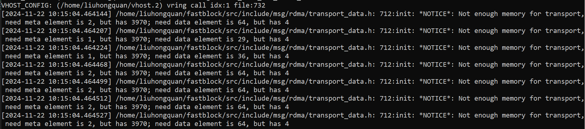

rpc有几个memory相关参数：
msg_server_metadata_memory_pool_capacity
msg_server_metadata_memory_pool_element_size
msg_server_data_memory_pool_capacity
msg_server_data_memory_pool_element_size
msg_client_metadata_memory_pool_capacity
msg_client_metadata_memory_pool_element_size
msg_client_data_memory_pool_capacity
msg_client_data_memory_pool_element_size

这几个参数值变小，rpc的性能会变高，但是太小又会因分配不到内存导致rpc卡住，因此需要找到一个合适的值
*_memory_pool_element_size这几个值为下面的值，调整*_memory_pool_capacity的值：
msg_server_metadata_memory_pool_element_size 为512
msg_server_data_memory_pool_element_size  为5120
msg_client_metadata_memory_pool_element_size 为512
msg_client_data_memory_pool_element_size 为5120

# 1 mkfs创建文件系统
在fastblock的image中建立一个bdev，然后作为虚拟机的磁盘启动虚拟机，对此磁盘建立文件系统（mkfs.ext4、mkfs.xfs）时，
当vhost绑定单个cpu核，*_memory_pool_capacity小于1024时，会报下面的日志
当vhost绑定多个cpu核，*_memory_pool_capacity小于2048时，会报下面的日志

并且mkfs.ext4、mkfs.xfs命令卡住，vhost进程也会卡住，rpc数据发送不出去。

*_memory_pool_capacity值调整为2048时，mkfs.ext4和mkfs.xfs才能正常运行
```
    "msg_server_metadata_memory_pool_capacity": 2048,
    "msg_server_data_memory_pool_capacity": 2048,
    "msg_client_metadata_memory_pool_capacity": 2048,
    "msg_client_data_memory_pool_capacity": 2048,
```

# 2 fio写4M数据
在fastblock的image中建立一个bdev，然后作为虚拟机的磁盘启动虚拟机，使用fio工具向磁盘写入4M数据

```
fio -direct=1 -iodepth=32 -thread -rw=randwrite -bs=4194304 -numjobs=1 -runtime=300 -group_reporting -name=test -filename=/dev/vda -ioengine=libaio -time_based
```

*_memory_pool_capacity小于4096时，会报下面的日志

并且fio会卡住，vhost进程也会卡住，rpc数据发送不出去。

*_memory_pool_capacity值调整为4096时，fio才能正常运行
```
    "msg_server_metadata_memory_pool_capacity": 4096,
    "msg_server_data_memory_pool_capacity": 4096,
    "msg_client_metadata_memory_pool_capacity": 4096,
    "msg_client_data_memory_pool_capacity": 4096,
```
当bs=4194304，numjobs=2或更大时，*_memory_pool_capacity值为4096，fio就不能正常运行了，需要把*_memory_pool_capacity值调整为8192

# 3 fio写8M和8M以上数据
在fastblock的image中建立一个bdev，然后作为虚拟机的磁盘启动虚拟机，使用fio工具向磁盘写入8M数据
```
fio -direct=1 -iodepth=32 -thread -rw=randwrite -bs=4194304 -numjobs=1 -runtime=300 -group_reporting -name=test 
-filename=/dev/vda -ioengine=libaio -time_based
```
*_memory_pool_capacity小于8192时，会报下面的日志

并且fio会卡住，vhost进程也会卡住，rpc数据发送不出去。

*_memory_pool_capacity值调整为4096时，fio才能正常运行
```
    "msg_server_metadata_memory_pool_capacity": 8192,
    "msg_server_data_memory_pool_capacity": 8192,
    "msg_client_metadata_memory_pool_capacity": 8192,
    "msg_client_data_memory_pool_capacity": 8192,
```

# 4 vhost进程中读写数据的长度
启动vhost进程时，打开日志libblk，启动命令中加上 "-L libblk"

在fastblock的image中建立一个bdev，然后作为虚拟机的磁盘启动虚拟机，在虚拟机中使用fio写数据、给磁盘分区、mkfs创建文件系统
dd写数据等操作，分析vhost日志发现，读写数据的最大长度是1310720
查看写数据的长度 'grep "write_object pool:"'
查看读数据的长度 'grep "read_object pool:"'