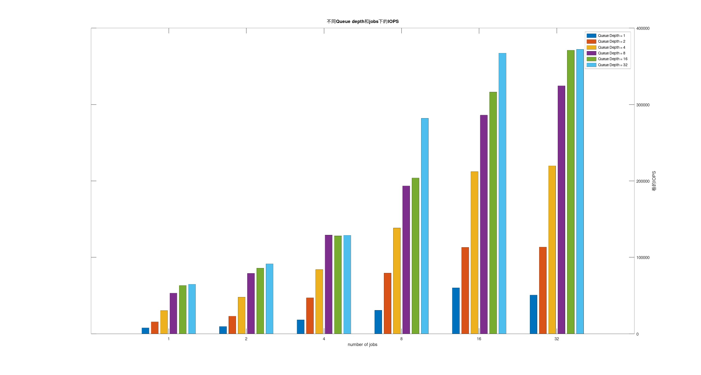

vhost对接qemu性能测试报告
# 1. 测试目标
- 测试版本(commit a1da9258f00)的三副本下，在虚拟机内部使用fio测试单线程延迟、IOPS以及多核并发IOPS及平均延迟和延迟分位统计

# 2. 注意事项
- 本测试报告重点在于fastblock-vhost对接qemu之后的性能测试，对接qemu的功能测试可以参考[vhost对接qemu测试](./qemu_vhost_test.md "vhost对接")
- 本测试报告重点在于fastblock-vhost对接qemu之后的性能测试，因此不会过多涉及集群部署的内容，因为此次测试整体环境与[0731性能测试报告](./performance_test_20240731.md)一致，部署可参考之
- 在性能测试方面，因[0731性能测试报告](./performance_test_20240731.md)测试了使用block_bench下的延迟和IOPS，得出了单线程延迟126.596us和总IOPS为441148的测试结果，而block_bench与使用vhost本质上就只增加了vhost层的开销，因此两者有可比性，本文将对接两者
- 本测试进行时，spdk已经合入了vhostallcores分支，在这个分支中，每个vhost的核都可以运行fastblock client
- 当前版本还未解决store层和rpc层的跨核通信问题，所以采用了较多的osd进程来提供总性能，并且采用的是aio类型的bdev，会在下个版本发布时解决

# 3. 性能测试环境
此处操作同[0731性能测试报告](./performance_test_20240731.md)，区别在于每个磁盘使用了5个分区，因此集群的osd总个数为60个。

# 4. 部署集群,并创建所需的pool和卷
此处同[0731性能测试报告](./performance_test_20240731.md) 

# 5. 启动vhost进程，并启动进行对接的qemu进程
此处操作同[vhost对接qemu测试](./qemu_vhost_test.md "vhost对接")  
注意，因为此服务器cpu资源较为丰富，总共为96个核，在每个osd使用了2个核的情况下，每台服务器上的osd使用了4*2*5=40个核，所以本次测试中，fastblock-vhost和qemu各自使用了8个核

# 6. 单线程测试
测试脚本为fio.sh:
```
echo "qd is $1, jobs is $2"
fio -size=10G -direct=1 -iodepth=$1 -thread -rw=randwrite -bs=4k -numjobs=$2 -runtime=60 -group_reporting  -name=test -filename=/dev/vda -ioengine=libaio -time_based
```
运行脚本`./fio.sh 1 1`  
结果如下:
```
test: (g=0): rw=randwrite, bs=(R) 4096B-4096B, (W) 4096B-4096B, (T) 4096B-4096B, ioengine=libaio, iodepth=1
fio-3.19
Starting 1 thread
Jobs: 1 (f=1): [w(1)][100.0%][w=30.9MiB/s][w=7907 IOPS][eta 00m:00s]
test: (groupid=0, jobs=1): err= 0: pid=1418: Thu Sep 19 09:52:39 2024
  write: IOPS=7711, BW=30.1MiB/s (31.6MB/s)(1808MiB/60001msec); 0 zone resets
    slat (nsec): min=2900, max=32700, avg=3323.29, stdev=301.17
    clat (usec): min=109, max=1212, avg=125.41, stdev= 5.45
     lat (usec): min=116, max=1216, avg=128.84, stdev= 5.47
    clat percentiles (usec):
     |  1.00th=[  118],  5.00th=[  120], 10.00th=[  121], 20.00th=[  122],
     | 30.00th=[  123], 40.00th=[  125], 50.00th=[  126], 60.00th=[  127],
     | 70.00th=[  128], 80.00th=[  129], 90.00th=[  131], 95.00th=[  133],
     | 99.00th=[  141], 99.50th=[  145], 99.90th=[  180], 99.95th=[  190],
     | 99.99th=[  206]
   bw (  KiB/s): min=29919, max=31944, per=100.00%, avg=30884.09, stdev=752.09, samples=119
   iops        : min= 7479, max= 7986, avg=7721.03, stdev=188.05, samples=119
  lat (usec)   : 250=100.00%, 500=0.01%, 750=0.01%
  lat (msec)   : 2=0.01%
  cpu          : usr=2.72%, sys=3.02%, ctx=462723, majf=0, minf=1
  IO depths    : 1=100.0%, 2=0.0%, 4=0.0%, 8=0.0%, 16=0.0%, 32=0.0%, >=64=0.0%
     submit    : 0=0.0%, 4=100.0%, 8=0.0%, 16=0.0%, 32=0.0%, 64=0.0%, >=64=0.0%
     complete  : 0=0.0%, 4=100.0%, 8=0.0%, 16=0.0%, 32=0.0%, 64=0.0%, >=64=0.0%
     issued rwts: total=0,462723,0,0 short=0,0,0,0 dropped=0,0,0,0
     latency   : target=0, window=0, percentile=100.00%, depth=1

Run status group 0 (all jobs):
  WRITE: bw=30.1MiB/s (31.6MB/s), 30.1MiB/s-30.1MiB/s (31.6MB/s-31.6MB/s), io=1808MiB (1895MB), run=60001-60001msec

Disk stats (read/write):
  vda: ios=20/462484, merge=0/0, ticks=4/57582, in_queue=57586, util=99.99%
```
整体结果与[0731性能测试报告](./performance_test_20240731.md)相差不大(128us vs 126us)，我们的目标是低于100us，原因主要在于采用aio bdev时，延迟还是会略大一些，另外一个原因是跨核通信问题。  

# 7. 多线程线程测试
我们分别测试了qd=1,2,4,8,16,32和numjobs=1,2,4,8,16,32时的总IOPS，结果如下:  
| qd\jobs | 1  |  2  | 4  | 8  | 16  | 32  |
|------|-------|-------|-------|-------|-------|-------|
| 1    | 7658  | 15583 | 30385 | 53228 | 63249 | 64857 |
| 2    | 9541  | 23004 | 47874 | 79006 | 85813 | 91407 |
| 4    | 18157 | 47053 | 84141 | 129161| 128082| 128940|
| 8    | 30712 | 79428 | 138394| 193535| 203843| 282080|
| 16    | 60089 | 113085| 212252| 286163| 316314| 367325|
| 32    | 50625 | 113540| 219827| 324567| 371007| 372218|


在qd和jnumobs提高的情况下，总IOPS存在比较明显的增长，如下图所示

整体结果与[0731性能测试报告](./performance_test_20240731.md)相比，在qd=32和numjobs=32的情况下，单卷的总IOPS达到372218,低于使用block_bench的441118，还是存在优化空间，但是相比未优化的[初始版本vhost性能数据](./performance_test_20231012.md)中的12万左右，还是有比较大的提高的。
