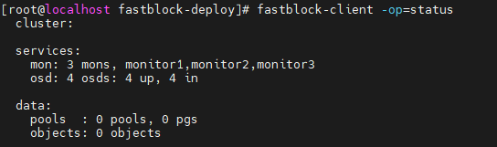
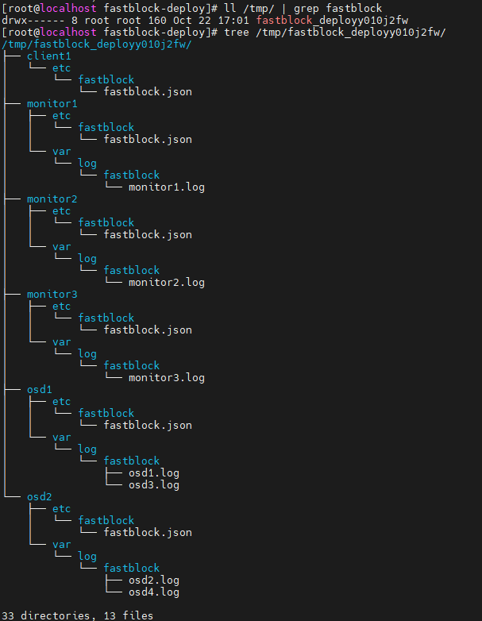

自动部署测试验证报告
## 测试环境
6台虚拟机：
- 1台作为ansible部署节点以及client节点（192.168.3.180）
- 3台作为monitor节点（192.168.3.181,192.168.3.182,192.168.3.183）
- 2台作为osd节点（192.168.3.191,192.168.3.192），每台osd节点有两个nvme磁盘（/dev/nvme0n1和/dev/nvme0n2），在每个osd节点上启动两个osd，分别绑定两个磁盘

## 测试步骤
### 1. 构建rpm包
运行构建脚本，构建rpm包
```bash
chmod +x make_rpm.sh
./make_rpm.sh
```

### 2. 自动部署测试
执行 `fastblock-deploy/fastblock-deploy.sh` 脚本，传入相关ip参数以及磁盘参数，脚本将配置ansible环境，运行用于部署的ansible playbook即可进行自动部署
```bash
./fastblock-deploy.sh -m "192.168.3.181,192.168.3.182,192.168.3.183" -o "192.168.3.191,192.168.3.192" -c "192.168.3.180" -d "192.168.3.191:/dev/nvme0n1,/dev/nvme0n2 192.168.3.192:/dev/nvme0n1,/dev/nvme0n2" -n rxe1 -t aio

ansible-playbook -vv -i hosts site.yml
```

### 3. 收集日志测试
执行 `fastblock-deploy/infrastructure-playbooks/gather-fastblock-logs.yml` playbook
```bash
ansible-playbook -vv infrastructure-playbooks/gather-fastblock-logs.yml -i hosts
```

### 4. 自动卸载测试
执行 `fastblock-deploy/infrastructure-playbooks/purge-cluster.yml` playbook
```bash
ansible-playbook -vv infrastructure-playbooks/purge-cluster.yml -i hosts
```

## 测试结果
### 1. 自动部署测试结果
查看集群状态，可以看到3个monitor和4个osd的集群已经部署完毕
```bash
fastblock-client -op=status
```


### 2. 收集日志测试结果
查看 `/tmp/` 目录下，以 `fastblock_deploy` 为前缀的文件夹，可以看到从集群中收集到的配置文件以及日志文件
```bash
ll /tmp/ | grep fastblock
tree /tmp/fastblock_deployvutewhst/
```


### 3. 自动卸载测试结果
查看集群机器上对应的
- fastblock 服务已经停止运行
- fastblock 程序已经卸载
- fastblock 相关文件和目录已经删除
