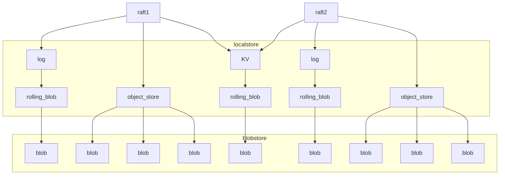

# 1. 概述

localstore实现了本地存储，基于spdk blobstrore进行存储。

包含了3个主要功能：

`disk_log`: 存储raft log，每个pg(对应一个raft组)都有一个。

`object_store`: 存储对象。每个pg都有一个，保存这个pg的所有块对象。下文简称log

`kv_store`: 每个cpu核拥有一个。保存当前cpu核上的需要保存的所有kv数据，包括raft的元数据、存储系统本身的数据。下文简称kv

# 2. 详细介绍

# 2.1 localstore整体示例

如下图所示，假设我们运行了两个raft，localstore为这两个raft提供了log、object和kv这3部分存储功能。



## 2.2 rolling_blob

```
Case 1(not rolled):  
从左往右写，随着数据的增加，front往右推进，但此时还没写到blob最右侧。
                                            
                                           |向右追加写-->
  __________________________________________________
  |begin       back|                  front|    end| 
                   |<-------- used ------->| 
                                    
 
Case 2(rolled):  
数据向右写到了 blob 结尾处，要从 blob 的起始位置重新开始写。
但front数字不会变小，它只会单调增加。对blob size取余，即可知道它在blob中的具体位置。
   
                 |向右追加写-->
  ___________________________________________________
  |begin    front|                back|          end|  
  |<-- used1 --->|                    |<-- used2 -->|
```

**介绍：** 循环写一个blob，类似一个循环队列，如果blob写满了，就从头开始循环写，底层是一个固定大小的blob。  
rolling_blob只支持追加写，只有一个append()方法可以写数据。  
为了进行空间的回收，需要用户(kv和log)主动调用trim方法回收空间。

**使用：** kv和log都用了rolling_blob，不同的是，kv对应的blob大小为32M，disk_log的blob大小为1G.

**实现：** 
1. 有4个变量，分别是back_pos、back_lba、front_pos、front_lba。pos是uint64_t，类似文件的偏移，是无限单调递增的，给用户使用；lba是pos在blob中的真实偏移，内部使用，用户并不知道。
2. blob最前面4K是super block，不写数据。trim时会更改一次back变量，并写一次super block。而front位置只有系统重启后从磁盘replay数据才会使用，由用户在replay时通过自己的校验位判断。

**设计思路：**  
1. 后面空间写完再从前面循环写的动作，叫做roll。用户从前面回收空间的动作，叫做trim。
2. 缺点：不能动态改变大小。如果写满了，就会报错。
3. 以后可以改成很多4M的blob循环使用的方法，trim的时候直接回收前面的blob，空间不够了就把空闲的blob追加在后面。

## 2.2 disk_log

**介绍：** 基于rolling_blob进行读写，每个raft都拥有一个对应的disk_log对象。需要raft随时更新已经apply（指已经apply到状态机）过的数据位置，然后内部的poller每隔一段时间进行一次trim。最多保存1000条已经apply的log，1000条之前的会被trim掉。

**实现：** 
```
log的存储格式：
|<--     raft log 1    -->|<--     raft log 2    -->|
|------------|------------|------------|------------|
|<- header ->|<-- data -->|<- header ->|<-- data -->|

其中data是raft消息真正携带的4k对齐的块数据。header固定4k大小，保存raft消息和块数据的元数据，元数据大概只有100字节。
```
1. 现在每条log我们都会在前面加上4k的header，然后写到磁盘。原因如下：  
    * 由于是块存储系统，log的数据是4k对齐的，我们想要保证一条log的原子性，所以把数据和header写在一起。
    * spdk的blobstore是支持512对齐的，如果header也512对齐可以节省空间。但512对齐的写效率比4k低很多，所以header用4k。
    * 上层raft会做请求合并，以后可以优化，减少空间浪费。

2. `_index_map`保存了从每个raft_index到pos的映射，底层是一个树，方便进行遍历及批量删除。由于只保存1000条log，所以map大小最大只有1000.

3. 三个变量记录disk_log保存了哪些index，用来计算trim的范围。
  `_lowest_index` 最小index  
  `_trim_index` 已经apply的index  
  `_highest_index` 最新的index（可能尚未apply）

4. 目前trim的poller运行间隔是5ms。最长可设置为1s，因为rolling_blob大小是1G，只要5ms内raft消息不会把rolling_blob不会写满即可。设单raft的4k请求iops为50000，则1s内会写入50000 * 8k = 390M，不会写满。

## 2.3 kv_store

**介绍：** 基于rolling_blob进行读写。一个cpu核只有一个kv_store，这个核上所由的raft都会把运行信息保存在这个kv中。

**使用：** 用户可以使用的接口有:  
```c++
void put(std::string key, std::optional<std::string> value);
void remove(std::string key);
std::optional<std::string> get(std::string key);
```

**实现：** 
1. 用户`put()`和`remove()`的kv数据，都被放在`op`数组中，等待poller每隔一段时间写到磁盘中。然后把`op`保存到一个hash map中，作为全量数据。

2. poller每次写磁盘，都是把`op`序列化之后，4k对齐追加写入rolling_blob中。

3. 如果rolling_blob写满了，或者空间不够下次写入，就会把全量数据`table`写入checkpoint中，并且清空rolling_blob。

4. checkpoint也持有一个blob，里面保存了全量的kv数据。

**设计思路：**
由于存储的数据量不多，一个内存中的hash map就足够了。

## 2.4 buffer_pool

内存池，每块内存4k大小。目前存储部分会从内存池拿到多个4k内存块，把数据都拷贝到内存块中。

## 2.5 spdk_buffer和buffer_list

`spdk_buffer` 一块spdk内存。

`buffer_list` 链表，持有很多个spdk_buffer。

# 3. 代码结构

`demo/` 存储的各个子系统的运行demo，进行基本功能测试。 

`blob_manager` 初始化blobstore，全局只有一个blobstore。

`buffer_pool` 内存池，基于spdk_mempool实现。

`disk_log` log相关代码。

`kv_checkpoint`、`kv_store` kv相关代码。

`log_entry` raft_log的数据结构定义。因为raft文件夹的raft_entry_t类型是一个protobuf数据结构，在这又定义了一个log_entry_t，用buffer_list保存数据。

`object_recovery`、`object_store` 对象相关代码。`object_recovery`是执行raft协议的install_snapshot时，读取对象数据用的，目前还没有使用到。

`rolling_blob` rolling_blob代码。

`spdk_buffer` 定义了spdk_buffer和buffer_list，以及buffer_list的序列化方法。

`storage_manager` storage用来管理一个核上的kv以及所有的disk_log和object_store。当创建一个raft时，应该从这里注册对应的disk_log和object_store，并获取对应的引用，而不应该直接管理存储层的数据结构。

`types` 定义了fb_blob和blob类型，定义了spdk_buffer的序列化方法，以后再整理一下序列化部分的代码。

# 4. 后续工作

1. 完善storage_manager，目前注册disk_log和object_store的功能还不全。

2. 增加从磁盘恢复数据的机制，根据xattr判断blob的类型，构造对应的kv、log、object等数据结构。

3. 增加mkfs操作，让进程显式初始化一块磁盘。

4. 增加blob pool，优化对象第一次写的创建耗时。

5. 数据结构的更改。buffer_list从std::list换成boost::instrusive_list；disk_log的std::map换成btree_map

6. 增加异常处理。修改new为noexcept版本，引入future分支，捕获异常。

7. 由于spdk的并发限制，需要增加对元数据操作、IO操作并发数量的控制。

---

作者：孙逸方

时间：2023/10/10


